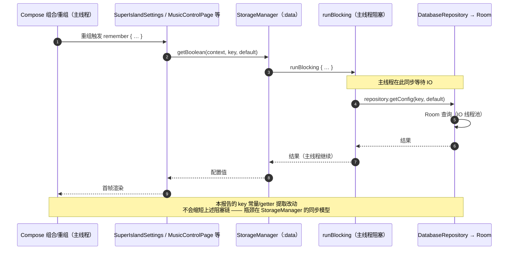

# 工具方法审计报告（`:app` / `:data` / `:base`）

> **审计范围**：非 Git 子模块的库 —— `:app`、`:data`、`:base`（旁证涉及 `:superislandui`）。
> **排除**：`:checkupdata`、`:scrcpy`、`nativecore/notify-relay-core`（Git 子模块，代码在各自仓库维护）。
> **方式**：只读静态核对。所有行号均已逐条读取源码确认；「0 调用」结论均区分了模块内部自调用与外部调用。
> **状态**：审计期间**未修改任何源码**，审计前后 `git status` 均为干净（分支 `审计文档`）。

---

## 一、结论速览

| 类别 | 数量 | 代表项 |
|---|---|---|
| **应合一**（重复实现） | 17 组 | `runWithErrorHandling` ×8、drawable→Bitmap ×8、剪贴板写入 ×6、`normalizeTitle` ×2 |
| **应提取**（下沉公共层） | 5 项 | drawable→Bitmap、等比缩放、hex 编码、剪贴板工具、`normalizeTitle` |
| **应删除**（死代码 / 废弃壳） | 10 项 | `DataUrlUtils`、`HapticFeedbackUtils`、`RoomTypeConverters`、`migrateAppConfig` |
| **不建议合并**（附理由） | 7 组 | DAO 样板、`getSystemService`、`CoroutineScope`、Compose 组件下沉 |
| **顺带发现缺陷** | 4 处 | `ImageUtils` 日志丢参、`getRunningServices` 已失效、监听器判定被弱化 |

**优先级口径**：**P0** = 零行为差异，可立即做；**P1** = 需删 import / 改可见性，风险可控；**P2** = 需人工确认语义差异。

### 一句话结论

本项目的工具复用**整体状态良好**（`:app` 中有 164 处 / 120 文件 `import notifyrelay.base.*`，`Logger` 单一入口 942 处）——不存在「大量工具该提取却没提取」的问题。

真正的问题集中在三类：

1. **重复实现**：同一段 3~8 行的样板在 5~8 个文件里各抄一份（`runWithErrorHandling`、drawable→Bitmap、剪贴板写入）；
2. **废弃残留**：`DataUrlUtils`（6 个方法全转发，真实调用点 **0**）与 `HapticFeedbackUtils`（整个 object 外部 **0** 调用）本应在上轮迁移中一并清除；
3. **一致性隐患**：存储 key 与通知 action 等**跨模块契约**在多处以字面量重复定义，改一处漏一处会静默出错。

---

## 二、应合一（重复实现）

### P0-1 `runWithErrorHandling` / `runWithErrorHandlingSuspend` —— 8 份逐字相同

同一 `replica` 包内 5 个文件各自持有私有实现，**函数体逐字相同**，唯一差异是 `TAG` 取自各 object 的私有常量：

| 文件 | 行 | 形态 |
|---|---|---|
| [FloatingReplicaManager.kt](../app/src/main/java/com/xzyht/notifyrelay/feature/notification/superisland/replica/FloatingReplicaManager.kt#L91) | 91 | 普通 |
| [FloatingReplicaListModeManager.kt](../app/src/main/java/com/xzyht/notifyrelay/feature/notification/superisland/replica/FloatingReplicaListModeManager.kt#L231) | 231 / 242 | suspend / 普通 |
| [FloatingReplicaMappingManager.kt](../app/src/main/java/com/xzyht/notifyrelay/feature/notification/superisland/replica/FloatingReplicaMappingManager.kt#L429) | 429 | 普通 |
| [FloatingReplicaNotificationManager.kt](../app/src/main/java/com/xzyht/notifyrelay/feature/notification/superisland/replica/FloatingReplicaNotificationManager.kt#L249) | 249 / 260 | 普通 / suspend |
| [FloatingReplicaWindowManager.kt](../app/src/main/java/com/xzyht/notifyrelay/feature/notification/superisland/replica/FloatingReplicaWindowManager.kt#L478) | 478 / 489 | 普通 / suspend |

```kotlin
private inline fun runWithErrorHandling(
    actionName: String,
    crossinline block: () -> Unit,
) {
    try {
        block()
    } catch (e: Exception) {
        Logger.w(TAG, "超级岛: $actionName 失败: ${e.message}")
    }
}
```

**调用点规模**（含定义行）：

| 文件 | 命中 | `return@` 标签 |
|---|---|---|
| `FloatingReplicaWindowManager.kt` | 19 | 7 |
| `FloatingReplicaNotificationManager.kt` | 8 | 1 |
| `FloatingReplicaListModeManager.kt` | 6 | 2 |
| `FloatingReplicaManager.kt` | 4 | 2 |
| `FloatingReplicaMappingManager.kt` | 2 | 0 |

**建议**：包内新增顶层 helper，`TAG` 作显式入参即可保持日志逐字不变：

```kotlin
internal inline fun runReplicaCatching(tag: String, actionName: String, block: () -> Unit)
internal suspend inline fun runReplicaCatchingSuspend(tag: String, actionName: String, crossinline block: suspend () -> Unit)
```

**风险**：无行为差异（纯透传）。**不要下沉 `:base`** —— `"超级岛: "` 前缀是业务语义，下沉会让 `:base` 承载不存在的领域概念。

---

### P0-2 通知渠道 ID 同值重复定义

```kotlin
// NotificationGenerator.kt:36
internal const val NOTIFICATION_CHANNEL_ID = "super_island_replica"
// LiveUpdatesNotificationManager.kt:21
const val CHANNEL_ID = "super_island_replica"
```

两者同值、渠道名同为「超级岛复刻」。`ReplicaIntentFactory.kt:38`、`ReplicaScrollUpdater.kt:69` 用前者，`LiveUpdatesNotificationManager` 用后者。

**建议**：以 `NotificationGenerator.NOTIFICATION_CHANNEL_ID` 为唯一来源，另一处改为别名转发。

**风险**：极低 —— 字符串值不变即可，渠道 ID 是系统侧契约。

---

### P0-3 广播 action 字符串 4 处硬编码

已有常量却只有一处复用：

```kotlin
// LiveUpdatesIntentFactory.kt:20 —— 唯一定义，且仅自身使用
internal const val ACTION_TOGGLE_FLOATING = "com.xzyht.notifyrelay.ACTION_TOGGLE_FLOATING"
```

仍硬编码的位置：

| 位置 | 字符串 |
|---|---|
| [ReplicaIntentFactory.kt:83](../app/src/main/java/com/xzyht/notifyrelay/feature/notification/superisland/notification/ReplicaIntentFactory.kt#L83) | `ACTION_TOGGLE_FLOATING` |
| [SuperIslandConfigUtils.kt:123](../app/src/main/java/com/xzyht/notifyrelay/feature/notification/superisland/config/SuperIslandConfigUtils.kt#L123) | `ACTION_CLOSE_NOTIFICATION` |
| [NotificationBroadcastReceiver.kt:34](../app/src/main/java/com/xzyht/notifyrelay/feature/notification/superisland/receiver/NotificationBroadcastReceiver.kt#L34) / :44 | 消费侧两个 action |

生产侧与消费侧靠注释维系契约（`LiveUpdatesIntentFactory.kt:15`、`NotificationBroadcastReceiver.kt:15-16` 都在写「必须一致」）。

**建议**：新增无依赖契约文件 `SuperIslandActions.kt` 承载两个常量，生产/消费两侧共用。

**风险**：低。**字符串值绝不能改** —— action 是跨进程/跨版本契约，改名会使旧 PendingIntent 失配。

---

### P0-4 存储 key 在多处独立定义（含跨模块）

| key | 定义点 | 隐患 |
|---|---|---|
| `superisland_enabled` | [NotifyRelayNotificationListenerService.kt:270](../app/src/main/java/com/xzyht/notifyrelay/feature/notification/service/NotifyRelayNotificationListenerService.kt#L270)、[SuperIslandSettings.kt:56](../app/src/main/java/com/xzyht/notifyrelay/ui/pages/SuperIslandSettings.kt#L56)、[superislandui/SuperIslandManager.kt:28](../superislandui/src/main/java/github/xzynine/superislandui/common/SuperIslandManager.kt#L28) | **跨 `:app` / `:superislandui` 两模块三处字面量** |
| `super_island_floating_window` | [SuperIslandConfigUtils.kt:17](../app/src/main/java/com/xzyht/notifyrelay/feature/notification/superisland/config/SuperIslandConfigUtils.kt#L17)、[SuperIslandSettings.kt:58](../app/src/main/java/com/xzyht/notifyrelay/ui/pages/SuperIslandSettings.kt#L58) | 设置页绕过 `SuperIslandConfigUtils` 直接读写 |
| `spec_injection_mode` | [SuperIslandConfigUtils.kt:19](../app/src/main/java/com/xzyht/notifyrelay/feature/notification/superisland/config/SuperIslandConfigUtils.kt#L19)、[SuperIslandSettings.kt:59](../app/src/main/java/com/xzyht/notifyrelay/ui/pages/SuperIslandSettings.kt#L59) | 同上 |
| `super_island_mirror_filter_enabled` | [SuperIslandProcessor.kt:120](../app/src/main/java/com/xzyht/notifyrelay/sync/notification/SuperIslandProcessor.kt#L120)、[SuperIslandSettings.kt:60](../app/src/main/java/com/xzyht/notifyrelay/ui/pages/SuperIslandSettings.kt#L60) | 读写两侧各写一份字面量 |

**关键点**：`SuperIslandConfigUtils` 本身**已有**完整 getter/setter（`isFloatingWindowEnabled` :34、`isNotificationListMode` :56、`getSpecInjectionMode` :86），但设置页 [SuperIslandSettings.kt:76-90](../app/src/main/java/com/xzyht/notifyrelay/ui/pages/SuperIslandSettings.kt#L76) 绕过它直接调 `StorageManager` 并自带私有 key 常量，等于绕开了 `getSpecInjectionMode` 里的**旧默认值迁移逻辑**（`LEGACY_BOTH_ORDINAL` 判定，:88-92）。

**建议**：
1. key 常量集中到 `SuperIslandConfigUtils`，设置页改为引用（**纯常量替换，零行为差异**）；
2. 设置页的读取/写回改走 `SuperIslandConfigUtils` 的 getter/setter —— **此步属行为变更，需单独确认**；
3. `superisland_enabled` 是跨模块 key，若要素单一来源，应放在 `:data` 或 `:base`（`:superislandui` 已依赖两者），**不要在 `:app` 与 `:superislandui` 各留一份**。

---

### P1-5 `normalizeTitle` 已有逐字副本

[FilterTextNormalizer.kt:7](../app/src/main/java/com/xzyht/notifyrelay/feature/notification/filter/FilterTextNormalizer.kt#L7)（全文件 10 行）已是正确抽取的成果，7 处复用：

```kotlin
internal fun normalizeTitle(title: String): String {
    val prefixPattern = Regex("^\\([^)]+\\)")
    return title.replace(prefixPattern, "").trim()
}
```

但 [NotificationProcessor.kt:146-150](../app/src/main/java/com/xzyht/notifyrelay/sync/notification/NotificationProcessor.kt#L146) 又抄了一份「逐字符相同」的局部函数：

```kotlin
fun normalizeTitleLocal(t: String?): String {
    if (t == null) return ""
    val prefixPattern = Regex("^\\([^)]+\\)")
    return t.replace(prefixPattern, "").trim()
}
```

调用点：`normalizeTitle` 7 处 / 3 文件 + `normalizeTitleLocal` 2 处（:152/:157）。

**建议**：合并为一个函数（保留可空入参处理），并下沉 `:base` 的 `TextUtils.kt`（零依赖，见「三、提取-5」）。

**风险**：极低 —— 需把 `internal` 改为 `public`；`Regex` 当前每次调用重建，可顺手提为 `private val`（等价优化）。

---

### P1-6 剪贴板写入 6 处内联重复

「取服务 → `newPlainText` → `setPrimaryClip`」三步手写，6 处 / 5 文件：

| 位置 | 标签 |
|---|---|
| [ClipboardSyncManager.kt:225-226](../app/src/main/java/com/xzyht/notifyrelay/feature/clipboard/ClipboardSyncManager.kt#L225) / :238 | `synced_text` |
| [ParamIslandCompose.kt:142-143](../app/src/main/java/com/xzyht/notifyrelay/feature/notification/superisland/floating/bigisland/ParamIslandCompose.kt#L142) | `verification code` |
| [GuideOptionalPermissionPage.kt:191-192](../app/src/main/java/com/xzyht/notifyrelay/ui/guide/GuideOptionalPermissionPage.kt#L191) | `adb` |
| [SuperIslandHistoryFormatters.kt:73-74](../app/src/main/java/com/xzyht/notifyrelay/ui/pages/superisland/SuperIslandHistoryFormatters.kt#L73) | `super_island_entry` |
| [ChatTest.kt:115-116](../app/src/main/java/com/xzyht/notifyrelay/ui/pages/ChatTest.kt#L115) | `message` |

**建议**：`:base` 新增 `ClipboardUtils.copyText(context, label, text): Boolean`。

**风险**：低，但**不要全部替换** —— `ClipboardSyncManager.kt:225-226` 属剪贴板同步业务逻辑（接收对端内容写本地），不是 UI「复制+提示」语义，应保留。实际可替换 4 处 UI 触发点。

---

### P1-7 删除按钮与拖拽枚举重复

```kotlin
// ui/pages/history/DeleteButton.kt:16        —— DeleteButton(modifier, onClick)
// ui/pages/superisland/SuperIslandHistoryCards.kt:73 —— SuperIslandDeleteButton(onClick, modifier)
```

两者**函数体逐字相同**（`IconButton` + `MiuixIcons.Delete` + `error` 底色 + `width(80.dp)` + `minHeight 40.dp` + `minWidth 80.dp` + icon `24.dp`），仅**参数顺序相反**。

另有两个同构枚举：

```kotlin
// NotificationHistory.kt:29
internal enum class DragValue { Center, End }
// SuperIslandHistoryCards.kt:64
internal enum class SuperIslandDragValue { Center, End }
```

**建议**：删除 `SuperIslandDeleteButton`，统一用 `DeleteButton`；`DeleteButton` 从 `ui/pages/history/` 上提到 `ui/pages/`（避免 `superisland` → `history` 的横向子包依赖）；枚举合一。

**风险**：低（纯合并）。

---

### P1-8 dp→px 滑动删除宽度逐字重复

```kotlin
// NotificationHistory.kt:98-100
// SuperIslandHistory.kt:83-85   —— 逐字相同
val density = LocalDensity.current
val deleteWidthPx = with(density) { 80.dp.toPx() }
val deleteWidth = 80.dp
```

全项目 `LocalDensity.current` 仅此 2 处。`deleteWidthPx` / `deleteWidth` 会向下透传到 `NotificationListBlock.kt`、`NotificationHistoryScaffold.kt`、`SuperIslandHistoryCards.kt` 共约 36 行参数。

**建议**：提取 `rememberDeleteSwipeWidth()` 到 `ui/pages/`，顺带去除参数层层透传。

**不合并**：[FloatingReplicaWindowManager.kt:418](../app/src/main/java/com/xzyht/notifyrelay/feature/notification/superisland/replica/FloatingReplicaWindowManager.kt#L418) 的 `context.resources.displayMetrics.density` 属 View/WindowManager 层，无 `LocalDensity` 可用，且 `12 * density` 是裸数字而非 dp 常量。

---

### P1-9 时间戳格式化：同一格式串两套 API

```kotlin
// NotificationHistory.kt:27   —— java.time
internal val dateTimeFormatter = DateTimeFormatter.ofPattern("yyyy-MM-dd HH:mm:ss", Locale.US)

// SuperIslandHistoryFormatters.kt:15   —— android.text.format.DateFormat
internal fun formatTimestamp(timestamp: Long): String =
    try {
        DateFormat.format("yyyy-MM-dd HH:mm:ss", Date(timestamp)).toString()
    } catch (_: Exception) { timestamp.toString() }
```

格式串逐字相同，但 API 不同：前者固定 `Locale.US` + `ZoneId.systemDefault()`，后者走系统 Locale。消费点：`NotificationCard.kt:140`、`NotificationListBlock.kt:192`、`SuperIslandHistoryCards.kt:218/398/477`。全项目**无相对时间（"x分钟前"）逻辑**。

**建议**：合并为一个 `formatTimestamp(Long)`（实现走 `dateTimeFormatter`，保留 `catch` 兜底），落点建议 `ui/pages/TimeFormatters.kt`。

**风险**：低但需确认 —— 统一到 `Locale.US` 会改变数字渲染（部分 ROM 的本地数字），属**修正**而非回归。

---

### P1-10 两个 History ViewModel 的图标预加载近乎逐字相同

[NotificationHistoryViewModel.kt:154](../app/src/main/java/com/xzyht/notifyrelay/ui/viewmodel/NotificationHistoryViewModel.kt#L154) / :202 与 [SuperIslandHistoryViewModel.kt:103](../app/src/main/java/com/xzyht/notifyrelay/ui/viewmodel/SuperIslandHistoryViewModel.kt#L103) / :143。

`preloadAppIcons` 约 30 行逐字相同，差异仅 2 处：island 版 filter 多一条 `&& it != "(未知应用)"`，`finally` 里用 `removeAll(toLoad)` 而非 `removeAll(toLoad.toSet())`。`getAppNameAndIcon` 语义完全相同（`pm.getApplicationLabel` + `AppRepository.getAppIconWithAutoRequest`）。

**建议**：提取 `AppIconPreloader`（`ui/viewmodel/`），两 ViewModel 组合使用。

**风险**：中 —— 两者 `init` 都订阅 `AppRepository.iconUpdates` 做 `invalidate + preload`，提取后失效路径必须一起迁移，否则图标更新事件会丢。

---

### P1-11 `Toast.makeText` 14 处绕过 `:base` 的 `ToastUtils`

`:base` 已有 [ToastUtils.kt:15](../base/src/main/java/notifyrelay/base/util/ToastUtils.kt#L15)，全项目已用 51 处。仍直连 `android.widget.Toast` 的 14 处：

| 文件 | 行 |
|---|---|
| [UIAbout.kt](../app/src/main/java/com/xzyht/notifyrelay/ui/pages/UIAbout.kt#L160) | 160 / 162 / 223 / 285 / 289 / 294 |
| [SuperIslandHistoryFormatters.kt](../app/src/main/java/com/xzyht/notifyrelay/ui/pages/superisland/SuperIslandHistoryFormatters.kt#L68) | 68 / 75 / 78 |
| [ParamIslandCompose.kt](../app/src/main/java/com/xzyht/notifyrelay/feature/notification/superisland/floating/bigisland/ParamIslandCompose.kt#L138) | 138 / 146 / 149 |
| [ChatTest.kt:117](../app/src/main/java/com/xzyht/notifyrelay/ui/pages/ChatTest.kt#L117) | 117 |
| [SuperIslandHistory.kt:77](../app/src/main/java/com/xzyht/notifyrelay/ui/pages/SuperIslandHistory.kt#L77) | 77 |

全部为 `Toast.LENGTH_SHORT`，与 `showShortToast` 完全等价。值得注意的是**同场景不一致**：`SuperIslandHistory.kt:77` 直连 Toast，而 `NotificationHistory.kt:92` 同功能用的是 `ToastUtils.showShortToast`。

**建议**：全部替换为 `ToastUtils.showShortToast`，并删除这 5 个文件中因此变为未使用的 `import android.widget.Toast`（AGENTS.md 要求不抑制警告）。

**风险**：低。Compose 上下文无限制（`LocalContext.current` 提供 Activity Context）；真正受限的后台/Rust 回调场景项目已用 `Handler(Looper.getMainLooper()).post { ToastUtils… }` 处理，不在这 14 处内。

---

### P1-12 `ApkArchMatcher` / `MediaControlUtil` 的死方法与防抖小项

- [ApkArchMatcher.kt:49](../app/src/main/java/com/xzyht/notifyrelay/util/ApkArchMatcher.kt#L49) `matchAssetByArch` 与 :9 `SUPPORTED_ABIS` —— **各 0 调用点**，可直接删除。
- [MediaControlUtil.kt:81](../app/src/main/java/com/xzyht/notifyrelay/feature/media/MediaControlUtil.kt#L81) `seekTo` —— **0 调用点**。
- `ToastDebounce`（[NotificationHistory.kt:32-34](../app/src/main/java/com/xzyht/notifyrelay/ui/pages/NotificationHistory.kt#L32)，`lastToastTime` + `DEBOUNCE_MILLIS = 1500L`）是通用防抖能力，当前 6 处 / 2 文件（`NotificationCard.kt:79/81/86/88`），可考虑并入 `:base` 的 `ToastUtils`。

---

### P2-13 drawable→Bitmap 样板复制 8 处

`intrinsicWidth` 命中 8 处，均为同一「非 BitmapDrawable 回退」逻辑：

| 文件 | 行 | 兜底尺寸 |
|---|---|---|
| [AppIconRepository.kt:216](../app/src/main/java/com/xzyht/notifyrelay/feature/appslist/AppIconRepository.kt#L216) | 216-217 | 96 |
| [InstalledAppsRepository.kt:90](../app/src/main/java/com/xzyht/notifyrelay/feature/appslist/InstalledAppsRepository.kt#L90) | 90-91 | 96 |
| [IconSyncManager.kt:352](../app/src/main/java/com/xzyht/notifyrelay/feature/appslist/sync/IconSyncManager.kt#L352) | 352-353 | 96 |
| [NotificationForwardRepository.kt:86](../app/src/main/java/com/xzyht/notifyrelay/feature/device/repository/NotificationForwardRepository.kt#L86) | 86-87 | 96 |
| [GuideComponents.kt:137](../app/src/main/java/com/xzyht/notifyrelay/ui/guide/GuideComponents.kt#L137) | 137-138 | 96 |
| [UIAbout.kt:107](../app/src/main/java/com/xzyht/notifyrelay/ui/pages/UIAbout.kt#L107) | 107-108 | 96 |
| [FilterListSection.kt:93](../app/src/main/java/com/xzyht/notifyrelay/ui/pages/FilterListSection.kt#L93) | 93-94 | **48** |
| [LocalAppsContent.kt:50](../app/src/main/java/com/xzyht/notifyrelay/ui/pages/remoteapps/LocalAppsContent.kt#L50) | 50-51 | **1** |

`:base` 的 `ImageUtils` 目前**没有** drawable→Bitmap 能力（`androidx.core.graphics.drawable.toBitmap` 已 import，但仅用于 Coil 结果转换，`ImageUtils.kt:123`）。

**建议**：`ImageUtils` 增加 `Drawable.toBitmapOrDefault(fallbackSize: Int = 96): Bitmap`。

**风险**：中 —— **必须保留 48 与 1 两个特殊兜底**（默认图标 / 极小占位），不能统一成 96；`FilterListSection.kt:93` 对 `drawable` 用 `?.` 安全调用（`defaultActivityIcon` 可能为 null），null 分支需留在调用侧。

---

### P2-14 等比缩放「最长边 ≤ N」两份实现

```kotlin
// SuperIslandStructuredDataHelper.kt:478
private fun scaleDownBitmap(bitmap: Bitmap, maxDimension: Int): Bitmap {
    val longest = maxOf(bitmap.width, bitmap.height)
    if (longest <= maxDimension || longest <= 0) return bitmap
    val ratio = maxDimension.toFloat() / longest
    val targetWidth = (bitmap.width * ratio).toInt().coerceAtLeast(1)
    val targetHeight = (bitmap.height * ratio).toInt().coerceAtLeast(1)
    return Bitmap.createScaledBitmap(bitmap, targetWidth, targetHeight, true)
}
// SuperIslandImageCache.kt:44-49 —— 同一算法，roundToInt + androidx.core scale
```

**建议**：`ImageUtils.scaleDown(bitmap, maxDimension)` 承载纯缩放逻辑。

**风险**：中 —— `.toInt()` 与 `.roundToInt()` 在极端长宽比下有 1px 差异；**只合并纯缩放 6 行**，`SuperIslandImageCache.normalizeBitmap` 后续的 `HARDWARE` config 拷贝与 `source.recycle()`（:52-60）是缓存特有策略，**不得并入**（有 use-after-recycle 风险）。

---

### P2-15 `md5` / `sha256` 的 hex 编码写法不一

```kotlin
// IconCacheManager.kt:265
digest.joinToString("") { "%02x".format(it) }                    // MD5，DiskLruCache key
// FloatingReplicaMappingManager.kt:195-197
hash.joinToString("") { "%02x".format(it) }                      // SHA-256，通知指纹
// superislandui/diff/DiffSystem.kt:74
bytes.joinToString("") { b -> ((b.toInt() and 0xFF).toString(16)).padStart(2, '0') }  // SHA-256
```

**关键**：**`md5` 绝不可并入 `sha256`** —— `IconCacheManager.md5` 是 DiskLruCache 的缓存 key（:43 `keyFor`），换算法会导致**全部已缓存图标失效**。可合并的**只有 hex 编码助手**（两种写法输出等价）。

**建议**：`:base` 新增 `fun ByteArray.toHex(): String`，各调用点改用它；摘要算法保持原样。

**风险**：hex 编码零风险；算法混用则是破坏性的，禁止。

---

### P2-16 `SuperIslandImageStore.resolve` / `resolveSuspend` 重复

[SuperIslandImageStore.kt:102-130](../app/src/main/java/com/xzyht/notifyrelay/feature/notification/superisland/image/SuperIslandImageStore.kt#L102)：两者开头 `isNullOrBlank` / `trim` / `toLongOrNull` / `<= 0` 判断逐字相同，差异仅在 `resolve` 多了主线程守卫 + `runBlocking(Dispatchers.IO)`。

**建议**：抽私有 `resolveId`，主线程守卫留在 `resolve`。

**注意**：`resolve` 在**主线程**直接走 `runBlocking(Dispatchers.IO)`（:127）—— 这是既有的主线程阻塞点，合并时不要顺手改变该行为，需单独评估（见「七、涉及时序」）。

---

### P2-17 `isFloatingWindowEnabled` 三层转发

```kotlin
// SuperIslandConfigUtils.kt:34  —— 真正的实现（读 StorageManager）
// FloatingReplicaManager.kt:21  —— private，一行转发
// FloatingReplicaWindowManager.kt:74 —— public，一行转发
```

`FloatingReplicaManager.kt:21` 的私有转发是多余的（唯一调用点在 :78 自身）。

**建议**：至少删除 `FloatingReplicaManager` 的私有转发，直接调 `SuperIslandConfigUtils`。

---

## 三、应提取到公共层

### 提取-1 `ImageUtils`：drawable→Bitmap、等比缩放、Bitmap→Base64

前两项见 P2-13 / P2-14。补充 Base64 归一：

| 位置 | 形态 |
|---|---|
| [IconSyncManager.kt:334-338](../app/src/main/java/com/xzyht/notifyrelay/feature/appslist/sync/IconSyncManager.kt#L334) | PNG/100 + `NO_WRAP`，**纯 base64 无前缀** |
| [ImageUtils.kt:90](../base/src/main/java/notifyrelay/base/util/image/ImageUtils.kt#L90) | PNG/100 + `NO_WRAP`，**带 `data:image/png;base64,` 前缀** |
| [MediaNotificationHandler.kt:105](../app/src/main/java/com/xzyht/notifyrelay/feature/notification/service/MediaNotificationHandler.kt#L105) | **JPEG/80** + `NO_WRAP` |
| [StateQueryResponder.kt:164](../app/src/main/java/com/xzyht/notifyrelay/feature/device/service/statequery/StateQueryResponder.kt#L164) | JPEG + 手工拼前缀 |
| [SuperIslandMessageBuilder.kt:58/69](../app/src/main/java/com/xzyht/notifyrelay/sync/builder/SuperIslandMessageBuilder.kt#L58) | 手工拼 `data:*;base64,` |
| [ClipboardSyncManager.kt:189-195](../app/src/main/java/com/xzyht/notifyrelay/feature/clipboard/ClipboardSyncManager.kt#L189) | 先 `bitmapToDataUri` 再手工 `substring(indexOf(',')+1)` 截前缀（**绕回**） |

**强证据**：`:superislandui` 的 `SuperIslandManager.kt` **同一文件内** :184/:190/:200/:253/:258/:267/:300 已在调 `ImageUtils.bitmapToDataUri`，却在 :209/:276 手写等价逻辑 —— 说明 `ImageUtils` **缺少无前缀/字节版入口**，两边各自绕开。

**建议**：`ImageUtils` 增加 `bitmapToBase64`（无前缀）与 `bytesToDataUrl(bytes, mime)`，保留 `bitmapToDataUri`（带前缀，改为薄封装）；JPEG 路径**不并入**（质量参数与业务上限耦合）。

**风险**：中 —— ① 带/不带前缀两个方法必须并存，严禁混用；② 异常语义不同（`ImageUtils` 版返回 `""`，`IconSyncManager` 版向上抛），归一后调用侧需重新决定；③ `ClipboardSyncManager.kt:189` 的「生成再截断」是明确反模式，应改为直接调无前缀版本。

---

### 提取-2 `:base` 新增 `DigestUtils`

见 P2-15，仅承载 `ByteArray.toHex()`。

---

### 提取-3 `:base` 新增 `ClipboardUtils`

见 P1-6，承载 `copyText(context, label, text): Boolean`。

---

### 提取-4 `:base` 新增 `TextUtils`（`normalizeTitle`）

见 P1-5。零依赖、纯字符串逻辑，`:app` → `:base` 方向合法。

---

### 提取-5 `SystemBarUtils`（可选，收益中等）

[SystemBarUtils.kt:6](../app/src/main/java/com/xzyht/notifyrelay/ui/common/SystemBarUtils.kt#L6) 是**纯 Android 平台工具** —— 仅依赖 `android.view.Window` + `java.lang.reflect.Method`，**无 Compose、无 Context、无业务模型、无资源**，可原样下沉。

**但**当前仅 `Theme.kt:42-43` 一个消费文件，`object` 已是 public，下沉收益有限。

**关键区别**：同文件的 `SetupSystemBars`（`Theme.kt:27`）依赖 `MiuixTheme.colorScheme`，**不能**与 `SystemBarUtils` 一起下沉。

---

## 四、应删除 / 应澄清归属

### 删除-1 `DataUrlUtils`（纯废弃转发壳，真实调用点 0）

[DataUrlUtils.kt](../base/src/main/java/notifyrelay/base/util/DataUrlUtils.kt#L12) 已标 `@Deprecated`，6 个方法**全部一行转发**到 `ImageUtils` 同签名方法：

```kotlin
@Deprecated("迁移至 ImageUtils", ReplaceWith("ImageUtils.findDataUrls(text)"))
fun findDataUrls(text: String): List<String> = ImageUtils.findDataUrls(text)
```

全仓引用统计（排除 `build`/`.gradle`/`.git`）：

| 命中 | 性质 |
|---|---|
| `DataUrlUtils.kt` 自身 4 处 | 定义 |
| `ImageUtils.kt:23` | 注释里的历史来源说明 |
| `superislandui/SuperIslandManager.kt:308` | **注释**「data URL / bitmap helpers moved to DataUrlUtils」（描述已过期） |
| `superislandui/SuperIslandImageUtil.kt:24` | **注释** |

**即真实调用点为 0**。其私有常量 `TAG`、`DATA_PREFIX` 也仅在本文件出现。同批迁移中 `MediaStoreHelper.kt` 已因 0 调用被删除（见 `memory/2026-09-19.md`），本项情况完全相同却被保留。

**建议**：删除该文件，并修正两处过期注释。这是本报告**投入产出比最高**的一项（净减一个文件 + 消除误导性注释），且不影响任何行为。

**风险**：无 —— 0 调用点，`ImageUtils` 承载全部实现。

---

### 删除-2 `HapticFeedbackUtils`（整个 object 外部 0 调用）

[base/HapticFeedbackUtils.kt:9](../base/src/main/java/notifyrelay/base/util/HapticFeedbackUtils.kt#L9) 三个 public 方法在 `:app`/`:data`/`:superislandui`/`:core` 中**各 0 命中**：

| 方法 | 行 | base 内 | 外部 |
|---|---|---|---|
| `isVibrationSupported` | 16 | 1（定义） | **0** |
| `performLightHaptic` | 35 | 1（定义） | **0** |
| `performPatternHaptic` | 60 | 1（定义） | **0** |

`:scrcpy` 子模块的触感走自己的 `AppHaptics`（Compose `LocalHapticFeedback`），与本 object 无关 —— 说明 Compose 场景已由 Compose API 覆盖。

**建议**：**先确认再删** —— 属对外 API 面收窄，按 AGENTS.md「非预期破坏性操作需询问」，此项需你确认后再执行。若确认无未来用途，删除可净减 91 行。

---

### 删除-3 `ImageUtils.findDataUrls` / `splitByDataUrls`（连带私有辅助）

| 方法 | 行 | 外部调用 |
|---|---|---|
| `findDataUrls` | 33 | **0**（唯一引用方是 `DataUrlUtils`，而它也是 0 调用） |
| `splitByDataUrls` | 44 | **0**（同上） |
| `findDataEndCandidate`（private） | 164 | 仅被上面两者使用 |

`ImageUtils` 其余方法的真实调用点：`parseColor` 53、`bitmapToDataUri` 8、`loadBitmap` 7、`isDataUrl` 2、`decodeDataUrlToBitmap` 2、`unescapeHtml` 1。

**建议**：随删除-1 一并清理这三个方法（合计约 43 行）。

**风险**：低 —— 0 调用点。唯一注意：若未来需要从长文本中提取 data URL，需重建。

---

### 删除-4 `RoomTypeConverters` 从未注册（58 行完全无效）

[RoomTypeConverters.kt](../data/src/main/java/notifyrelay/data/database/converter/RoomTypeConverters.kt#L10) 定义了 8 个 `@TypeConverter`，但**全仓 `@TypeConverters` 注解 0 命中** —— `AppDatabase` 的 `@Database(...)`（:120-138）并未注册它。

KSP 生成产物佐证（`data/build/generated/ksp/.../*Dao_Impl.kt`）：

```kotlin
public fun getRequiredConverters(): List<KClass<*>> = emptyList()
```

三个 DAO Impl 全部返回 `emptyList()`，即 Room 一个转换器都没用上。

**建议**：删除该文件。已核对 13 个实体字段类型均为 `String`/`Long`/`Int`/`Boolean`/`ByteArray?`，Room 原生支持。

**风险**：低 —— 0 注册、0 调用点。唯一注意：若**未来**要加 `Date`/`Set<String>` 字段，需重建。

---

### 删除-5 `MigrationHelper.migrateAppConfig` 是空转方法

```kotlin
// MigrationHelper.kt:31-50
suspend fun migrateAppConfig(context: Context, appConfigDao: AppConfigDao) {
    run { /* Logger.d(...) 已注释 */ }
    val configs = mutableListOf<AppConfigEntity>()   // 永远为空
    // 迁移逻辑已经简化，因为 StorageManager 现在直接使用 Room 数据库
    if (configs.isNotEmpty()) {                      // 永远 false
        appConfigDao.insertAll(configs)
    }
}
```

唯一调用点 [AppDatabase.kt:663-666](../data/src/main/java/notifyrelay/data/database/AppDatabase.kt#L663)。

**建议**：删除方法 + 调用点 + 随之无用的 `import AppConfigDao` / `AppConfigEntity`。

**风险**：极低（逻辑已空转，删除不改变任何行为）。

**顺带**：`MigrationHelper.kt:52-54` 的 KDoc 写成「迁移超级岛历史记录」，但方法实为 `migrateNotifications`（通知记录）—— 与 :121-123 的 `migrateSuperIslandHistory` KDoc 复制粘贴串了，应更正。

---

### 删除-6 `AppConfig` 单键包装（25 行包 1 个 key）

[AppConfig.kt](../data/src/main/java/notifyrelay/data/config/AppConfig.kt#L10) 全文 25 行，只包装 `udp_discovery_enabled` 一个 key，唯一消费方是 [DeviceConnectionManager.kt](../app/src/main/java/com/xzyht/notifyrelay/feature/device/service/DeviceConnectionManager.kt#L321)（4 处）。

**建议**：删除 `AppConfig`，在 `DeviceConnectionManager` 内用局部常量直连 `StorageManager`。

**风险**：低 —— **key 与默认值 `true` 必须逐字保留**，否则已有用户的开关状态会重置。

---

### 删除-7 `AppListHelper` 4 个方法 0 调用点

`AppListHelper`（183 行）实测调用点：

| 方法 | 调用点 |
|---|---|
| `getApplicationLabel` | 3（真实使用） |
| `getInstalledApplications` | 2 |
| `canQueryApps` | 1 |
| `filterAppsByPackageNames` | **0** |
| `searchApps` | **0** |
| `parseRemoteAppList` | **0** |
| `mergeLocalAndRemoteApps` | **0** |
| `getAppNameWithFallback` | **0** |

**建议**：删除后 4 个方法（约 100 行）。**不建议**把 `getInstalledApplications` 下沉 `:base` ——「排除系统应用与自身」是产品决策，下沉易被误用。

---

### 删除-8 `ServiceManager` / `IntentUtils` / `Logger` 的死成员

| 成员 | 位置 | 外部调用 | 备注 |
|---|---|---|---|
| `ServiceManager.isServiceRunning` | [:59](../base/src/main/java/notifyrelay/base/util/ServiceManager.kt#L59) | **0** | 见「七、缺陷-2」，实现本身**已失效** |
| `ServiceManager.checkAutoStartPermission` | [:79](../base/src/main/java/notifyrelay/base/util/ServiceManager.kt#L79) | **0** | — |
| `IntentUtils.createIntentWithExtras` | [:71](../base/src/main/java/notifyrelay/base/util/IntentUtils.kt#L71) | **0** | — |
| `IntentUtils.createImplicitIntentWithData` | [:105](../base/src/main/java/notifyrelay/base/util/IntentUtils.kt#L105) | **0** | 调用侧改用 `createImplicitIntent` + 手赋 `data` |
| `IntentUtils.addFlags` | [:116](../base/src/main/java/notifyrelay/base/util/IntentUtils.kt#L116) | **0** | — |
| `IntentUtils.setData` | [:130](../base/src/main/java/notifyrelay/base/util/IntentUtils.kt#L130) | **0** | — |
| `Logger.plant` | [:49](../base/src/main/java/notifyrelay/base/util/Logger.kt#L49) | **0** | `init` 块 (:23) 直接调 `Timber.plant` |

**风险**：删 `Logger.plant` 会使 `:app` 无法注入自定义 Timber Tree（当前 0 调用，但属 API 面收窄）；`IntentUtils` 的 4 个重载属工具库完备性储备。**建议先确认再用**。

---

### 删除-9 `Scrcpy*` 死常量（需走 `submodule-modifier`）

`data/config/ScrcpyPreferenceKeys.kt` 与 `ScrcpyDefaults.kt` 中有 **0 引用**的常量：两侧 `THEME_BASE_INDEX`（均为 :61，与 `base/ThemeSettingsManager.kt:8` 重复定义）、`MONET`、`PASSWORD_REQUIRE_AUTH`。

**风险**：这两个文件的消费方 `:scrcpy` 是 **git 子模块**。按 AGENTS.md，涉及子模块须走 `submodule-modifier` skill 并双端同步。**建议本轮只做零引用常量删除，不动签名。**

---

### 澄清-1 `MeasureTime` 的实际消费者

`measureTime`（[MeasureTime.kt:3](../base/src/main/java/notifyrelay/base/util/MeasureTime.kt#L3)）在 `:app` 中 **0 调用**，唯一消费者是 `:superislandui`：

- `superislandui/common/BitmapUtils.kt`（:60、:195 为调用点）
- `superislandui/common/TextSplitter.kt`（:100、:153 为调用点）

**判定**：归属正确（`:superislandui` 依赖 `:base`），**保留**。仅需知晓它不服务 `:app` —— 即 `:app` 缺性能埋点，而非本工具冗余。

---

### 澄清-2 `:base` 与 `:data` 之间无 SharedPreferences 样板重复

`StorageManager` 已全量走 Room（`DatabaseRepository.getConfig/setConfig`，:53-55、:84-86），`grep SharedPreferences` 在 `StorageManager.kt` 中 **0 命中**。

全仓 `getSharedPreferences` 仅 4 个文件、4 个不同 prefs，语义互不可合并：

| prefs 文件 | 定义 | 用途 |
|---|---|---|
| `theme_settings` | `base/ThemeSettingsManager.kt:7` | 主题基色索引 |
| `secure_key_storage` | `base/SecureKeyStorage.kt:17` | Keystore 密文 |
| `remote_apps_prefs` | `app/PinnedAppsRepository.kt:18` | 置顶应用 `Set<String>` 集合 |
| `nativecore_adb_rsa` | `data/ScrcpyPreferenceKeys.kt:4` | ADB RSA 私钥，`:scrcpy` 独占 |

**判定：保留**，不合并（合并需跨模块数据迁移且无收益）。

---

### 澄清-3 `DatabaseRepository` / `AppDatabase` / `MigrationHelper` 职责不重叠

| 类 | 职责 |
|---|---|
| `AppDatabase.kt:197-484` | Room **schema 版本迁移**（8 个 `Migration`，288 行 SQL DDL） |
| `AppDatabase.kt:649-692` | `onCreate` 时触发旧存储一次性搬迁 |
| `DatabaseRepository.kt` | DAO 聚合门面 + 领域组合逻辑 + 退役表裸 SQL（89 处 DAO 调用） |
| `MigrationHelper.kt` | **JSON 文件 / SP → Room** 的数据搬运（与 SQL schema 迁移正交） |

**判定：保留**。`MigrationHelper` 的 6 个方法由 `AppDatabase.migrateFromLegacyStorage`（:652-692）按序调用，与 `addMigrations`（:188）机制不同，**不是重复**。

`DatabaseRepository` 中存在 2 组**同体别名**，属真实冗余（可选清理）：

```kotlin
// DatabaseRepository.kt:648 与 :668 —— 函数体完全相同
fun getAllAppDevices() = appDeviceDao.getAll()              // 0 外部调用
fun getAllAppDeviceAssociations() = appDeviceDao.getAll()   // 1 处使用（InstalledAppsRepository.kt:139）

// :324 与 :331 —— List 重载 0 外部调用（2 个调用点均传单实体）
suspend fun saveSuperIslandHistory(history: List<SuperIslandHistoryEntity>)
suspend fun saveSuperIslandHistory(history: SuperIslandHistoryEntity)
```

**另注**：`DatabaseRepository` 还有 24 个零外部调用方法（如 `getIconMissingApps`/`getExpiredApps`/`updateAppIcon`/`markAppIconAsMissing`，构成一套完整的图标生命周期 API），**不建议批量删除** —— 可能是厂商适配或未来功能预留的稳定 API 面。

---

### 澄清-4 权限逻辑重复（`:app` 绕过 `:base` 已有实现）

| 重复项 | `:base` 已有 | `:app` 重复实现 | 说明 |
|---|---|---|---|
| **MIUI/澎湃检测** | [PermissionHelper.kt:443](../base/src/main/java/notifyrelay/base/util/PermissionHelper.kt#L443)（**private**） | [GuidePermissionUiState.kt:46](../app/src/main/java/com/xzyht/notifyrelay/ui/guide/GuidePermissionUiState.kt#L46)、[GuideRequiredPermissionPage.kt:51](../app/src/main/java/com/xzyht/notifyrelay/ui/guide/GuideRequiredPermissionPage.kt#L51) | `private` 导致 app 抄了 2 遍；:44 注释写着「与 PermissionHelper 保持一致」——作者已知重复但无法复用。**建议**：提升为 `public` |
| **通知监听器启用判定** | [:222-255](../base/src/main/java/notifyrelay/base/util/PermissionHelper.kt#L222)（`ComponentName` 精确匹配） | [GuidePermissionUiState.kt:30](../app/src/main/java/com/xzyht/notifyrelay/ui/guide/GuidePermissionUiState.kt#L30)、[NotifyRelayNotificationListenerService.kt:441](../app/src/main/java/com/xzyht/notifyrelay/feature/notification/service/NotifyRelayNotificationListenerService.kt#L441) | app 版**只比对包名前缀**，正是 `:base` 注释警告的误判模式（见「七、缺陷-3」） |
| **悬浮窗权限** | [:164](../base/src/main/java/notifyrelay/base/util/PermissionHelper.kt#L164) + [:178](../base/src/main/java/notifyrelay/base/util/PermissionHelper.kt#L178) | [FloatingReplicaWindowManager.kt:76](../app/src/main/java/com/xzyht/notifyrelay/feature/notification/superisland/replica/FloatingReplicaWindowManager.kt#L76) / :79、[GuideOptionalPermissionPage.kt:137](../app/src/main/java/com/xzyht/notifyrelay/ui/guide/GuideOptionalPermissionPage.kt#L137) | app 内 `canDrawOverlays` 3 处 / 2 文件 |
| **外部存储权限** | [:347](../base/src/main/java/notifyrelay/base/util/PermissionHelper.kt#L347)（已带 API 30 守卫） | [FtpServer.kt:126](../app/src/main/java/com/xzyht/notifyrelay/sync/FtpServer.kt#L126)、[DataCallbackHandler.kt:231](../app/src/main/java/com/xzyht/notifyrelay/feature/device/service/callback/DataCallbackHandler.kt#L231) | `Environment.isExternalStorageManager()` 2 处，替换安全 |

**风险**：低（多为可见性变更或等价替换）；但「通知监听器判定」的替换会**修正**一处潜在误判，属行为变更，需确认调用处确实仅用于日志。

---

### 澄清-5 `:superislandui` 对 `:base` 的复用已充分

| 模式 | `:superislandui` 命中 |
|---|---|
| `Logger` / `ImageUtils` | 有（**已在复用 `:base`**；`ImageUtils` 覆盖 21 文件） |
| `measureTime` | 有（20 处 / 2 文件） |
| `Toast` / `ToastUtils` | **0** |
| `WindowCompat` / `setStatusBarColor` | **0** |
| `TopAppBar` / `Scaffold` | **0** |
| `DoubleClick` / `navigationevent` | **0** |

**判定**：`:superislandui` **不需要** `:app` 的 UI 组件 —— 这削弱了「把 Compose 组件下沉到 `:base`」的收益论证（见「五、不建议合并」）。

---

## 五、不建议合并（附理由）

| 组 | 规模 | 不合并理由 |
|---|---|---|
| **Compose 组件下沉 `:base`** | 5 件套 | `:base` **无 Compose 编译器插件、无任何 `@Composable`**（全模块 grep 0 命中），下沉需先加 `kotlin.compose` 插件 + miuix/navigationevent/compose-foundation 依赖 —— 这是**构建层面的实质变更**，且会削弱 `:base`「无内部依赖的纯工具库」定位。且 `:superislandui` 对这些组件**零重复**（见澄清-5），当前无跨模块复发需求。**若确需下沉，新建 `:ui` 模块比污染 `:base` 更干净** |
| **DAO 的 `insert`/`insertAll`/`delete`/`getAll` 同形方法** | 8 个 DAO | **Room 框架惯例** —— `@Dao` 是接口 + 注解驱动，表名/SQL 必须是编译期字面量，无法用 Kotlin 泛型抽象；`DatabaseRepository`（746 行、89 处 DAO 调用）已是统一门面。强行抽象会退化为手写 SQL 反射层 |
| **`md5` 并入 `sha256`** | 2 处 | **破坏性**：`IconCacheManager.md5`（:43 `keyFor`）是 DiskLruCache 的 key，换算法 ⇒ **全部图标缓存失效** |
| **`getSystemService`** | 36 处 / 25 文件 | 两种写法混用（`as NotificationManager` 强转 vs `NotificationManager::class.java`），**异常语义不同**；统一会改变既有崩溃/降级行为，改动面 25 文件而收益仅为风格 |
| **`CoroutineScope(...)` fire-and-forget** | 29 处 / 12+ 文件 | 均为**不保留 Job、不可取消**的发射后不管。统一共享 scope 会改变生命周期语义（如 `SuperIslandHistoryStore.kt`、`ClipboardSyncManager.kt` 依赖每次独立 scope 避免互相取消）。若要治理应作为独立议题 |
| **`JSONObject` 手写解析** | 115 处 | 各业务 payload key 契约不同（`SuperIslandProcessor` / `MediaCapsulePresenter` / `RemoteFilterConfig` 等），强行抽象 DTO 会引入 115 处行为风险 |
| **`Handler(Looper.getMainLooper())`** | 11 处 | 4 处是「切主线程 post」，7 处是持有长生命周期 `Handler` 字段，生命周期语义不同 |
| **`ScreenCaptureCoordinator` / `MainActivityPermissions` / `ReplicaIntentFactory` / `ProtocolSender` / `MediaControlUtil`** | 各 3~11 调用点 | 均强绑 `:app` 类型（`MainActivity`、`NotificationBroadcastReceiver`、`DeviceConnectionManager`）或 `:core`（`NativeCore`）。下沉会造成 `:base → :app` 反向依赖，或 `:base → :core → :base` **成环**。且 `MainActivityPermissions` 已在正确复用 `:base` 的 `PermissionHelper`/`ServiceManager`/`ToastUtils`/`Logger` —— 该复用的都复用了，残余是 Activity 生命周期编排 |
| **`FloatingReplicaWindowManager` 密度换算并入 Compose 工具** | 1 处 | View/WindowManager 层无 `LocalDensity`；且 `:base` 引入 `Dp`/`LocalDensity` 会扩大其 Compose 依赖面 |

---

## 六、`base` 低复用 public API 清单（0 外部调用）

统计口径：在 `:app`/`:data`/`:superislandui`/`:core` 中的命中数（排除 `:base` 自身、`build`、`.gradle`、`.git`、子模块）。

| 方法 | 行 | 外部命中 | 处置建议 |
|---|---|---|---|
| `DataUrlUtils.*`（6 个） | 17-38 | **0** | 删除整类（删除-1） |
| `ImageUtils.findDataUrls` | 33 | **0** | 删除（删除-3） |
| `ImageUtils.splitByDataUrls` | 44 | **0** | 删除（删除-3） |
| `HapticFeedbackUtils.*`（3 个） | 16/35/60 | **0** | 确认后删除（删除-2） |
| `ServiceManager.isServiceRunning` | 59 | **0** | 删除（实现已失效，见缺陷-2） |
| `ServiceManager.checkAutoStartPermission` | 79 | **0** | 待确认 |
| `Logger.plant` | 49 | **0** | 待确认 |
| `IntentUtils.createIntentWithExtras` | 71 | **0** | 待确认 |
| `IntentUtils.createImplicitIntentWithData` | 105 | **0** | 待确认 |
| `IntentUtils.addFlags` | 116 | **0** | 待确认 |
| `IntentUtils.setData` | 130 | **0** | 待确认 |
| `PermissionHelper.checkSensitiveNotificationPermission` | 81 | **0** | 待确认（疑为厂商适配预留） |
| `PermissionHelper.isUsageStatsEnabled` | 126 | **0** | 待确认 |
| `PermissionHelper.checkDevScreenShareProtectOff` | 333 | **0** | 待确认 |
| `PermissionHelper.isAccessibilityServiceEnabled` | 472 | **0** | 待确认 |

> **以下方法虽外部命中 0，但被 `:base` 内部使用，属正常内部实现，不在死代码之列**：
> `PermissionHelper.getDeclaredPermissions`（被 :310 调用）、`PermissionHelper.isLocalNetworkPermissionRequired`（被 :298/:311 调用）、`PermissionHelper.openAppDetailsSettings`（被 `GuidePermissionRequester.kt:47/59` 调用）、`ServiceManager.startNotificationListenerService`（被 :79/:95 调用）。

**已正确复用的高价值 API**（对照参考，无需改动）：

| API | 外部命中 | 文件数 |
|---|---|---|
| `Logger` | 942 | 116 |
| `ImageUtils` | 79 | 20 |
| `ToastUtils` | 71 | 19 |
| `PermissionHelper` | 45 | 15 |
| `ThemeSettingsManager` | 34 | 6 |
| `IntentUtils` | 24 | 6 |
| `MeasureTime` | 19 | 2（仅 superislandui） |
| `BatteryUtils` | 18 | 7 |
| `GuidePermissionRequester` | 9 | 4 |
| `DeviceUtils` | 8 | 4 |
| `SecureKeyStorage` | 5 | 1 |
| `ServiceManager` | 5 | 1 |
| `BatteryIconConverter` | 4 | 1 |

---

## 七、顺带发现的真实缺陷（非重复问题）

### 缺陷-1 `ImageUtils` 三处日志丢弃了参数

```kotlin
// ImageUtils.kt:67
Logger.w(TAG, "data URL 格式无效，原始前64字符: ")
// :192
Logger.w(TAG, "cleanDataUrl: 不以 data: 开头，原始前64字符: ")
// :197
Logger.w(TAG, "cleanDataUrl: 未找到逗号分隔符，清理后前64字符: ")
```

三条消息都以「…前64字符: 」结尾，却**没有拼接任何变量** —— 原意显然要输出 `dataUrl.take(64)`，实现时丢失了参数。这会导致该路径的排障信息不可用（`:app` 与 `:superislandui` 的图片解码失败均会走到 `decodeDataUrlToBitmap`，:65-68 与 :191-199）。

**建议**：补上 `.take(64)` 参数（注意日志可能含图片 base64 片段，请确认是否愿意记录）。

---

### 缺陷-2 `ServiceManager.isServiceRunning` 依赖已废弃 API，实现本身失效

```kotlin
// ServiceManager.kt:58-66
@Suppress("DEPRECATION")
fun isServiceRunning(context: Context, serviceClassName: String): Boolean {
    ...
    val running = am.getRunningServices(Int.MAX_VALUE)
    running.any { it.service.className == serviceClassName }
}
```

`ActivityManager.getRunningServices` 自 Android 8（API 26）起**只返回调用方自己的服务**，因此该方法对「判断任意服务是否运行」**已功能性失效**。它同时也是 0 调用点。

**建议**：删除（而非修复）—— 属纯收益。若确需服务状态判断，应改用 `NotificationManager.getActiveNotifications` 或前台服务自身的状态标志。

---

### 缺陷-3 通知监听器启用判定被弱化为「包名前缀比对」

`:base` 有精确实现 [PermissionHelper.kt:222-255](../base/src/main/java/notifyrelay/base/util/PermissionHelper.kt#L222)（用 `ComponentName` 精确匹配，代码注释明确警告「仅比对包名会在服务类名变更时误判」）。

但 app 又写了两份弱化版：

- [GuidePermissionUiState.kt:30-41](../app/src/main/java/com/xzyht/notifyrelay/ui/guide/GuidePermissionUiState.kt#L30)（自行 split `":"` 比对 component，勉强精确）
- [NotifyRelayNotificationListenerService.kt:441-445](../app/src/main/java/com/xzyht/notifyrelay/feature/notification/service/NotifyRelayNotificationListenerService.kt#L441) —— **只比对包名包含关系**，正是 `:base` 注释指出的误判模式

**建议**：复用 `PermissionHelper.checkNotificationListenerServiceCanStart`（:201-208）。经核对该处仅用于 `Logger.w` 前的判断，替换安全 —— 但**替换会修正一处潜在误判，属行为变更**，需确认。

---

### 缺陷-4 其他不一致（低优先）

- [FloatingReplicaNotificationManager.kt:162](../app/src/main/java/com/xzyht/notifyrelay/feature/notification/superisland/replica/FloatingReplicaNotificationManager.kt#L162) 在 `catch` 内用 `e.printStackTrace()`，与项目统一用 `Logger` 的约定不符（同文件其余 catch 都用 `Logger.w`）。
- `MigrationHelper.kt:52-54` 的 KDoc 与方法实际职责不符（见删除-5）。
- [FcitxClipboardManager.kt:186](../app/src/main/java/com/xzyht/notifyrelay/feature/clipboard/FcitxClipboardManager.kt#L186) 使用字符串字面量 `"fcitx5_clipboard_key"`，而同文件 :43/:141 使用常量 `CLIPBOARD_KEY_ALIAS`（:30 定义同值）—— 同文件内的字面量重复。

---

## 八、涉及时序的说明

`StorageManager` 的全部读写都通过 `runBlocking` 包住 Room 调用（**19 处**，`StorageManager.kt:54/85/116/147/169/203/234/265/294/323/354/381/411/446/482/511/565/584`），而其中**相当一部分调用点位于 `@Composable` 内部或主线程**（如 `SuperIslandSettings.kt:76-90`、`MusicControlPage.kt:58-64`、`SuperIslandTestDialog.kt:36/62`、`UIAbout.kt:79-82`、`SettingsScreen.kt:52/60`、`SuperIslandHistory.kt:45`、`GuideBasicSettingsPage.kt:258`）。

这决定了一条重要结论：本报告任何「把设置读取提取成公共 getter」的改动，都**不会**改善主线程阻塞 —— 阻塞源在 `StorageManager` 自身的同步模型，而不在调用方。

若后续要治理，应针对 `StorageManager` 单独立项（例如改挂 `Flow`/`suspend` 或引入内存缓存层），而不是在调用方做局部优化。



另有 `SuperIslandImageStore.resolve`（[:114-130](../app/src/main/java/com/xzyht/notifyrelay/feature/notification/superisland/image/SuperIslandImageStore.kt#L114)）在主线程经 `runBlocking(Dispatchers.IO)` 解析图片 ID（:127），并有 `isMainThread()` 守卫与告警日志（:121-124）。P2-16 的合并**不得改变**该守卫行为。

---

## 九、建议执行顺序

**第一批（P0，零行为差异，建议先做）**

1. 删除 `DataUrlUtils` + `ImageUtils.findDataUrls`/`splitByDataUrls`/`findDataEndCandidate` + 修正 2 处过期注释（0 调用点，净减约 80 行）
2. 合并 `replica` 包 8 份 `runWithErrorHandling`（5 文件 / 39 处调用）
3. 通知渠道 ID 去重（同值别名）
4. 广播 action 常量统一（字符串值不变）
5. 补充 `ImageUtils` 三处日志丢失的参数（缺陷-1）

**第二批（P1，改动面可控）**

6. 删除按钮 + 拖拽枚举合一
7. dp→px 提取 `rememberDeleteSwipeWidth()`
8. 时间戳格式化统一为 `formatTimestamp`
9. 14 处 `Toast.makeText` → `ToastUtils`（含删未用 import）
10. `normalizeTitle` 合并 `normalizeTitleLocal`（先留在 `:app`，下沉可后置）
11. 存储 key 常量集中到 `SuperIslandConfigUtils`（**仅常量替换**）

**第三批（P2，需确认语义）**

12. `ImageUtils` 增加 drawable→Bitmap（**保留 48 / 1 兜底**）
13. `ImageUtils` 增加等比缩放（**只合并纯缩放 6 行**）
14. `:base` 增加 `toHex()`（**不动摘要算法**）
15. `AppIconPreloader` 提取（注意 `iconUpdates` 订阅迁移）
16. `SuperIslandImageStore.resolve/resolveSuspend` 去重（**保持主线程守卫**）
17. `:base` 新增 `ClipboardUtils`，替换 4 处 UI 触发点

**第四批（清理，需确认）**

18. 删除 `RoomTypeConverters`、`MigrationHelper.migrateAppConfig`、`AppConfig`、`AppListHelper` 4 个死方法
19. 删除 `ApkArchMatcher.matchAssetByArch`/`SUPPORTED_ABIS`、`MediaControlUtil.seekTo`
20. `Scrcpy*` 零引用常量删除（**须走 `submodule-modifier`**）

**需你确认后才能执行**

- 删除 `HapticFeedbackUtils`（整个 object 外部 0 调用，但属 API 面收窄）
- 删除 `ImageUtils.findDataUrls`/`splitByDataUrls`（若担心未来需要从长文本提取 data URL）
- 存储 key 治理中的「设置页改走 `SuperIslandConfigUtils` getter」—— 会使其开始遵守 `LEGACY_BOTH_ORDINAL` 迁移逻辑，属**行为变更**
- 通知监听器判定改用 `:base` 精确实现（会**修正**一处潜在误判）
- `:base` 中 6 个「0 外部调用但可能为厂商适配预留」的方法（`checkSensitiveNotificationPermission` 等）是否清理
- Compose 组件是否下沉（当前**建议不动**；若确需，新建 `:ui` 模块）

---

## 十、审计方法与环境

- **静态核对**：逐文件读取源码 + 全文检索（排除 `build`/`.gradle`/`.git`/子模块），函数级、方法级、字面量级三重统计。
- **「0 调用」判定**：均区分 `:base` 内部自调用与外部调用，避免把内部引用误判为使用。
- **未执行构建**：本任务为只读审计，结论不依赖构建产物，审计期间未产生代码变更，故无基线可比。实施阶段应按 AGENTS.md「执行前先构建、执行后再构建对比」的要求，对比 Kotlin 警告基线（当前 `:app:compileDebugKotlin` 唯一警告 **26 条**，见 `memory/2026-09-19.md`）。
- **`:superislandui` 仅作旁证**（依赖方向 `:superislandui → :base`/`:data`），未纳入改动建议主体。
- **子系统边界**：`:checkupdata`、`:scrcpy`、`nativecore/notify-relay-core` 为 Git 子模块，按约定不在本审计范围；涉及它们的改动（如 `Scrcpy*` 常量）须走 `submodule-modifier` skill。
