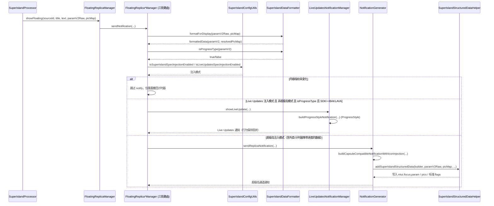

# 超级岛审阅问题修复计划（仅计划 + 验证，未改动任何代码）

> 状态：**计划阶段**。本文只记录「问题是否仍然存在」的核对结论与拟定改法，尚未执行任何修改。
> 审阅意见按「不可信输入」处理，逐条对照当前代码核验；不成立的已标注跳过原因。

---

## 0. 结论速览

| # | 问题 | 核对结论 | 处置 |
|---|------|----------|------|
| 1 | `SuperIslandExtras.writePicMap` 缺图片校验/数量上限 | ✅ 成立 | 修（P2 加固） |
| 2 | `FloatingWindowContainer` actions 分支被内容分支吞掉 | ✅ 成立 | 修（P1） |
| 3 | `build.gradle.kts` 移除 `kotlin.android` 插件别名 | ❌ 不成立 | **跳过**（刻意保留，见 1.3） |
| 4 | `HighlightInfo.toJson()` 丢 `bigImageLeft/Right/iconOnly` | ✅ 成立 | 修（P0） |
| 5 | `SuperIslandImageSpec` 需 URI scheme 白名单 | ✅ 部分成立 | 修（P2，仅告警不改写入） |
| 6 | `ParamIslandSpec` 大/小岛区域应为必填 | ✅ 成立 | 修（P2，无外部调用点，可安全改非空） |
| 7 | `business()` 应拒绝空白字符串 | ✅ 成立（低危） | 修（P2） |
| 8 | `extractInnerParamV2` 吞掉解析失败 | ✅ 成立（真实数据丢失） | 修（**P0**） |
| 9 | `HighlightInfoCompose` 图标 size 密度双重换算 | ✅ 成立 | 修（P0） |
| 10 | `HighlightInfoCompose` content/subContent 去重基准错误 | ✅ 成立 | 修（P1） |
| 11 | `HintInfoCompose` padding/size 顺序颠倒 | ✅ 成立 | 修（P0） |
| 12 | `ActionInfoButton` 缺点击回调 + contentDescription | ✅ 成立 | **延期**（按钮接线属后续开发） |
| 13 | `BImageText6` 旧字段 `digit/text` 兼容声明未实现 | ✅ 成立 | 修（P1，注释与实现对齐） |
| 14 | `BParser` BImageText6 缺「≤3 位数字」约束 | ✅ 成立 | 修（P1，先加日志观察） |
| 15 | 补充：计时器类型走错通知通道 | ✅ 成立 | 修（**P0**，见第 2 节） |
| 16 | 补充：外卖场景数据走 Live Updates 而非超级岛通道 | ✅ 成立 | 修（**P0**，见第 2 节） |

---

## 1. 审阅意见逐条核对

### 1.1 ✅ 成立 — `SuperIslandExtras.writePicMap` 缺校验与数量上限

- 位置：`superislandui/.../builder/SuperIslandExtras.kt:64-80`
- 现状：只判断 `key.startsWith("miui.focus.pic_")` 就写入，**不做任何 URL 校验，也不限制张数**。
  `SuperIslandImageSpec.MAX_IMAGE_COUNT = 10` 已定义，但只在 `validatePicMap()` 里产出「提示」，
  `logImageIssues()` 仅打日志，不阻断写入。
- 调用点（均需受益于集中过滤）：
  - `SuperIslandStructuredDataHelper.kt:83`
  - `SuperIslandStructuredDataHelper.kt:278`
- 改法：在 `writePicMap` 内集中过滤——
  - 新增 `SuperIslandImageSpec.isPicEntryValid(url)`（复用 1.5 的 scheme 白名单 + 非空判断）；
  - 只累加合法项，`count >= MAX_IMAGE_COUNT` 后停止写入；
  - 返回值语义保持「实际写入数量」不变，调用方无需改动。
- 风险：低。`picMap` 来自本地注入与远端同步，过滤只会减少无效 extras。

### 1.2 ✅ 成立 — `FloatingWindowContainer` 的 actions 分支被内容分支吞掉

- 位置：`app/.../superisland/floating/FloatingWindowContainer.kt:311-328`
- 现状：`when` 中 `highlightInfoV3 / hintInfo / textButton / actions` 互斥，
  `actions` 是最后一个分支，前三者任一非空就**永远不渲染**按钮区。
- 改法：把内容三分支保留为 `when`（维持现有优先级），
  `paramV2.actions?.isNotEmpty() == true` 拆成独立的 `if`，在其后单独调用 `ActionCompose`。
- 风险：低。仅新增一个原本不渲染的区块；分隔线逻辑（301-310）保持只画一次。

### 1.3 ❌ 不成立 — 移除 `build.gradle.kts` 的 `kotlin.android` 插件别名（**建议跳过**）

- 位置：`Android/build.gradle.kts:9`
- 现状：

  ```kotlin
  // 固定 Kotlin Gradle 插件版本为 2.4.20，以读取 miuix (Kotlin 2.4.20) 编译的元数据。
  alias(libs.plugins.kotlin.android) apply false
  ```

- 判断：这是**刻意保留**的版本钉定，注释已说明理由。`apply false` 只把 KGP 放进构建脚本 classpath，
  不会给根工程应用插件，无副作用。删除会导致 miuix 元数据版本不匹配，**反而破坏构建**。
- 处置：跳过，不改 `libs.versions.toml`。

### 1.4 ✅ 成立 — `HighlightInfo.toJson()` 丢失 `bigImageLeft/Right/iconOnly`

- 位置：`superislandui/.../builder/SuperIslandComponentSerializer.kt:128-143`
- 现状：模型 `HighlightInfo.kt:22-24` 定义了三个字段，`parseHighlightInfo` 也会读（43-45 行），
  但序列化侧**完全没写出** → 类型化构建器产出的载荷会静默丢失左右大图与「仅图标」配置。
- 影响面（已确认依赖方）：
  - `HighlightInfoCompose.kt:63` —— `iconOnly` 控制是否渲染计时器/主文本；
  - `HighlightInfoCompose.kt:113-125` —— `bigImageLeft/Right` 控制大岛左右图片渲染；
  - `HighlightInfoCompose.kt:168-175` —— `selectIconKey()` 也把这两个 key 当图标候选。
- 改法（与文件内既有风格一致，Boolean 仅 true 时写出）：

  ```kotlin
  putOpt("bigImageLeft", bigImageLeft)
  putOpt("bigImageRight", bigImageRight)
  if (iconOnly) put("iconOnly", true)
  ```

- 风险：低，纯补齐对称字段。

### 1.5 ✅ 部分成立 — `SuperIslandImageSpec` 需 URI scheme 白名单

- 位置：`superislandui/.../builder/SuperIslandImageSpec.kt:42-46 / 87-88`
- 现状：`isRemoteHttp()` 只识别 `http://` 与 `https://`，
  因此 `ftp://...` 这类「带 scheme 但不是 http」的值**既不会被判为问题、也不会被拒**。
- 改法：改为 scheme allowlist —— 白名单 `https://`、`data:`、`content://`、`file://` 及无 scheme 的本地路径；
  有 scheme 但不在白名单 → 记为问题。
- **收敛约束（重要）**：现有语义是「仅记录日志，不阻断」（见 `logImageIssues`）。
  为避免误伤现有数据，本次**只扩展告警范围，不改变写入行为**；真正的过滤放 1.1 的 `writePicMap` 统一处理。
- 风险：低。

### 1.6 ✅ 成立 — `ParamIslandSpec` 大/小岛区域应为必填

- 位置：`superislandui/.../builder/SuperIslandIslandSpec.kt:107-108`
- 现状：`bigIslandArea`、`smallIslandArea` 均可空，`ParamIslandSpec.toJson()`（201-211 行）在 null 时直接不写出，
  于是 `SuperIslandParamBuilder.validate()` 必然报「缺少必传 bigIslandArea/smallIslandArea」。
- 关键事实（已验证）：**`ParamIslandSpec` 全仓库只有一处引用**
  （`SuperIslandParamBuilder.kt:138` 的 `island(spec)`），没有任何构造点。
  → 改为非空**不会破坏任何现有调用**，不需要分阶段模型。
- 改法：两字段改为非空 `BigIslandAreaSpec` / `SmallIslandAreaSpec`（去掉 `? = null`），
  `toJson()` 里改为直接 `put(...)`。
- 风险：低（当前零调用点）。

### 1.7 ✅ 成立（低危）— `business()` 应拒绝空白字符串

- 位置：`superislandui/.../builder/SuperIslandParamBuilder.kt:49-53`
- 现状：`business(" ")` 能通过，却在 `validate()`（82 行）被判「缺少必传字段 business」。
- 改法：`require(value.isNotBlank()) { "business 不能为空白" }`。
- 影响面：`replica()` 走的是 `businessOf()`（有 fallback `"replica"`），不会传空，不受影响。
- 风险：低。

### 1.8 ✅ 成立（**真实数据丢失，建议优先修**）— `extractInnerParamV2` 吞掉解析失败

- 位置：`superislandui/.../builder/SuperIslandParamBuilder.kt:106-114`
- 现状：`catch` 后返回**空 `JSONObject()`**，不抛出。
- 后果链（已验证）：

  ```
  SuperIslandStructuredDataHelper.kt:58-80
    try {
        replica(rawData, businessOf(rawData))   // 解析失败 → 静默得到空 param_v2
            .island(paramIslandOf(rawData))     // → 空 param_island
            .build()                            // → 只有 business 的"默认载荷"
        extras.putString(KEY_PARAM, payload)    // ← 写入
    } catch (e: Exception) {
        extras.putString(KEY_PARAM, rawData)    // ← 原始兜底，永远到不了
    }
  ```

  即：原始数据哪怕只是局部损坏，也会被**只有默认值的载荷整体覆盖**，
  而作者在 78 行写的原始兜底逻辑是死代码。
- 改法：让解析失败可见——
  - `extractInnerParamV2` 内部不再静默吞异常（抛出或返回带失败标记的密封结果）；
  - 保证 `replica()` / `businessOf()` / `paramIslandOf()` 在解析失败时向上传播，
    使调用方的 `catch` 能落到 `rawData` 兜底。
- 风险：中低。会让「原先静默产出坏载荷」的场景改为产出原始数据 —— 这正是预期行为；
  但需回归确认 `addNonMediaSuperIslandStructuredData`（244-276 行）同样受益。

### 1.9 ✅ 成立 — `HighlightInfoCompose` 图标 size 密度双重换算

- 位置：`superislandui/.../floating/bigisland/components/HighlightInfoCompose.kt:94`（以及 `BigAreaImage`:135）
- 现状：`val density = LocalConfiguration.current.densityDpi / 160f`（42 行），
  随后 `size = (24 * density).dp`。但 `.dp` **本身已乘一次 density** → 双重换算。
  在 3x 设备上实际是 72dp 而不是 24dp（`BigAreaImage` 的 44 同理变 132dp）。
- 改法：改为固定 `24.dp` / `44.dp`。
- 连带：`BigAreaImage(painter, density, ...)` 的 `density` 参数将不再被使用 → 需一并删除，
  否则留下 unused parameter（见 AGENTS.md：不要新增可处理的警告）。

### 1.10 ✅ 成立 — `HighlightInfoCompose` content/subContent 去重基准错误

- 位置：`HighlightInfoCompose.kt:77-78`、`:101-102`
- 现状：去重判断是 `it != primaryText`（`primaryText` 取 title/content/subContent 首个非空，50-52 行）。
  但当 `timerInfo != null && !iconOnly` 时（63 行），真正渲染的主文本是**计时器文本**，
  `primaryText` 根本没被渲染 → 此时 content 会被误判为「重复」而跳过。
  - 复现条件：`title == null`、`content == primaryText`（如 content="送达"）、且带 timerInfo。
- 改法：先算出 `renderedPrimaryText = if (渲染计时器) null else primaryText`，
  再让 content/subContent 都与 `renderedPrimaryText` 比较。
- 风险：低。

### 1.11 ✅ 成立 — `HintInfoCompose` padding/size 顺序颠倒

- 位置：`superislandui/.../floating/bigisland/components/HintInfoCompose.kt:91`
- 现状：`Modifier.size(14.dp).padding(end = 4.dp)` —— padding 在 size **之内**，
  图标实际内容区被压成 10dp，且 4dp 间隙被算进 14dp 盒子里。
- 改法：`Modifier.padding(end = 4.dp).size(14.dp)`（先留外部间隙，再固定 14dp 图标）。
- 风险：低。

### 1.12 ✅ 成立 — `ActionInfoButton` 缺回调与 contentDescription（**本次延期**）

- 位置：`superislandui/.../floating/common/ActionInfoButton.kt:53-79`
- 现状：`Row` 无 `clickable`，图标 `contentDescription = null`。
- 处置：按你的说明，**按钮实际接线属后续开发内容，本次不做**。
  本计划只在第 3 节登记，待后续开发时再补 `onAction` 回调 + 语义化 `contentDescription`，
  并由 `HintInfoCompose` / `HighlightInfoV3Compose` 传入，按 `action / actionIntentType / actionIntent` 分发。

### 1.13 ✅ 成立 — `BImageText6` 旧字段兼容声明未实现

- 位置：`superislandui/.../floating/smallisland/right/BComponent.kt:54`（注释）
  vs `superislandui/.../parser/BParser.kt:70`（实现）
- 现状：注释写「兼容旧字段 `digit` / `text`」，但解析只读 `textInfo.title`，
  只用旧字段的生产者会拿到 `BEmpty` —— 声明与实现不符。
- 改法（二选一，需你确认）：
  - (a) 加回退：`titleText ?: right.optString("digit") ?: right.optString("text")`；
  - (b) **推荐**：无法确认是否存在使用旧字段的生产者时，删掉兼容性注释，改为明确的迁移说明，
    避免「声称支持实际不支持」。
- 风险：低。

### 1.14 ✅ 成立 — `BParser` BImageText6 缺「≤3 位数字」约束

- 位置：`superislandui/.../parser/BParser.kt:68-80`
- 现状：注释写「数字最多支持 3 个数字」，实现只判 `titleText != null`，未校验纯数字与长度。
- 改法：加 `title.all(Char::isDigit) && title.length <= 3`，不满足 → `BEmpty`。
- **前置动作**：加约束前先补一条临时日志，统计真实数据里 `type=6` 的 title 实际取值，
  确认不会出现「带符号/百分号」的合法值被误杀（如 `"100%"`）。确认后再落地硬校验。
- 风险：中（过严会误杀），故需先观察。

---

## 2. 两个补充问题的核对与修复方案

### 2.1 根因（两者同源）

复刻通知的**通道选择**目前只看「是不是进度类」，**完全没看「规范信息注入方式」设置**：

- 判定函数：`SuperIslandDataFormatter.kt:74`
  ```kotlin
  fun isProgressType(paramV2: ParamV2?): Boolean =
      paramV2?.progressInfo != null || paramV2?.multiProgressInfo != null
  ```
- 三处路由（逻辑完全一致）：
  - `FloatingReplicaNotificationManager.kt:63, 80`
  - `FloatingReplicaWindowManager.kt:173, 191`
  - `FloatingReplicaListModeManager.kt:102, 120`

  ```kotlin
  } else if (isProgressType && Build.VERSION.SDK_INT >= Build.VERSION_CODES.BAKLAVA) {
      LiveUpdatesNotificationManager.showLiveUpdate(...)   // Live Updates / ProgressStyle 通道
  } else {
      NotificationGenerator.sendReplicaNotification(...)   // 超级岛通道
  }
  ```

而**超级岛结构化数据注入只在超级岛通道里发生**：

- `NotificationGenerator.kt:637-651` → `buildCapsuleCompatibleNotificationWithIconInjection(...)`
- 其内 `NotificationGenerator.kt:799-809` 才调用
  `SuperIslandStructuredDataHelper.addSuperIslandStructuredData(...)`

**媒体类型其实已经做了正确的按模式分流**（`NotificationGenerator.kt:297-406`：
`isSuperIslandEnabled` → 注入超级岛数据；`isLiveUpdatesEnabled` → ProgressStyle + 滚动更新）。
这就是你所说的「按照其他数据实例」的既有范式——复刻通道应当对齐它。

### 2.2 问题 15：计时器类型走错通道 ✅ 成立

- 证据链：
  - 计时器类型识别：`BComponent.kt:227` `isTimerType` / `NotificationGenerator.kt:523`
    （`bComponent is BSameWidthDigitInfo && bComponent.timer != null`）。
  - 现有测试数据里唯一的计时器样本位于 `SuperIslandTestDialog.kt:650-659`
    （`testMultiProgressInfo`），它**同时带 `multiProgressInfo`**（615 行）
    → `isProgressType == true` → 被判成进度类而非计时器类 → 走 Live Updates 通道，
    拿不到 `addSuperIslandStructuredData` 的超级岛注入。
  - 附带发现：该样本用的是 `"timer"` 键（651 行），而解析器只认 `"timerInfo"`
    （`BParser.kt:113`）→ 计时器根本解析不出来，`timer` 恒为 null，
    进一步导致 `isTimerType == false`（被判成「其它类型」）。
- 修复方案：
  1. **路由层**：按注入模式分流（见 2.4）。
  2. **识别层**：把测试数据 `"timer"` 改为规范的 `"timerInfo"`；
     若确认存在用 `timer` 的真实生产者，则在 `BParser.kt:113` 加 `timerInfo ?: timer` 回退。

### 2.3 问题 16：外卖场景走 Live Updates 通道 ✅ 成立

- 证据链：
  - 外卖样本：`SuperIslandTestDialog.kt:700-786`（`test_multi_progress_with_icons`），
    `"business": "food_delivery"`（739 行），且**带 `progressInfo`**（752-763 行）。
  - → `isProgressType == true` → `LiveUpdatesNotificationManager`（Live Updates / ProgressStyle）。
  - → `NotificationGenerator` 的超级岛分支不执行（`NotificationGenerator.kt:653-655`
    注释也明确了：「进度类型通知，已通过 LiveUpdatesNotificationManager 处理，不重复添加胶囊兼容字段」）。
  - 渲染侧同样受影响：`MultiProgressCompose.kt:151-152` 对 `food_delivery` 有首节点透明特例。
- 修复方案：**按注入模式分流**（见 2.4）。

### 2.4 统一修复方案（对齐媒体类型的既有范式）

把三处路由判定从「只看 isProgressType」改为「注入模式优先」：

```kotlin
// 伪代码（三处路由统一）
val superIslandMode = SuperIslandConfigUtils.isSuperIslandSpecInjectionEnabled(context)
val liveUpdatesMode = SuperIslandConfigUtils.isLiveUpdatesSpecInjectionEnabled(context)
val canUseLiveUpdates = isProgressType &&
        Build.VERSION.SDK_INT >= Build.VERSION_CODES.BAKLAVA

if (canSkipRefresh) {
    // 现状不变
} else if (liveUpdatesMode && !superIslandMode && canUseLiveUpdates) {
    LiveUpdatesNotificationManager.showLiveUpdate(...)   // Live Updates 注入 → 现有通道
} else {
    NotificationGenerator.sendReplicaNotification(...)   // 超级岛注入 → 超级岛通道
}
```

即：**Live Updates 注入模式下保持现有通道不变；超级岛注入模式下（即便含 progressInfo）走超级岛通道。**

需要同步确认的点：

- `SpecInjectionMode` 已存在（`SuperIslandConfigUtils.kt:21-25`：`SUPER_ISLAND` / `LIVE_UPDATES` / `NONE`），
  设置入口在 `SuperIslandSettings.kt:65-69, 180-181`。
- `NotificationGenerator.kt:637` 处的 `if (!isProgressType)` 内部还有「进度类型不加胶囊兼容字段」的分支，
  改为按模式路由后需复核此处是否仍要保留 `isProgressType` 判断（建议改为按 `liveUpdatesMode` 判断）。
- `LiveUpdatesNotificationManager.kt:876` 也传了 `isSuperIslandSpecInjectionEnabled`，
  超级岛模式改走 NotificationGenerator 后，需确认该文件是否还有残留调用路径。

#### 时序图（修复后的通道分流）



---

## 3. 本次明确不做 / 延期项

| 项 | 位置 | 说明 |
|----|------|------|
| 按钮实际接线（clickable + 操作分发） | `ActionInfoButton.kt:53-61`、`HintInfoCompose`、`HighlightInfoV3Compose` | 按你的说明属**后续开发内容**，本次不实现。仅在本次同步补齐 `contentDescription`，还是一并推迟，建议推迟以保持改动面最小。 |
| 移除 `kotlin.android` 插件别名 | `Android/build.gradle.kts:9` | 刻意保留的版本钉定（1.3），不改。 |

---

## 4. 建议分批（每批可独立构建验证）

**P0 — 数据正确性与明显渲染错误**

1. `#8` `extractInnerParamV2` 解析失败不再静默吞掉（恢复原始兜底）
2. `#15 + #16` 复刻通道按注入模式分流（外卖 / 计时器不再错走 Live Updates）
3. `#4` `HighlightInfo.toJson()` 补齐 `bigImageLeft/Right/iconOnly`
4. `#9` `HighlightInfoCompose` 图标 size 去掉密度双重换算（连带清理 `BigAreaImage` 的 `density` 参数）
5. `#11` `HintInfoCompose` padding/size 顺序

**P1 — 渲染语义与解析健壮性**

6. `#2` `FloatingWindowContainer` actions 独立分支
7. `#10` `HighlightInfoCompose` 去重基准改为 `renderedPrimaryText`
8. `#13` `BImageText6` 注释与实现对齐（推荐：删兼容性声明 + 写迁移说明）
9. `#14` `BParser` BImageText6 数字约束（**先加日志观察真实取值再落地**）

**P2 — 加固（不改变现有行为）**

10. `#1` `writePicMap` 集中校验 + 数量上限
11. `#5` `SuperIslandImageSpec` scheme 白名单（仅扩展告警）
12. `#6` `ParamIslandSpec` 大/小岛区域改必填（已确认零外部调用点）
13. `#7` `business()` 拒绝空白

---

## 5. 验证方式（按 AGENTS.md：执行前后各构建一次并对比）

- 基线构建（改之前先跑一次，留存日志作为对照）：

  ```bash
  cd /e/GitHubCode/01Main/NotifyRelay/Android
  ./gradlew :app:assembleDebug
  ./gradlew :superislandui:assembleDebug
  ```

- 每批改完再跑同样两条命令，**对比是否有新增错误/警告**（存量非本次相关的不动）。
- 重点回归清单：
  1. 超级岛测试对话框 → 「带图标多节点进度测试」（外卖样本）在**超级岛注入模式**下应出现
     `miui.focus.param`（日志关键字：`添加miui.focus.param成功` / `添加超级岛结构化数据成功`）；
  2. 同一入口切到 **Live Updates 注入模式**应仍走 ProgressStyle（日志：`发送Live Update进度通知成功`）；
  3. 计时器样本：`BParser` 能解析出 `timerInfo`（先按 2.2 修正测试数据键名）；
  4. 故意传入损坏的 `param_v2` JSON，确认日志出现
     `构建完整焦点通知参数结构失败，回退到原始数据`（即 `#8` 的兜底真正生效）。

- 注意：`notify-relay-core` 是 git 子模块；本计划**不触碰子模块**，
  若后续涉及需先走 `submodule-modifier` skill 并单独提交。
