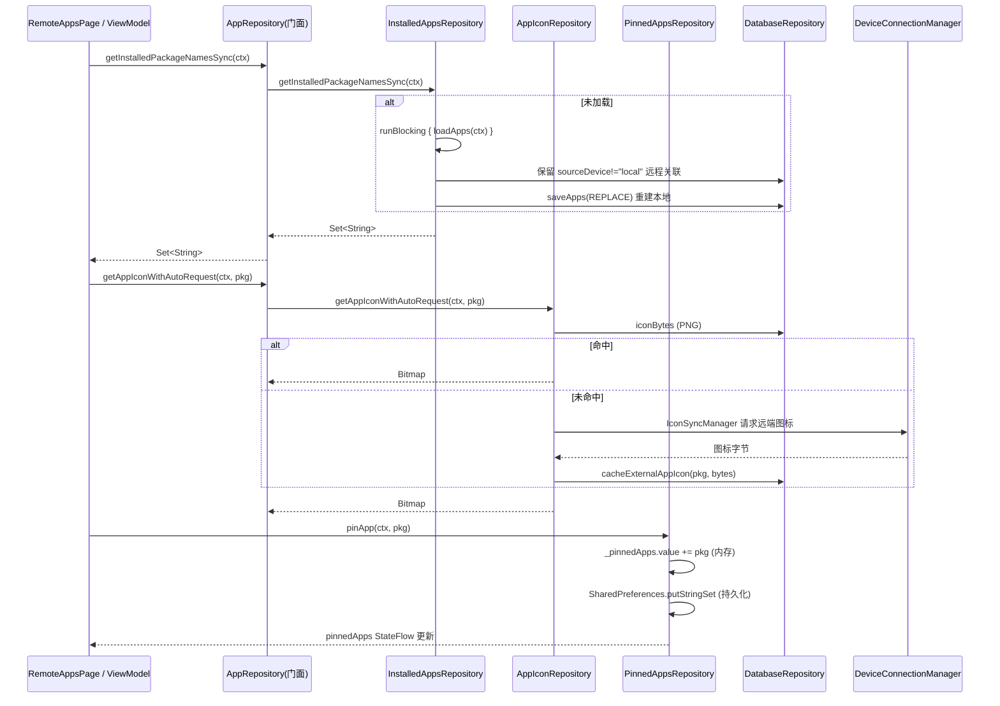

# 拆分计划：`AppRepository.kt`

- 分支：`refactor/split-app-repository`
- 工作树：`worktree/app-repository`
- 基线提交：`6bb837f`
- 目标文件：`app/src/main/java/com/xzyht/notifyrelay/feature/appslist/AppRepository.kt`

## 一、现状（已读文件核对）

| 项 | 值 |
|---|---|
| 实际行数 | 819 |
| 顶层声明 | 仅 `object AppRepository`（37-819），无 companion object |
| 同目录 | `AppListHelper.kt`、`IconCacheManager.kt` |

### 分区

| 行号 | 职责 | 主要成员 |
|---|---|---|
| 37-76 | 状态与初始化 | `TAG`(38)、`databaseRepository`(41)+`databaseRepositoryLock`(42)、`_isLoading`/`_apps`/`_remoteApps`/`_iconUpdates`(45-56)、`notifyIconUpdated`(62)、`initDatabaseRepository`(68, private) |
| 87-201 | 已安装应用加载 | `loadApps`(87, suspend) |
| 211-405 | 过滤与查询 | `getFilteredApps`(211)、`clearCache`(250)、`cacheRemoteAppList`(273)、`getInstalledAndCachedPackageNames`(334)、`isDataLoaded`(351)、`getAppLabel`(363)、`getInstalledPackageNames`(374)/`Async`(382)/`Sync`(397) |
| 415-588 | 图标加载与缓存 | `loadAppIcons`(415, private)、`getAppIconAsync`(477)、`cacheExternalAppIcon`(506)、`getExternalAppIcon`(573)、`getExternalAppIcons`(597) |
| 627-739 | 图标直取与自动请求 | `getAppIconFromPackageManager`(627, private)、`getAppIconWithAutoRequest`(703) |
| 741-818 | 置顶应用与远程列表 | `_pinnedApps`(741)/`pinnedApps`、`PREFS_NAME`/`KEY_PINNED_APPS_PREFIX`(744-745)、`loadPinnedApps`(747)、`pinApp`(759)、`unpinApp`(772)、`isAppPinned`(785)、`savePinnedApps`(790, private)、`getRemoteAppsList`(799) |

### 状态可见性

- 私有：`TAG`(38)、`databaseRepository`(41)、`databaseRepositoryLock`(42)、`_isLoading`/`_apps`/`_remoteApps`/`_iconUpdates`(45-56)、`_pinnedApps`(741)、`PREFS_NAME`/`KEY_PINNED_APPS_PREFIX`(744-745)
- 公开（UI 可访问）：`isLoading`、`apps`、`remoteApps`、`iconUpdates`、`pinnedApps` 及全部 public 方法

## 二、拆分步骤

### 步骤 1（低风险）：抽 `PinnedAppsRepository`
- 范围：`_pinnedApps`(741)/`pinnedApps`、`PREFS_NAME`(744)、`KEY_PINNED_APPS_PREFIX`(745)、`loadPinnedApps`(747)、`pinApp`(759)、`unpinApp`(772)、`isAppPinned`(785)、`savePinnedApps`(790)。
- 新建 `feature/appslist/PinnedAppsRepository.kt`，internal object。
- 依赖：`Context`（SharedPreferences）、`_pinnedApps` 的 `MutableStateFlow`。
- 风险：**低**。
  - 置顶状态**双写**：内存 StateFlow + SharedPreferences(`remote_apps_prefs`/`pinned_apps_`，751-796)，抽离后必须同时写两处，顺序不变。
  - `pinnedApps` 被 UI 观察（`RemoteAppsPage` 置顶分区），公开 StateFlow 引用不可替换（不能变成新 object 的新 flow 而让 UI 继续读旧的）——需确认 UI 读取点并同步改。

### 步骤 2（中风险）：抽 `AppIconRepository`
- 范围：`iconUpdates`/`_iconUpdates`(45-56 之一)、`loadAppIcons`(415, private)、`getAppIconAsync`(477)、`cacheExternalAppIcon`(506)、`getExternalAppIcon`(573)、`getExternalAppIcons`(597)、`getAppIconFromPackageManager`(627, private)、`getAppIconWithAutoRequest`(703)。
- 新建 `feature/appslist/AppIconRepository.kt`，internal object；持有 `databaseRepository` 引用（由 AppRepository 注入或用同样的懒加载锁）。
- 风险：**中**。
  - 图标统一以 **PNG 字节数组**存 `iconBytes`(140-141/492/584/613)，Bitmap↔ByteArray 互转依赖该格式，抽离后编解码逻辑必须原样搬。
  - `databaseRepository` 懒初始化用 `synchronized(databaseRepositoryLock)`(42, 69-74)，两个 object 若各自持有实例会破坏单例语义 —— 应让 `AppIconRepository` 从 `AppRepository` 取，或抽公共 `AppDatabaseHolder`。
  - `getAppIconWithAutoRequest`(703) 含「无图标时向远端请求」逻辑，跨模块依赖 `DeviceConnectionManager`/`DeviceInfo`/`IconSyncManager`，抽离后依赖注入面变大。
  - 同目录已有 `IconCacheManager.kt` —— **先读它**，确认图标缓存职责是否已存在重复实现（AGENTS.md 要求优先复用现有方法，避免重复实现）。

### 步骤 3（中风险）：抽 `InstalledAppsRepository`
- 范围：`_apps`(45-56 之一)、`_isLoading`、`loadApps`(87-201)、`getFilteredApps`(211)、`clearCache`(250)、`getInstalledAndCachedPackageNames`(334)、`isDataLoaded`(351)、`getAppLabel`(363)、`getInstalledPackageNames`(374)/`Async`(382)/`Sync`(397)。
- 风险：**中**。
  - `loadApps`(174-186) 必须先保留 `sourceDevice != "local"` 的远程关联再重建本地列表，因为 `saveApps` 用 `OnConflictStrategy.REPLACE` 会触发外键级联删除 —— **抽离时该顺序不可变**，否则远端应用关联丢失。
  - `getInstalledPackageNamesSync`(397) 含 `runBlocking { loadApps(context) }`(400-402) 阻塞回退，是从同步上下文（如 `BackendRemoteFilter.filterRemoteNotification`）调用的入口，**不可改为 suspend**。

### 步骤 4（可选）：`RemoteAppsCache`
- 范围：`_remoteApps`、`cacheRemoteAppList`(273)、`getRemoteAppsList`(799)。
- 风险：低，但与步骤 3 的 `getInstalledAndCachedPackageNames`(334) 有交叉（同时读本地+远端）。建议与步骤 3 一起做或都不做。

## 三、不建议动的部分

- `databaseRepository` + `databaseRepositoryLock` 的懒加载锁(41-42, 69-74)：若三个 object 各自持有一份会破坏单例与外键语义。**方案：抽 `AppDatabaseHolder` object 统一持有**，或保持全部方法在 `AppRepository` 内作为门面、子 object 只做纯逻辑。
- JSON/DB 契约：`AppEntity`/`AppDeviceEntity` 字段、`iconBytes` 的 PNG 格式、`sourceDevice` 取值（`"local"` vs uuid）。
- StateFlow 跨协程写入无统一同步（现状）：拆分时**不要顺手加同步**，属独立议题。

## 四、验收标准

1. 执行前 `./gradlew :app:assembleDebug` 记录基线错误/警告数。
2. 每步骤后 `./gradlew :app:compileDebugKotlin` 通过。
3. 完成后 `./gradlew :app:assembleDebug`，**无新增错误/警告**。
4. 行为冒烟：
   - 应用列表页本地/远程切换、搜索、图标显示（含外部图标自动请求）
   - 置顶应用：置顶后杀进程重进仍置顶（验证 SharedPreferences 双写）
   - 远端应用缓存：配对设备离线后仍显示缓存列表
5. `./gradlew ktlintFormat`（pre-commit 自动执行）。

## 五、时序（步骤 1+2 抽离后的调用链路）

## 六、备注

- 本文件是**重状态 + 数据库 + 并发**的仓库类，与 UI 类拆分（RemoteAppsPage 等）相比风险更高。建议先做步骤 1（收益明确、边界清晰），验证后再推进步骤 2/3。
- 拆分前**必须先读同目录 `IconCacheManager.kt` 与 `AppListHelper.kt`**，确认图标缓存职责归属，避免造出重复实现（AGENTS.md 明确要求）。
- 与 `refactor/split-remote-apps-page`（UI 侧读 `pinnedApps`/`iconUpdates`）、`refactor/split-backend-remote-filter`（调 `getInstalledPackageNamesSync`）存在交叉，合并时注意冲突。
