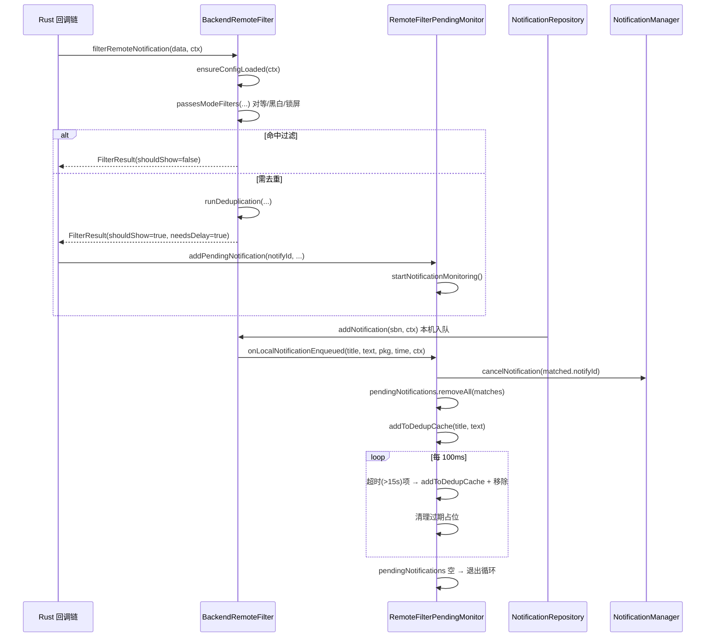

# 拆分计划：`BackendRemoteFilter.kt`

- 分支：`refactor/split-backend-remote-filter`
- 工作树：`worktree/backend-remote-filter`
- 基线提交：`6bb837f`
- 目标文件：`app/src/main/java/com/xzyht/notifyrelay/feature/notification/filter/BackendRemoteFilter.kt`

## 一、现状（已读文件核对）

| 项 | 值 |
|---|---|
| 实际行数 | 912 |
| 顶层声明 | 两个 object：`BackendRemoteFilter`(36-512)、`RemoteFilterConfig`(519-912) |
| 同目录 | `BackendLocalFilter.kt` |

### 分区

| 行号 | 职责 | 主要成员 |
|---|---|---|
| 36-88 | 状态与数据类 | `rustContext: Pointer?`(38, public)、`scope`(41)、`dedupCache`(44)、`pendingNotifications`(47)、`pendingPlaceholders`(50)、`Placeholder`(52)、`PendingNotification`(60) |
| 90-238 | 过滤主流程 | `FilterResult`(81)、`filterRemoteNotification`(97-238) |
| 243-273 | 去重工具 | `checkDuplicateInMemory`(243)、`normalizeTitle`(270) |
| 278-341 | 占位队列 | `addToDedupCache`(278)、`addPlaceholder`(290)、`removePlaceholderMatching`(307)、`isPlaceholderPresent`(328) |
| 348-435 | 被动撤回 | `onLocalNotificationEnqueued`(348)、`addPendingNotification`(408) |
| 440-498 | 撤回与监控 | `cancelNotification`(440)、`startNotificationMonitoring`(456) |
| 503-511 | 可靠性探测 | `checkHistorySyncReliability`(503) — **空壳，恒返回 true** |
| 519-912 | 配置 object | `RemoteFilterConfig`，含 `load`/`save`/`syncToRust`/黑白名单 CRUD/`buildRustConfigJson` |

## 二、拆分步骤（按风险递增）

### 步骤 1（零风险）：`RemoteFilterConfig` 独立成文件
- 新建 `feature/notification/filter/RemoteFilterConfig.kt`，整体搬移 519-912。
- 影响：`BackendRemoteFilter` 内引用点 102/103/105/106/109/125/128/135/137/144/150/159/160/165/296/355/416 无需改（同包同名 object）。
- 外部引用：`NotificationData.kt:293`（`RemoteFilterConfig.enableDeduplication`）、`NotificationHistory.kt:133/152`（`mapToLocalPackage`）—— 包名 object 名不变，**无需改 import**。
- 风险：**无**。纯搬移，同一 module 同 package。

### 步骤 2（低风险）：删除 `checkHistorySyncReliability`（503-511）
- 现状：`try { return true } catch { return false }`，永远返回 true，调用点 190 结果未使用（`checkHistorySyncReliability()` 返回值被丢弃）。
- 做法：删除方法与调用行 190-191，连同注释 192-193 中已失效的 `notifyHistoryChanged` 引用说明一并清理。
- 前提：确认无其他调用点（计划执行时全局搜索一次）。
- 风险：**低**。但属于行为无关的死代码删除，若保守可保留。

### 步骤 3（低风险）：抽 `RemoteFilterDedupCache`
- 范围：`dedupCache`(44) + `addToDedupCache`(278) + `normalizeTitle`(270) 中的缓存部分。
- 做法：新文件 `filter/RemoteFilterDedupCache.kt`，internal object 持有 `mutableListOf<Triple<...>>` 与 `add`/`containsRecent`/`clear`。
- 风险：**低**。但 `normalizeTitle` 同时被 `removePlaceholderMatching`(312)、`isPlaceholderPresent`(334)、`onLocalNotificationEnqueued`(356) 使用，需一并外提为 internal 顶层函数（`filter/FilterTextNormalizer.kt`）或保留副本。

### 步骤 4（中风险）：抽 `RemoteFilterPlaceholderQueue`
- 范围：`pendingPlaceholders`(50) + `addPlaceholder`(290) + `removePlaceholderMatching`(307) + `isPlaceholderPresent`(328) + `onLocalNotificationEnqueued`(348) 中的占位处理段（359-377）。
- 依赖：`addToDedupCache`(371)、`normalizeTitle`。
- 风险：**中**。`onLocalNotificationEnqueued` 是跨模块调用入口（由 `NotificationData.kt:295` 调用），改动需保证签名 `(String?, String?, String, Long, Context)` 不变。

### 步骤 5（中风险）：抽 `RemoteFilterPendingMonitor`
- 范围：`pendingNotifications`(47) + `PendingNotification`(60) + `addPendingNotification`(408) + `cancelNotification`(440) + `startNotificationMonitoring`(456)。
- 依赖：`addToDedupCache`(477)、`normalizeTitle`(383)、`scope`(41)、`DeveloperModeActivity.DEBUG_UI_ENABLED`(385)。
- 风险：**中**。监控协程（456-498）是 `while(true) + delay(100ms)` 的常驻循环，生命周期由 `pendingNotifications` 空/非空驱动；抽离后必须保持「空则退出、非空则重入」语义，且 `clearPending`(72) 需同步清三个队列。

### 步骤 6（中高风险，可选）：拆分 `filterRemoteNotification`（97-238）
- 现状：142 行单函数，含 5 个 return 分支（对等模式 128、黑白名单 136、锁屏 144、去重 150、兜底 233）。
- 拆分点：
  - 配置懒加载段（102-116）→ `ensureConfigLoaded(context)` 
  - 对等/黑白名单/锁屏三段（128-147）→ `passesModeFilters(...)` 返回 `FilterResult?`（null 表示继续）
  - 去重段（150-224）→ `runDeduplication(...)`
- 风险：**中高**。`needsDelay` 语义（217/221）与锁屏分支（211-214）耦合：锁屏时返回 `shouldShow=false, needsDelay=false`，非锁屏返回 `shouldShow=true, needsDelay=true`，这是与 `DeviceConnectionManager` 的隐式契约（注释 209-210 说明），拆分时必须逐字保留。

## 三、不建议动的部分

- `buildRustConfigJson`(824-892)：与 Rust `nrc_set_filter_config` 的 JSON 契约（`groupName`/`packages`/`groupEnabled`/`filterMode` 数值 0/1/2/`filterList`/`enablePeerMode`/`installedPackages`），改名会静默破坏过滤。**只搬移，不重构**。
- `saveLock`(530) + `save`(641)：Mutex 串行化是为解决「后触发者先完成」竞态（注释 524-529），抽离时锁必须跟随 object 单例。
- `loadBlocking`(594) / `saveBlocking`(669)：`runBlocking` 是同步入口兜底，注释明确「无法挂起」场景，不能改 suspend。

## 四、验收标准

1. 执行前 `./gradlew :app:assembleDebug` 记录基线错误/警告数。
2. 每步骤后编译通过。
3. 全部完成后 `./gradlew :app:assembleDebug`，**无新增错误/警告**。
4. 契约不变：`FilterResult` 字段顺序与默认值、`filterRemoteNotification` 的 5 个分支返回语义、`onLocalNotificationEnqueued` 签名、`RemoteFilterConfig` 全部 public 成员名。
5. `./gradlew ktlintFormat`（pre-commit 自动执行）。

## 五、时序（步骤 5 抽离后的撤回流程）

## 六、备注

- 步骤 1 是**零风险验证项**，建议先做以验证 worktree + 构建流程可用。
- 注释 192-193、196 提到「references a non-existent method/class」，是历史遗留注释，清理时可一并处理（属文档性改动，不改行为）。

---

## 七、实际执行记录（合并前审查回写）

本节由合并前独立审查补写，用于区分「有意偏离」与「漏做」。原计划正文未改。

### 已完成
- 步骤 1~6 全部完成，含 §二 标注「中高风险、可选」的步骤 6（拆分 `filterRemoteNotification`）。
- 步骤 1 `RemoteFilterConfig` 为纯搬移，与基线逐行一致。
- 步骤 2 删除 `checkHistorySyncReliability` 前已全局 grep 确认无外部引用。

### 实际偏离（**需决策**）
- `BackendRemoteFilter.kt:221-222`：命中 10 秒缓存的分支**新增**了 `toCancel.forEach { dedupCache.add(...) }`。基线该分支只撤回、不写去重缓存。此改动会刷新去重窗口并可能堆积重复项，**属计划未声明的行为改动**。若要求严格零行为变更，应回退该行；若为有意修正，应在此处注明理由。

### 审查发现（遗留，未处理）
- `BackendRemoteFilter.kt:105-108` 第二处 `enableLockScreenOnly && !isLocked` 恒为 `false`，是不可达死分支（基线遗留）。
