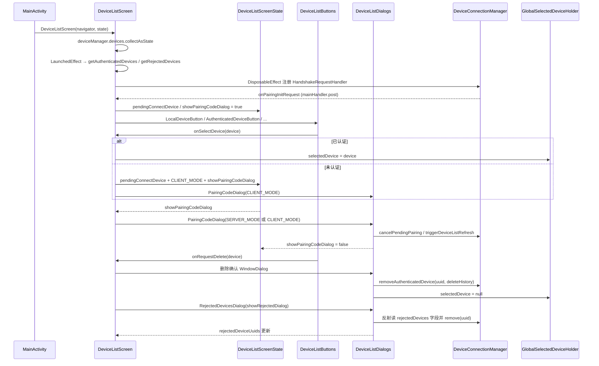

# 拆分计划：`DeviceListScreen.kt`

- 分支：`refactor/split-device-list-screen`
- 工作树：`worktree/device-list-screen`
- 基线提交：`6bb837f`
- 目标文件：`app/src/main/java/com/xzyht/notifyrelay/ui/screen/DeviceListScreen.kt`

## 一、现状（已读文件核对）

| 项 | 值 |
|---|---|
| 实际行数 | 657 |
| 顶层声明 | `GlobalSelectedDeviceHolder`(72-92, public object)、`DeviceListScreenState`(98-123, public class)、`DeviceListScreen`(130-657, public Composable) |
| **局部 Composable** | `DiscoverySwitch`(232)、`LocalDeviceButton`(253)、`AuthenticatedDeviceButton`(306)、`UnauthenticatedDeviceButton`(410)、`RejectedDevicesButton`(431) —— 全部声明在 `DeviceListScreen` 函数体内 |
| 调用方 | `MainActivity.kt:586`（横屏左栏）、`MainActivity.kt:611`（竖屏顶栏） |

### 分区

| 行号 | 职责 | 成员 |
|---|---|---|
| 69-92 | 全局选中状态 | `GlobalSelectedDeviceHolder`：私有 `_selectedDevice`(73)、public `selectedDevice`(74)、`@Composable current()`(83-91) |
| 94-123 | 弹窗状态持有 | `DeviceListScreenState`：`pendingConnectDevice`(99)、`showRejectedDialog`(101)、`showPairingCodeDialog`(103)、`pairingCodeDialogMode`(105)、`serverPairingCode`(107)、`hasAnyDialogShowing()`(113)、`dismissAllDialogs()`(118) |
| 130-230 | 屏幕状态与派生 | `authedDeviceUuids`(141)、`rejectedDeviceUuids`(142)、`discoveryEnabled`(143)、`deviceMap`(145)、`selectedDevice`(148)、`showDeleteHistoryDialog`(149)、`pendingDeleteDevice`(150)、`findOtherUuidsWithSameIp`(172)、`LaunchedEffect`(181)、`DisposableEffect`(189-209)、`onSelectDevice`(216) |
| 232-449 | 五个局部设备按钮 | `DiscoverySwitch`(232)、`LocalDeviceButton`(253)、`AuthenticatedDeviceButton`(306)、`UnauthenticatedDeviceButton`(410)、`RejectedDevicesButton`(431) |
| 451-502 | 横竖屏两套布局 | 竖屏 `Column`(451-475)、横屏 `LazyRow`(476-502) |
| 504-553 | 配对码对话框 | SERVER_MODE(505-527)、CLIENT_MODE(530-553) 两次 `PairingCodeDialog` |
| 555-578 | 已拒绝设备对话框 | `RejectedDevicesDialog`(557) |
| 580-656 | 删除设备确认对话框 | `WindowDialog`(584-655) |

## 二、拆分步骤

### 步骤 1（零风险）：`GlobalSelectedDeviceHolder` 与 `DeviceListScreenState` 独立成文件
- 新建 `ui/screen/devicelist/GlobalSelectedDeviceHolder.kt`、`ui/screen/devicelist/DeviceListScreenState.kt`。
- 风险：**无**。
  - `GlobalSelectedDeviceHolder` 被 `NotificationHistory.kt:242` 读取，包名不变则无需改调用方。
  - `DeviceListScreenState` 被 `MainActivity.kt:80/475` 引用，同理。
  - `current()`(83-91) 里 `rememberUpdatedState(_selectedDevice)`(85) 返回值**未被使用**（随后 `return remember { object : State ... }`），是疑似无效代码 —— 可单独确认后清理，但属行为相关，**建议先只搬移，不删**。

### 步骤 2（低风险）：五个局部按钮提为顶层
- 范围：`DiscoverySwitch`(232-251)、`LocalDeviceButton`(253-304)、`AuthenticatedDeviceButton`(306-408)、`UnauthenticatedDeviceButton`(410-429)、`RejectedDevicesButton`(431-449)。
- 新建 `ui/screen/devicelist/DeviceListButtons.kt`。
- 闭包自由变量需显式化为参数：
  - `discoveryEnabled`(143) / `onDiscoveryChange`
  - `localBatteryLevel`(152)
  - `isLandscape`(212)、`buttonMinHeight`(230)
  - `selectedDevice`(148)、`onSelectDevice`(216)
  - `deviceStates`(147)、`colorScheme`(136)、`textStyles`(137)
  - `onRequestDelete: (DeviceInfo) -> Unit`（原内部写 `pendingDeleteDevice`/`showDeleteHistoryDialog`）
  - `state.showRejectedDialog` 写入（434）
- 风险：**低**。
  - `AuthenticatedDeviceButton`(306) 内两处 `LaunchedEffect`(314/322) 从 `device.batteryLevel` 推导电量显示，抽离后 key 不变。
  - `LocalDeviceButton`(253) 内 `remember { mutableStateOf(BatteryUtils.isCharging(context)) }`(257-259) 只算一次，抽离后同样只算一次。
  - `buttonMinHeight = 44.dp`(230) 与横竖屏判定(212) 需作为参数传入，或提取为文件级常量。

### 步骤 3（低风险）：四个对话框块 → `ui/screen/devicelist/DeviceListDialogs.kt`
- 范围：配对码对话框(504-553)、已拒绝设备对话框(555-578)、删除确认对话框(580-656)。
- 风险：**低**，但有两处需注意：
  - **反射访问私有字段**：`deviceManager.javaClass.getDeclaredField("rejectedDevices")`(561-571)，设 `isAccessible=true` 后直接改 MutableSet —— 这是侵入 `DeviceConnectionManager` 私有结构的脆弱点。抽离时**保留原样**，改进需与 `refactor/split-device-connection-manager` 分支协调（暴露 internal 方法）。
  - 删除确认对话框(580-656) 内两个 `TextButton` 的回调**几乎完全重复**（608-629 与 630-651，仅 `deleteHistory` 参数不同），可合并为一个带参数的私有函数（低风险优化，可选）。

### 步骤 4（中风险）：拆分 `DeviceListScreen` 主函数（130-657）
- 拆为：
  - `DeviceListScreenContent`（布局编排 451-502 + 五个按钮调用）
  - 主函数保留状态 derivation(135-230) 与副作用(181-209)
- 风险：**中**。`DisposableEffect(deviceManager)`(189-209) 注册 `HandshakeRequestHandler` 并在 `onDispose`(204-208) 用 `===` 判断后注销 —— 该副作用必须留在 `DeviceListScreen` 或明确移入状态类，注销语义不可丢。

## 三、不建议动的部分

- `GlobalSelectedDeviceHolder.current()`(83-91) 的 `rememberUpdatedState` 未使用返回值：疑似无效但可能是有意为之（触发重组），**只搬移不改**。
- 反射读 `rejectedDevices`(561-571)：跨分支改进项，本分支保留。
- `findOtherUuidsWithSameIp`(172-179) 是函数内局部函数，被 `RejectedDevicesDialog` 的 `onRestoreDevice`(567) 使用 —— 步骤 3 抽离时需一并作为参数传入。

## 四、验收标准

1. 执行前 `./gradlew :app:assembleDebug` 记录基线。
2. 每步骤后 `./gradlew :app:compileDebugKotlin` 通过。
3. 完成后 `./gradlew :app:assembleDebug`，**无新增错误/警告**。
4. 真机冒烟：
   - 设备列表显示（本机 + 已认证 + 未认证 + 已拒绝），横竖屏切换
   - 电量/充电图标显示与刷新
   - 「显示未认证设备」开关
   - 点击未认证设备 → 客户端配对码对话框；收到配对请求 → 服务端配对码对话框
   - 已拒绝设备 → 查看并恢复
   - 选中设备 → 删除按钮 → 「仅删除设备」/「删除并清除历史」
   - 全局选中状态在切到历史页后仍保持
5. `./gradlew ktlintFormat`（pre-commit 自动执行）。

## 五、时序（步骤 2+3 抽离后的交互链路）

## 六、备注

- 本文件是**状态持有 + 局部 Composable + 对话框**三合一，拆分收益明确（5 个局部组件 + 4 个对话框块），风险低于服务类文件。
- 与 `refactor/split-main-activity`（`DeviceListScreenState` 与 `DeviceListScreen` 调用方）强交叉 —— **建议两个分支串行合并**，或先合本分支再合 main-activity。
- 反射 `rejectedDevices`(561-571) 与 `refactor/split-device-connection-manager` 交叉，合并时优先采用暴露 internal 方法的版本。
