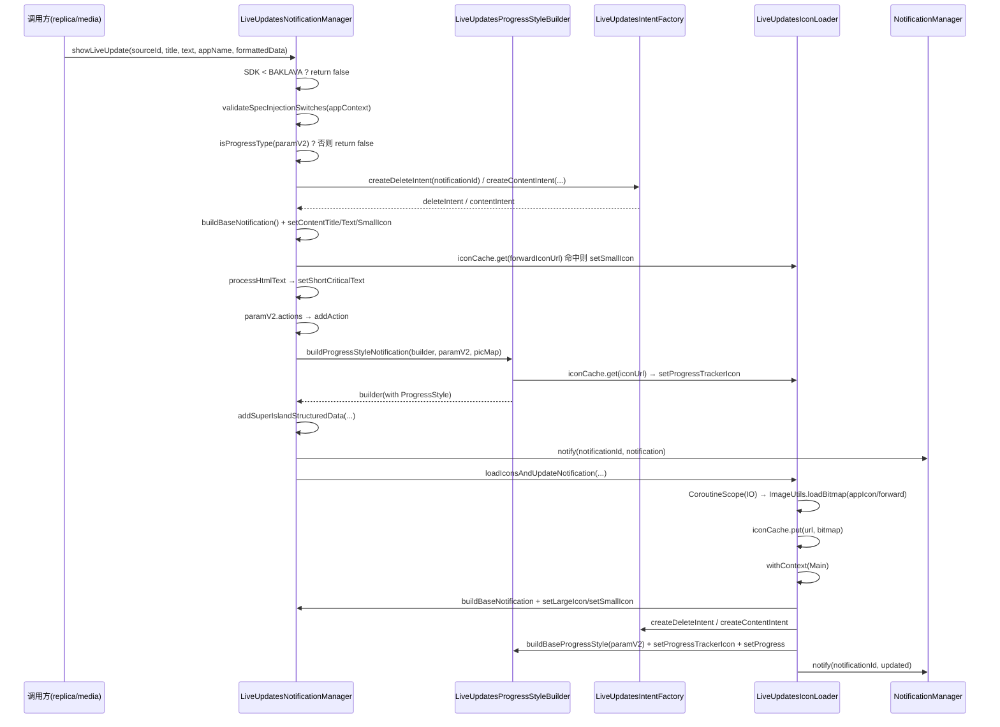

# 拆分计划：`LiveUpdatesNotificationManager.kt`

- 分支：`refactor/split-live-updates-notification-manager`
- 工作树：`worktree/live-updates-notification-manager`
- 基线提交：`6bb837f`
- 目标文件：`app/src/main/java/com/xzyht/notifyrelay/feature/notification/superisland/notification/LiveUpdatesNotificationManager.kt`

## 一、现状（已读文件核对）

| 项 | 值 |
|---|---|
| 实际行数 | 879 |
| 顶层声明 | 仅 `object LiveUpdatesNotificationManager`（31-879） |
| 对外接口 | `const val CHANNEL_ID`(33, **public const**)、`clearIconCache`(70)、`initialize`(74)、`showLiveUpdate`(94)、`cancelLiveUpdate`(778)、`dismissLiveUpdateNotification`(804)、`canUseLiveUpdates`(812) |

### 分区

| 行号 | 职责 | 成员 |
|---|---|---|
| 31-92 | 状态与初始化 | `TAG`(32)、`CHANNEL_ID`(33)、`CHANNEL_NAME`(34)、`NOTIFICATION_BASE_ID=10000`(35)、`ICON_CACHE_SIZE=10`(36)、`notificationManager`(52 lateinit)、`appContext`(53 lateinit)、`iconCache`(56-65 LruCache)、`clearIconCache`(70)、`initialize`(74)、`createNotificationChannel`(84) |
| 94-282 | 主入口 | `showLiveUpdate`(94-282)：版本门控(102)、开关校验(108)、进度类型判定(128)、intents(140-164)、基础 builder(167)、前进图标选取(181-207)、shortText(211-226)、action 按钮(229-244)、进度样式(249)、结构化数据(252)、hasPromotable 校验(257-268)、notify(271)、异步图标(275) |
| 287-422 | 异步图标加载 | `loadIconsAndUpdateNotification`(287)、`loadProgressStyleIcons`(311-422) |
| 427-545 | 主线程更新 | `updateNotificationWithAllIcons`(427-545) |
| 550-707 | 进度样式构建 | `buildProgressStyleNotification`(550-707)，含 `setProgress` 回退(701-705) |
| 712-761 | BAKLAVA 基础样式 | `buildBaseProgressStyle`(712-761) |
| 763-776 | 基础通知 | `buildBaseNotification`(763) |
| 778-847 | 取消与能力检查 | `cancelLiveUpdate`(778)、`dismissLiveUpdateNotification`(804)、`canUseLiveUpdates`(812，反射 828) |
| 852-878 | 辅助 | `processHtmlText`(852)、`addSuperIslandStructuredData`(861) |

## 二、拆分步骤

### 步骤 1（低风险）：抽 `LiveUpdatesProgressStyleBuilder`
- 范围：`buildProgressStyleNotification`(550-707) + `buildBaseProgressStyle`(712-761)。
- 新建 `notification/LiveUpdatesProgressStyleBuilder.kt`，internal object。
- 依赖：`processHtmlText`(574/690)、`iconCache`(657)、`pointColor`/`segmentColor` 解析(586-591)。
- 风险：**低**。
  - 两函数高度重复（550-707 与 712-761 都在算 nodeCount/segmentCount/pointColor，区别仅节点位置是否避开 0%/100%），抽离时**不要合并**，两者语义不同（711-761 是 BAKLAVA 专属 `@RequiresApi` 路径）。
  - 回退分支（679-706）在 ProgressStyle 异常时改走 `setProgress(100, cur, false)`，必须保留。

### 步骤 2（低风险）：抽 `LiveUpdatesIconLoader`
- 范围：`iconCache`(56-65) + `clearIconCache`(70) + `loadIconsAndUpdateNotification`(287) + `loadProgressStyleIcons`(311-422) + `updateNotificationWithAllIcons`(427-545)。
- 新建 `notification/LiveUpdatesIconLoader.kt`，internal object。
- 依赖：`appContext`(370/394)、`notificationManager`(539)、`processHtmlText`(444/464)、`SuperIslandConfigUtils`(478-479)、`buildBaseNotification`(436)、`buildBaseProgressStyle`(521)。
- 风险：**中**。
  - 线程切换：`CoroutineScope(Dispatchers.IO).launch`(297) → `withContext(Dispatchers.Main)`(413) 更新通知，抽离后必须保持。
  - `iconCache` 为共享可变 LruCache(上限 10)，并发读写需同样保证（原代码在 Main 线程写 377/401，IO 线程读 201/657 —— 现状本身即有跨线程访问，抽离时不要"顺手改成线程安全"而改变行为，如需改应单独评估）。
  - `updateNotificationWithAllIcons` 重复计算 `processHtmlText`(444 与 463-467 两次)，可合并为一次（低风险优化，可选）。

### 步骤 3（中风险）：抽 intent 构造为 `LiveUpdatesIntentFactory`
- 范围：`showLiveUpdate` 内 140-164（deleteIntent + contentIntent）与 `updateNotificationWithAllIcons` 内 483-505（同逻辑重复）。
- 新建 `notification/LiveUpdatesIntentFactory.kt`。
- 风险：**低**。纯构造，action 字符串 `"com.xzyht.notifyrelay.ACTION_TOGGLE_FLOATING"`(159/500) 须与 `NotificationBroadcastReceiver` 一致。
- 收益：消除 140-164 与 483-505 的重复（约 45 行）。

### 步骤 4（中风险）：拆分 `showLiveUpdate`（94-282，189 行）
- 拆为：
  - `resolveNotificationId(sourceId, override)`(116)
  - `checkEligibility()`：版本门控(102) + 开关校验(108) + 进度类型(128)
  - `buildInitialNotification(...)`：基础 builder(167) + 图标(181-207) + shortText(211-226) + actions(229-244) + 进度样式(249) + 结构化数据(252)
  - `postNotification(...)`：hasPromotable 校验(257-268) + notify(271) + 异步图标(275)
- 风险：**中**。`hasPromotableCharacteristics()` 校验(258) 只记日志不影响流程，拆分时不要误改为提前 return。

### 步骤 5（可选）：`canUseLiveUpdates`(812-847) 的反射
- 现状：反射调用 `notificationManager.canPostPromotedNotifications()`(828)，带 5 个 catch 分支。
- 做法：保留（跨 ROM 兼容必需），可考虑改用 `Build.VERSION.SDK_INT >= BAKLAVA` 后的直接调用 + try/catch 兜底，但 minSdk=31 且 BAKLAVA=36，需编译期 API 可用性确认。
- 风险：**中高**，且收益低。**建议保留现状**。

## 三、不建议动的部分

- `CHANNEL_ID = "super_island_replica"`(33)：与 `NotificationGenerator.NOTIFICATION_CHANNEL_ID`(67，字面量相同) 及监听服务 134 行字符串比较三方一致。**若要提取共享常量，必须另开分支并全量验证**。
- `NOTIFICATION_BASE_ID = 10000`(35)：与 `NotificationGenerator` 的 20000 刻意错开避免通知 ID 冲突，**不可改**。
- `@RequiresApi(Build.VERSION_CODES.BAKLAVA)` 门控（75/102/520/712/779/805/814）：全部保留。
- `lateinit` 初始化守卫：`::notificationManager.isInitialized`(785/820)、`::appContext.isInitialized`(788)。

## 四、验收标准

1. 执行前 `./gradlew :app:assembleDebug` 记录基线。
2. 每步骤后 `./gradlew :app:compileDebugKotlin` 通过。
3. 完成后 `./gradlew :app:assembleDebug`，**无新增错误/警告**。
4. 真机冒烟（需 API 36+ / BAKLAVA 设备）：进度类超级岛通知的首次展示、图标异步加载后的二次更新、取消通知、`canUseLiveUpdates` 返回值。
5. `./gradlew ktlintFormat`（pre-commit 自动执行）。

## 五、时序（步骤 2+3 抽离后的展示流程）

## 六、备注

- 本文件与 `NotificationGenerator` 共享通道、共享 `SuperIslandStructuredDataHelper`、共享 `SuperIslandConfigUtils`，两者若并行拆分，注意 `Docs/文件用途基础说明.md` 同步更新。
- 步骤 2 中的 `iconCache` 跨线程访问（IO 读 / Main 写）是既有问题，拆分时**不要顺带改**，应另开议题评估。
