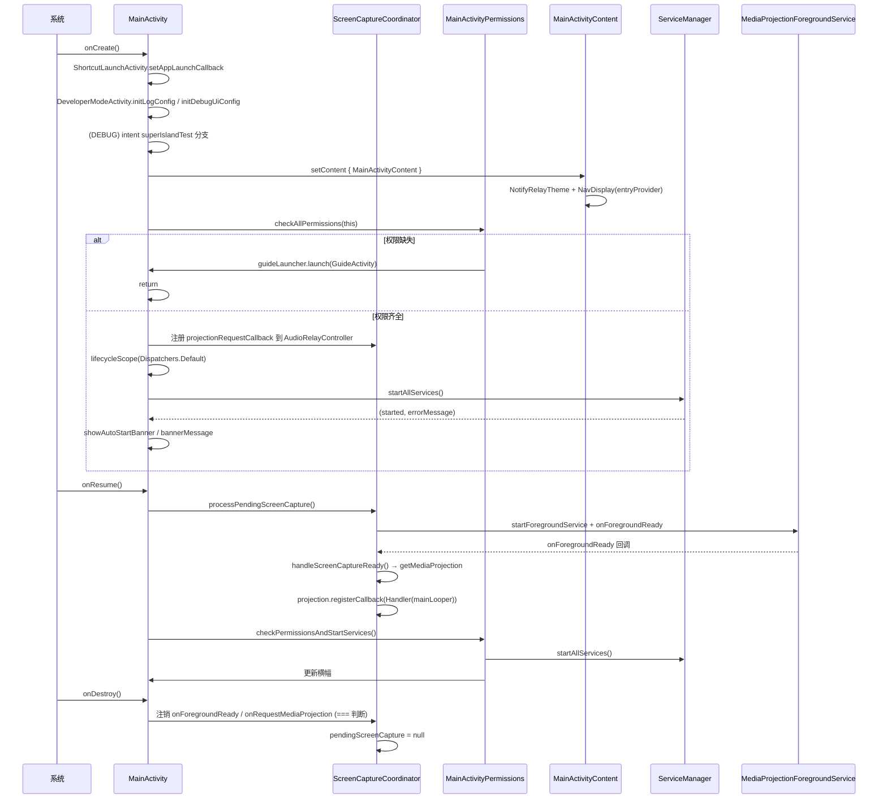

# 拆分计划：`MainActivity.kt`

- 分支：`refactor/split-main-activity`
- 工作树：`worktree/main-activity`
- 基线提交：`6bb837f`
- 目标文件：`app/src/main/java/com/xzyht/notifyrelay/ui/activity/MainActivity.kt`

## 一、现状（已读文件核对）

| 项 | 值 |
|---|---|
| 实际行数 | 674 |
| 顶层声明 | `class MainActivity : FragmentActivity()`(115-458)、`MainScreen`(460-630, public Composable)、`MainScreenBackHandler`(632-674, private Composable) |
| 同目录 | `ClipboardSyncActivity.kt`、`DeveloperModeActivity.kt`、`GuideActivity.kt` |

### 分区

| 行号 | 职责 | 成员 |
|---|---|---|
| 115-125 | Activity 状态 + companion | `showAutoStartBanner`(116, internal)、`bannerMessage`(117, internal)、`EXTRA_SUPER_ISLAND_TEST`(121)、`EXTRA_SUPER_ISLAND_TEST_VARIABLE`(124) |
| 127-191 | 屏幕捕获生命周期 | `pendingScreenCapture`(128)、`registeredOnForegroundReady`(129)、`registeredOnRequestMediaProjection`(130)、`processPendingScreenCapture`(132)、`handleScreenCaptureReady`(145)、`bringMainActivityToFront`(182) |
| 193-241 | 权限与服务启动 | `checkPermissionsAndStartServices`(193)、`onResume`(234) |
| 243-285 | 销毁与启动器 | `onDestroy`(243)、`guideLauncher`(256)、`screenCaptureLauncher`(261)、`recordAudioPermissionLauncher`(273)、`launchScreenCapture`(282) |
| 287-438 | `onCreate` | 151 行：快捷启动回调(290-300)、日志/调试初始化(302-303)、intent 调试入口(309-318)、前台检测(320)、窗口设置(322-323)、`setContent`(325-404)、权限检查(406-412)、投影回调注册(414-427)、后台初始化(430-437) |
| 440-457 | 服务启动与横幅 | `startServicesAndUpdateBanner`(440) |
| 460-630 | `MainScreen` Composable | 171 行：主题色、横屏判定、Activity 引用、Pager 状态、返回处理(485)、Scaffold + 顶栏横幅(490-525) + 底栏(526-568) + 横竖屏两套布局(570-627) |
| 632-674 | `MainScreenBackHandler` | 43 行：NavigationEvent 返回处理 |

## 二、拆分步骤

### 步骤 1（低风险）：`MainScreen` + `MainScreenBackHandler` → `ui/screen/MainScreen.kt`
- 范围：460-674（215 行）。
- 新建 `ui/screen/MainScreen.kt`（`ui/screen/` 已有 `DeviceListScreen`、`HistoryScreen`、`SettingsScreen` 等，符合现有分包）。
- 依赖：`LocalActivity.current as? MainActivity`(470/639) 读 `showAutoStartBanner`/`bannerMessage`（internal）、`Route`、`Navigator`、`DeviceListScreenState`、`HorizontalPager`。
- 风险：**低**。
  - `MainScreen` 是 public（被 `onCreate` 的 `entry<Route.Main>`(376) 调用），跨文件后需 import。
  - `MainScreenBackHandler` 是 private，改 internal 或放同文件保持 private。

### 步骤 2（中风险）：抽 `ScreenCaptureCoordinator`
- 范围：`pendingScreenCapture`(128)、`registeredOnForegroundReady`(129)、`registeredOnRequestMediaProjection`(130)、`processPendingScreenCapture`(132)、`handleScreenCaptureReady`(145)、`launchScreenCapture`(282)、`screenCaptureLauncher`(261)、`recordAudioPermissionLauncher`(273)、`projectionRequestCallback`(414-427)。
- 新建 `ui/activity/ScreenCaptureCoordinator.kt`，持有 Activity 引用与三个 launcher。
- 风险：**中**。
  - 三个 `registerForActivityResult` 必须在 Activity **创建前**（字段初始化期）注册，不能在 `onCreate` 里 —— 抽离为独立类后仍需在 Activity 字段位置初始化。
  - `handleScreenCaptureReady`(145-180) 内 `MediaProjection.Callback.onStop`(157-168) 用 `===` 判断当前投影(161)，避免误杀新会话，逻辑不可改。
  - 与 `MediaProjectionForegroundService.onForegroundReady`(137/245) 和 `AudioRelayController.onRequestMediaProjection`(427/249) 的静态回调注册/注销配对，`onDestroy`(243-254) 的 `===` 判断必须保留。
  - `Handler(Looper.getMainLooper()).post`(415) + `lifecycle.currentState.isAtLeast(STARTED)`(416) 守卫需保留。

### 步骤 3（中风险）：抽 `MainActivityPermissions`
- 范围：`checkPermissionsAndStartServices`(193-232)、`startServicesAndUpdateBanner`(440-457)、`guideLauncher`(256)、权限检查(406-412)。
- 新建 `ui/activity/MainActivityPermissions.kt`。
- 风险：**中**。
  - 两处横幅文案重复（229 与 454 同一字符串），可提取常量（低风险优化）。
  - `checkPermissionsAndStartServices`(193) 与 `startServicesAndUpdateBanner`(440) 职责重叠（都调 `ServiceManager.startAllServices`），前者在 `onResume`(239)，后者在 `onCreate`(436) —— **合并前必须确认两处调用时序差异是否是有意为之**（onResume 每次回前台重查权限，onCreate 只启动服务）。

### 步骤 4（低风险）：`onCreate` 内主题与导航块 → `ui/activity/MainActivityContent.kt`
- 范围：`setContent`(325-404) 内的 `NotifyRelayTheme` + `NavDisplay` entryProvider(374-399)。
- 抽为 `MainActivityContent(navigator)` 或把 entryProvider 抽为 `ui/navigation/AppEntries.kt`（`ui/navigation/` 已有 `Navigator.kt`、`Route.kt`）。
- 风险：**低**。纯声明式搬移。
- 收益：`onCreate` 从 151 行降到约 80 行。

### 步骤 5（可选）：调试入口抽为 `SuperIslandTestLauncher`
- 范围：309-318 的 intent 调试分支 + companion 两个 EXTRA 常量(121/124)。
- 风险：**低**。仅在 `BuildConfig.DEBUG` 下生效，注释 305-308 已说明 adb 用法。

## 三、不建议动的部分

- `ShortcutLaunchActivity.setAppLaunchCallback`(290-300)：静态回调，APK 快捷方式入口，签名不可改。
- `onDestroy`(243-254) 的 `===` 引用比较（245/249）：防止注销掉别人注册的回调，逻辑敏感。
- `lifecycleScope.launch(Dispatchers.Default)`(238/430) 的两处后台初始化：时序敏感，`DeviceInfoManager.generateDeviceInfoFile` → `LiveUpdatesNotificationManager.initialize` → `NotificationRepository.init` → `AppRepository.loadApps` 顺序(431-435) 不可随意调整。
- `MainScreenBackHandler` 的 `NavigationEventInfo.None`(651) 与 `NavigationBackHandler`：属于 Navigation3/NavigationEvent 约定（AGENTS.md 要求），不可替换为旧 `BackHandler`。

## 四、验收标准

1. 执行前 `./gradlew :app:assembleDebug` 记录基线。
2. 每步骤后 `./gradlew :app:compileDebugKotlin` 通过。
3. 完成后 `./gradlew :app:assembleDebug`，**无新增错误/警告**。
4. 真机冒烟：
   - 冷启动 → 权限齐全时直接进主界面；权限缺失 → 跳引导页
   - 主界面三 tab 切换（历史/设备互联与增强/设置）+ 横竖屏切换
   - 返回键：非首页 tab 回首页 → 再按一次退出（Toast 提示）
   - 屏幕捕获授权流程（录音权限 → 投影授权 → 前台服务启动）
   - 自启动失败横幅显示 + 「前往设置」跳转
   - adb 调试：`am start --es superIslandTest multi_progress_with_icons`（debug 包）
5. `./gradlew ktlintFormat`（pre-commit 自动执行）。

## 五、时序（步骤 2+3 抽离后的启动流程）

## 六、备注

- 步骤 1 收益最大且风险最低（215 行 UI 搬移），建议先做。
- 步骤 2 涉及 Activity 结果启动器的注册时机，**必须保持字段初始化顺序**，是本计划中风险最高的一步，建议单独提交并重点验证屏幕捕获流程。
- 与 `refactor/split-device-connection-manager`（`AudioRelayController.onRequestMediaProjection`）存在交叉。

---

## 七、实际执行记录（合并前审查回写）

本节由合并前独立审查补写，用于区分「有意偏离」与「漏做」。原计划正文未改。

### 已完成
- 步骤 1~5 全部完成，含标注「可选」的步骤 5。

### 生命周期重点项（审查已核对无回归）
- 三个 `registerForActivityResult` 仍在**字段初始化期**注册，未挪进 `onCreate`。
- `onDestroy` 的 `super` 顺序与 `===` 判断保留。
- `onCreate`「权限门控 → 注册投影回调 → 后台初始化」与 `onResume`「processPendingScreenCapture → 权限协程」顺序均未变。
- `MainScreen` 抽出体与原 460-674 行逐行 diff 仅 2 处差异（全限定名 `Navigator` 改为 import）。

### 实际偏离（**有意且正确**）
- 未合并 `checkPermissionsAndStartServices`(onResume) 与 `startServicesAndUpdateBanner`(onCreate)。原计划提示需确认时序差异是否有意为之；合并会改变「每次回前台重查权限 vs 仅首次启动服务」的语义，故保留两个独立入口。此处记录以便评审识别为「有意」。

### 审查发现（遗留，未处理）
- **包级循环依赖**（已验证）：`MainActivityContent.kt:24` import `ui.screen.MainScreen`，而 `MainScreen.kt:40` 反向 import `ui.activity.MainActivity`；拆分前二者同文件无此环。
- 原 `MainActivity.companion` 的 public `EXTRA_SUPER_ISLAND_TEST` / `_VARIABLE` 被删除并迁至 `SuperIslandTestLauncher`，属**对外常量 API 的破坏性移除**（仓内无引用，但应显式说明）。
- `MainActivity.kt:29-38` `bringMainActivityToFront()` 现仅被协调器 lambda 使用，归属应随 `ScreenCaptureCoordinator` 走。
