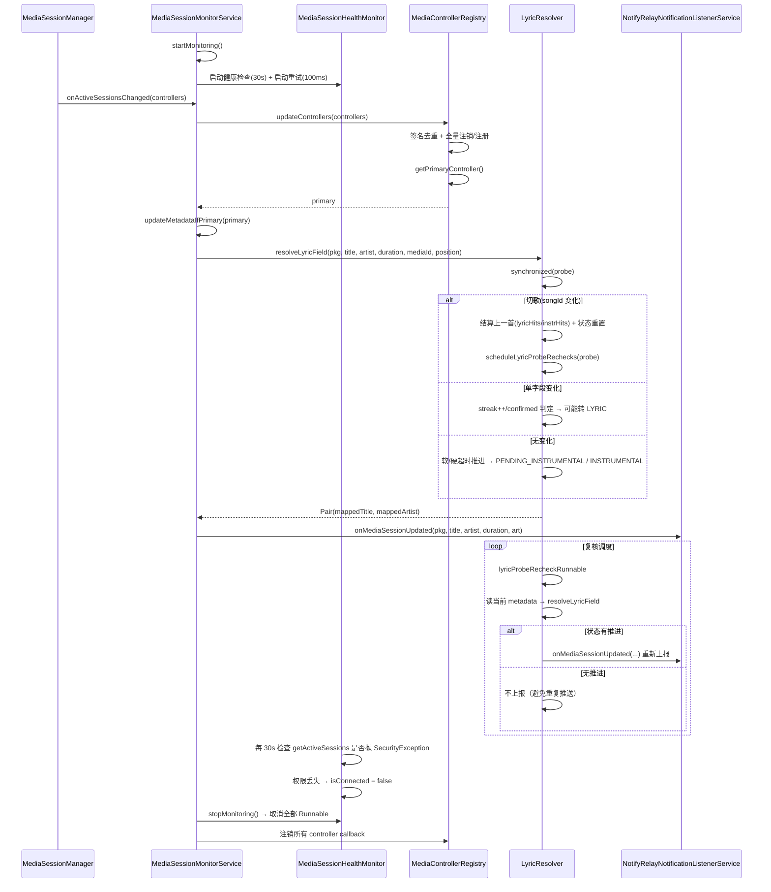

# 拆分计划：`MediaSessionMonitorService.kt`

- 分支：`refactor/split-media-session-monitor-service`
- 工作树：`worktree/media-session-monitor-service`
- 基线提交：`6bb837f`
- 目标文件：`app/src/main/java/com/xzyht/notifyrelay/feature/media/service/MediaSessionMonitorService.kt`

## 一、现状（已读文件核对）

| 项 | 值 |
|---|---|
| 实际行数 | 600 |
| 顶层声明 | 仅 `class MediaSessionMonitorService`(18-600) |
| 同目录 | `MediaProjectionForegroundService.kt` |
| 创建方 | `NotifyRelayNotificationListenerService.onCreate`(249) |
| 反向调用 | `NotifyRelayNotificationListenerService.onMediaSessionUpdated`(389/591) 静态方法 |

### 分区

| 行号 | 职责 | 成员 |
|---|---|---|
| 18-45 | companion 常量与探针表 | `TAG`(22)、`instance`(23, public var)、`LYRIC_FIELD_CONFIRM_THRESHOLD=2`(26)、`FAST_WATCH_INTERVAL_MS=100`(30)、`FAST_WATCH_WINDOW_MS=1500`(31)、`T_INSTRUMENTAL_FAST/NORMAL/SLOW_MS`(34-36)、`COLD_PKG_RECHECK_DELAYS_MS`(39-40)、`lyricFieldProbes`(44, ConcurrentHashMap，**跨实例保留**) |
| 48-89 | 枚举与探针数据类 | `LyricField`(48)、`LyricState`(51-63)、`LyricFieldProbe`(66-89) |
| 91-175 | 状态与三个 Runnable | `isConnected`(92)、`mediaSessionManager`(94)、`componentName`(95)、`activeControllers`(98)、`controllerCallbacks`(101)、`lastMetadataHash`(104)、`lastComputedIsPlaying`(105)、`updateToken`(108)、`lastControllerSignatures`(111)、`sessionsChangedListener`(113)、`handler`(120)、`healthCheckRunnable`(123)、`startupRetryRunnable`(144)、`retryRunnable`(162) |
| 177-233 | 生命周期 | `initialize`(178)、`startMonitoring`(184)、`stopMonitoring`(201)、`destroy`(230) |
| 235-332 | 控制器管理 | `updateControllers`(235)、`recheckSessions`(320)、`getPrimaryController`(334) |
| 357-396 | 元数据更新 | `updateMetadataIfPrimary`(357) |
| 398-532 | **歌词字段判定** | `resolveLyricField`(413-532，120 行) |
| 534-547 | 阈值自适应 | `instrumentalThreshold`(538) |
| 549-599 | 复核调度 | `scheduleLyricProbeRechecks`(555)、`lyricProbeRecheckRunnable`(571-599) |

## 二、拆分步骤

### 步骤 1（低风险）：抽 `LyricFieldProbe` 数据类 + 枚举
- 范围：`LyricField`(48)、`LyricState`(51-63)、`LyricFieldProbe`(66-89)、`instrumentalThreshold`(538-547)。
- 新建 `feature/media/lyric/LyricFieldProbe.kt`（或 `feature/media/model/`）。
- 风险：**低**。`instrumentalThreshold` 只依赖 `probe.lyricHits`/`instrHits`，可一并搬为 probe 的成员方法或同名 internal 函数。
- 注意：`lyricFieldProbes`(44) 是 **companion 的 static map**，注释 42-43 明确说明「跨服务实例保留（监听服务会被系统频繁解绑重建）」—— **该 map 必须留在 companion 或独立的 object 单例中**，不可降级为实例字段。

### 步骤 2（中风险）：抽 `LyricResolver`
- 范围：`resolveLyricField`(413-532)、`instrumentalThreshold`(538)、`scheduleLyricProbeRechecks`(555)、`lyricProbeRecheckRunnable`(571-599)、`lyricFieldProbes`(44)。
- 新建 `feature/media/lyric/LyricResolver.kt`，持有 `lyricFieldProbes` 与 `handler`。
- 依赖回宿主的回调：状态推进时需 `NotifyRelayNotificationListenerService.onMediaSessionUpdated(...)`(591) 重新上报 —— 需注入回调 `(pkg, title, artist, duration, bitmap) -> Unit` 与 `getPrimaryController() -> MediaController?`。
- 风险：**中**。
  - `resolveLyricField` 是 `synchronized(probe)`(422) 的 120 行状态机，含切歌结算(456-473)、单字段变化判定(474-494)、软/硬超时推进(498-521)、字段互换返回(524-530) 四段，**顺序不可变**。
  - 注释 570-571 说明「切歌后重置播放位置基准」(470-471) 是为避免新歌首帧被误判为 INSTRUMENTAL，属 bugfix 逻辑，不可删。
  - `scheduleLyricProbeRechecks`(555) 每轮先 `handler.removeCallbacks(lyricProbeRecheckRunnable)`(556) 再批量 post(568)，抽离后 handler 引用需一致（同一个 mainLooper handler）。
  - `lyricProbeRecheckRunnable`(571) 内部读 `probe.state` 前后对比(580/590)，仅状态推进才上报 —— 该优化不可丢（否则重复推送）。

### 步骤 3（低风险）：抽 `MediaSessionHealthMonitor`
- 范围：`healthCheckRunnable`(123-141)、`startupRetryRunnable`(144-159)、`retryRunnable`(162-175)、`isConnected`(92)。
- 新建 `feature/media/service/MediaSessionHealthMonitor.kt`。
- 风险：**低**。三个 Runnable 都是 `handler.postDelayed` 驱动的定时重试，无复杂状态。
  - `healthCheckRunnable` 每 30s 自调度(139)，`stopMonitoring`(206-209) 需能取消全部三个 —— 抽离后需暴露 `stop()`。
  - 依赖 `mediaSessionManager`/`componentName`/`isConnected`/`updateControllers`，注入面较大但都是只读。

### 步骤 4（中风险）：抽 `MediaControllerRegistry`
- 范围：`activeControllers`(98)、`controllerCallbacks`(101)、`lastControllerSignatures`(111)、`updateControllers`(235-318)、`getPrimaryController`(334-355)。
- 新建 `feature/media/service/MediaControllerRegistry.kt`。
- 风险：**中**。
  - `updateControllers`(235) 用签名去重(240-245)、`synchronized(activeControllers)`(249) 全量注销再注册、`onPlaybackStateChanged`(267-289) 内嵌元数据哈希兜底（注释 271-272 说明多数应用不回调 `onMetadataChanged`）—— 该兜底逻辑不可删。
  - `onSessionDestroyed`(295-299) 通过 `handler.post { recheckSessions() }` 强制刷新，抽离后 handler 需一致。
  - `getPrimaryController`(334) 的优先级链（播放中 > 最近活跃）不可变。

### 步骤 5（可选）：`updateMetadataIfPrimary`(357-396) 保留在宿主
- 该函数是「元数据 → 歌词映射 → 上报」的编排，依赖 `resolveLyricField`（已抽）+ `NotifyRelayNotificationListenerService`，保留在宿主类最合适。

## 三、不建议动的部分

- `lyricFieldProbes` 的 **static 跨实例保留**语义(44, 注释 42-43)：监听服务被系统频繁解绑重建，实例字段会导致学习状态丢失。
- `lastMetadataHash`(104) 与 `lastComputedIsPlaying`(105) 的去重：后者(105) 在 `recheckSessions`(325) 被重置但**当前文件中未见写入/读取**（疑似部分实现），抽离时保留原样，不要"顺手删"。
- `updateToken`(108) 防抖令牌与 `handler.postAtTime`(117) 的用法。
- `instance`(23, public var)：`initialize`(179) 写入、`destroy`(231) `===` 判断后清空 —— 对外可见，可能被兄弟包读取。

## 四、验收标准

1. 执行前 `./gradlew :app:assembleDebug` 记录基线。
2. 每步骤后 `./gradlew :app:compileDebugKotlin` 通过。
3. 完成后 `./gradlew :app:assembleDebug`，**无新增错误/警告**。
4. 真机冒烟（需音乐 App，建议覆盖 QQ音乐/网易云/fnos 等）：
   - 播放/暂停/切歌 → 歌词正确显示（区分「歌词在 title」与「歌词在 artist」两类 App）
   - 纯音乐（无歌词）→ 约 2s/4s/6s 后回退显示歌名
   - 前奏/间奏 → 歌词状态粘滞不回退
   - 切歌 → 学习状态（lyricHits/instrHits）正确结算，字段确认后快速监听
   - 杀掉通知监听服务再重建 → 歌词字段学习状态保留
5. `./gradlew ktlintFormat`（pre-commit 自动执行）。

## 五、时序（步骤 2+3 抽离后的歌词流转）

## 六、备注

- 本文件内聚度尚可（plan.md 原判 P3「内聚度尚可，若要动先抽歌词探测」），本次拆分的核心收益是步骤 2（歌词状态机 120 行 + 复核调度 45 行）。
- 歌词判定是**启发式状态机**（连续观测 2 次确认 + 自适应阈值 + 粘滞），改动极易引入回归。建议：
  1. 拆分前先记录若干代表性 App 的日志行为作为基线。
  2. 步骤 2 单独提交，重点回归测试。
- 与 `refactor/split-notify-relay-notification-listener-service`（`onMediaSessionUpdated` 契约、服务创建/销毁时序）强交叉。

---

## 七、实际执行记录（合并前审查回写）

本节由合并前独立审查补写，用于区分「有意偏离」与「漏做」。原计划正文未改。

### 已完成
- 步骤 1~5 全部完成（步骤 5 为「保留在宿主」，未抽离，符合计划）。

### 实际偏离（**有意，未回写原计划**）
- 步骤 3 要求把 `isConnected` 抽出，实际改为**留在宿主 + 注入 getter + 写回回调**（`onPermissionLost`）。此方案更合理（避免跨对象持有连接状态），但与计划文字不符。
- 计划中的 `updateControllers` 被改名为 `refreshControllers`。

### 审查发现（遗留，未处理）
- 4 个新类全为 `public`（`LyricResolver.kt:15`、`MediaControllerRegistry.kt:19`、`MediaSessionHealthMonitor.kt:17`、`LyricFieldProbe.kt:22`）；基线为 private 嵌套声明，建议降 `internal`。
- `MediaSessionMonitorService.kt:35` `lastComputedIsPlaying` 只在 `:132` 被重置、从不读取（死字段）。
- `LyricResolver.kt:17` 回调位图类型写成 `Any?`，弱化了类型。
- 本树原先**未更新** `Docs/文件用途基础说明.md`，已由合并前审查补写。
