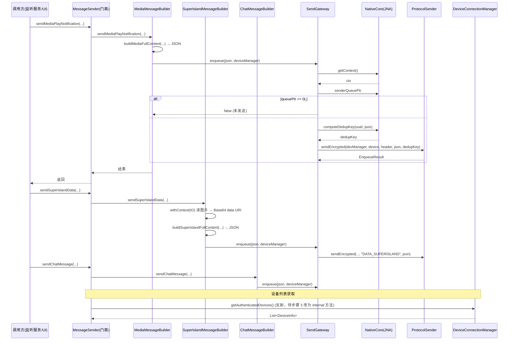

# 拆分计划：`MessageSender.kt`

- 分支：`refactor/split-message-sender`
- 工作树：`worktree/message-sender`
- 基线提交：`6bb837f`
- 目标文件：`app/src/main/java/com/xzyht/notifyrelay/sync/MessageSender.kt`

## 一、现状（已读文件核对）

| 项 | 值 |
|---|---|
| 实际行数 | 544 |
| 顶层声明 | 仅 `object MessageSender`(26-544)，无 companion object |
| 状态字段 | 仅 `private const TAG`(27)，**无可变状态** |
| 同目录 | `ConnectionDiscoveryManager.kt`、`ConnectionKeepAlive.kt`、`FtpServer.kt`、`HeartbeatProcessor.kt`、`ProtocolSender.kt` |

### 分区

| 行号 | 职责 | 主要成员 |
|---|---|---|
| 32-54 | 媒体全量 JSON | `buildMediaFullContent`(32) |
| 62-177 | 聊天与通知入队 | `sendChatMessage`(62)、`sendNotificationMessage`(109)、`enqueueNotification`(152, private) |
| 109-202 | 媒体播放/结束 | `sendMediaPlayNotification`(109)、`sendMediaPlayEndNotification`(179) |
| 259-389 | 超级岛数据 | `buildSuperIslandFullContent`(259, suspend)、`sendSuperIslandData`(342, suspend)、`sendSuperIslandEnd`(394) |
| 441-492 | 本地高优先级通知 | `sendHighPriorityNotification`(441) |
| 499-543 | 设备查询与校验 | `getAuthenticatedDevices`(499, private, **反射**)、`hasAvailableDevices`(536)、`isValidMessage`(543) |

## 二、关键约束（不可改）

1. **JNA/NativeCore 契约**：所有发送经 Rust core，每行发送前需 `NativeCore.getContext()` 与 `queuePtr == 0L` 守卫（123/190/363/409），再经 `ProtocolSender.sendEncrypted` 加密封装（限流/重试/去重）。
2. **JSON 序列化契约**（与 Rust 合并引擎对齐）：`packageName`/`appName`/`title`/`text`/`time`/`isLocked`/`coverUrl`/`isPlaying`/`param_v2_raw`/`featureIdOverride`/`pics` —— **字段不可改名**。
3. **去重键**：`NativeCore.computeDedupKey(uuid, json)`(163)，JSON 内容即幂等键。
4. **反射**：`getAuthenticatedDevices`(499-517) 反射取 `DeviceConnectionManager` 私有字段 `authenticatedDevices`/`uuid` 与方法 `getDeviceInfo`。
5. **主线程依赖**：`sendHighPriorityNotification`(441) 用 `Handler(mainLooper).postDelayed` 5s 取消(484-486)。

## 三、拆分步骤

### 步骤 1（低风险）：按消息类型拆 Builder
- `MediaMessageBuilder`：`buildMediaFullContent`(32-54) + `sendMediaPlayNotification`(109) + `sendMediaPlayEndNotification`(179)
- `SuperIslandMessageBuilder`：`buildSuperIslandFullContent`(259) + `sendSuperIslandData`(342) + `sendSuperIslandEnd`(394)
- `ChatMessageBuilder`：`sendChatMessage`(62) + `sendNotificationMessage`(109)
- 新建 `sync/builder/` 三个文件，`MessageSender` 保留为门面（转发调用，保持外部 API 不变）。
- 风险：**低**。
  - 每个 Builder 都需 `NativeCore.getContext()`/`senderQueuePtr`/`ProtocolSender`，抽公共 `sync/SendGateway.kt` 封装「取 ctx → 判 queuePtr → sendEncrypted → 记日志」四步。
  - `enqueueNotification`(152) 是三个 send 共用的私有入队函数（含 `computeDedupKey`），应随 `SendGateway` 或单独抽出，**不要复制到三个 Builder**。

### 步骤 2（中风险）：抽 `HighPriorityNotifier`
- 范围：`sendHighPriorityNotification`(441-492)。
- 新建 `feature/notification/HighPriorityNotifier.kt`（或 `sync/` 下）。
- 风险：**低**。独立职责（本地悬浮通知 + 5s 自动取消），无 JSON 契约。
  - 被 `NotificationHistory.kt:179` 调用，需更新 import。

### 步骤 3（中风险）：替换反射 `getAuthenticatedDevices`
- 范围：499-517（反射 `DeviceConnectionManager` 私有字段/方法）。
- 现状问题：`DeviceConnectionManager` 已拆出 `DeviceQuery`（`state/DeviceQuery.kt`），反射取私有字段是**强脆弱点**，字段改名即静默失效。
- 做法：与 `refactor/split-device-connection-manager` 协调，在 `DeviceConnectionManager` 暴露 internal 方法（如 `getAuthenticatedDeviceInfos()`）替代反射。
- 风险：**中**（跨文件改动 + 跨分支协同）。
- 备选（本分支内可做）：保留反射但补充失败日志与降级（当前 catch 后返回空列表）。

### 步骤 4（低风险）：`hasAvailableDevices`(536) 与 `isValidMessage`(543)
- `hasAvailableDevices` 直接读 `deviceManager.devices.value.isNotEmpty()`(536)，无反射，可留在门面或移入 `DeviceQuery`。
- `isValidMessage`(543) 是纯工具，可移到 `base/util` 或留在门面。
- 风险：**无**。

## 四、不建议动的部分

- JSON 字段名与顺序（Rust 合并引擎契约）。
- `NativeCore.getContext()` / `senderQueuePtr == 0L` 守卫（123/190/363/409）。
- `buildSuperIslandFullContent` 内 `withContext(Dispatchers.IO)` 读本地图片转 Base64 data URI(273-319)：IO 调度不可改为主线程。
- `sendHighPriorityNotification` 的 5s 自动取消(484-486)。

## 五、验收标准

1. 执行前 `./gradlew :app:assembleDebug` 记录基线错误/警告数。
2. 每步骤后 `./gradlew :app:compileDebugKotlin` 通过。
3. 完成后 `./gradlew :app:assembleDebug`，**无新增错误/警告**。
4. 行为冒烟（需两台设备配对）：
   - 普通通知转发 → 对端收到历史
   - 媒体播放/结束通知（含封面 base64 data URI）
   - 超级岛数据转发（含图片转 Base64、`param_v2_raw`、`featureIdOverride`）
   - 聊天测试消息
   - 高优先级通知：本机弹出 → 5s 后自动消失
   - 去重：短时间内重复内容不重复发送（观察 `computeDedupKey` 日志）
5. `./gradlew ktlintFormat`（pre-commit 自动执行）。

## 六、时序（步骤 1 抽离后的发送链路）

## 七、备注

- 本文件**无可变状态**（仅 TAG），拆分本质是**函数分组**，风险低于数据/服务类文件，是 16 个目标中收益/风险比最好的几个之一。
- 步骤 3（反射替换）是唯一跨分支协同项；若 `refactor/split-device-connection-manager` 尚未合并，**建议本分支先只加日志（备选方案）**，等对方合并后再替换。
- 与 `refactor/split-notify-relay-notification-listener-service`（主要调用方）、`refactor/split-device-connection-manager`（反射目标）、`refactor/split-notification-history`（`sendHighPriorityNotification` 调用方）交叉。

---

## 七、实际执行记录（合并前审查回写）

本节由合并前独立审查补写，用于区分「有意偏离」与「漏做」。原计划正文未改。

### 已完成
- 步骤 1~4 全部完成。外部 11 处调用点全部仍走 `MessageSender.` 门面，API 未破。
- 计划误判 `enqueueNotification` 为「三个 send 共用」（媒体实走 `pushMediaState`）；实现只放 `SendGateway` 一处，处理正确。

### 关于步骤 3 反射（按计划备选方案执行）
- 计划步骤 3 要求替换反射并给出备选「本分支内可保留反射并补充失败日志与降级」。
- 核查结论：**无可用非反射访问器**能返回相同语义（`List<DeviceInfo>`、按 uuid 排除自身）——`getAuthenticatedDevices()` 返回 `Map<String, AuthInfo>`（非 `DeviceInfo`、未排除自身），`getAuthenticatedOnlineDevices()` 仅返回在线设备。
- 故按备选保留反射，并**集中到新建 `SendGateway`**（原先散在 `MessageSender` 内，现去重为单一实现），未复制到三个 Builder。

### 审查发现（遗留，未处理）
- `SendGateway.kt:23` / `:58` `getAuthenticatedDevices` / `enqueueNotification` 原为 `private`，现为 `public`，建议降 `internal`。
- `DeviceConnectionManager.getAuthenticatedDevices()` 基线已是 public，反射可部分消除（计划允许延后）。
