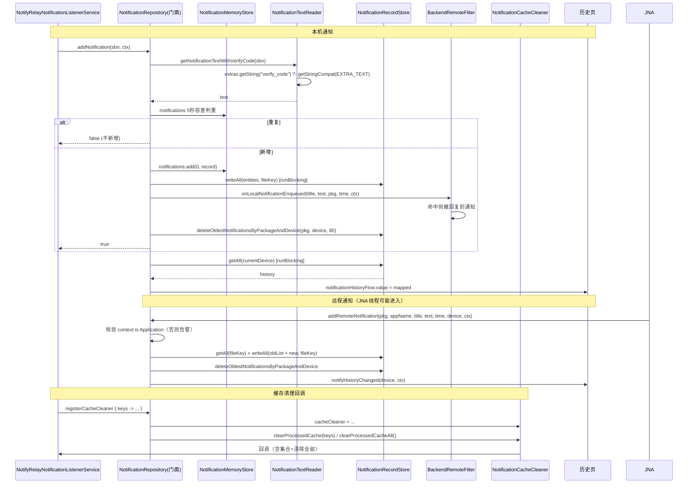

# 拆分计划：`NotificationData.kt`

- 分支：`refactor/split-notification-data`
- 工作树：`worktree/notification-data`
- 基线提交：`6bb837f`
- 目标文件：`app/src/main/java/com/xzyht/notifyrelay/feature/device/model/NotificationData.kt`

## 一、现状（已读文件核对）

| 项 | 值 |
|---|---|
| 实际行数 | 648 |
| 顶层声明 | **3 个**：`class NotificationRecordStore`(19-104)、`object NotifyRelayStoreProvider`(107-115)、`object NotificationRepository`(118-648) |
| 文件名与内容不符 | 文件名叫 `NotificationData`，实际是「Room Store + 单例提供者 + 内存仓库」三合一 |
| 同目录 | `DeviceModels.kt`、`DeviceNameCache.kt`、`DeviceSnapshot.kt`、`HandshakeRequest.kt` |

### 分区

| 行号 | 职责 | 成员 |
|---|---|---|
| 19-104 | Room 持久化 Store | `repository`(23)、`convertToRoomEntity`(26)、`convertFromRoomEntity`(41)、`readAll`(52, internal)、`writeAll`(59, internal)、`insert`(70)、`getAll`(76)、`deleteByKey`(84)、`clearByDevice`(92)、`deleteByPackageAndDevice`(97) |
| 107-115 | 单例提供者 | `NotifyRelayStoreProvider.getInstance`(111，双重检查锁) |
| 118-215 | 仓库前半：历史流与远程写入 | `_notificationHistoryFlow`(120)、`notificationHistoryFlow`(121)、`notifyHistoryChanged`(126, @Synchronized)、`addRemoteNotification`(163, **@JvmStatic**)、`addNotification`(220 起) |
| 220-312 | `addNotification` | 内联 `getStringCompat`(228)、5 秒容差判重(263-277)、写内存 + `syncToCache`(290)、`BackendRemoteFilter.onLocalNotificationEnqueued`(294)、按包名保留 80 条(303-307) |
| 314-399 | 文本/验证码读取 + 设备列表 | `notifications`(314, SnapshotStateList)、`getStringCompat`(319)、`getVerifyCode`(335)、`getNotificationTextWithVerifyCode`(348)、`currentDevice`(367)、`deviceList`(370)、`scanDeviceList`(374) |
| 401-507 | 初始化与删除 | `maxNotificationsPerDevice`(401)、`debounceJob`(402)、`DEBOUNCE_DELAY`(403)、`hasCleanedUpOldNotifications`(404)、`init`(406)、`removeNotification`(445)、`removeNotificationsByPackage`(478) |
| 512-648 | 清除/同步/缓存回调 | `clearDeviceHistory`(512)、`syncToCache`(547, internal, @Synchronized)、`getNotificationsByDevice`(582)、`cacheCleaner`(590)、`registerCacheCleaner`(595)、`clearProcessedCache`(602)、`clearProcessedCacheAll`(609)、`cleanupOldNotifications`(617) |

### 关键契约（不可改）

- `addRemoteNotification`(163) 是 **`@JvmStatic`**，疑似由 Rust core 经 JNA 调用：签名（参数顺序/类型）与「context 必须是 Application」(176-178 有告警日志) 均为契约。
- `notifications`(314) 是 Compose `SnapshotStateList`，UI 直接观察。
- `notificationHistoryFlow`(121) 供 UI 订阅。
- `currentDevice`(367)/`deviceList`(370) 是跨 UI 与 `scanDeviceList` 的全局可变状态。
- Room 实体以全限定名引用 `notifyrelay.data.database.entity.NotificationRecordEntity`(29/41)，未 import。

## 二、拆分步骤

### 步骤 1（零风险）：`NotificationRecordStore` + `NotifyRelayStoreProvider` → `NotificationRecordStore.kt`
- 范围：19-115（97 行）。
- 新建 `feature/device/model/NotificationRecordStore.kt`（或 `feature/device/data/`，视项目分层）。
- 风险：**无**。同包搬移。
  - `readAll`(52)/`writeAll`(59) 是 internal，被 `NotificationRepository.init`(415)、`addRemoteNotification`(184/200)、`syncToCache`(570) 调用，同包无需改 import。
  - 可选：把全限定名 Room 实体改为 import（低风险，纯可读性）。

### 步骤 2（低风险）：文本/验证码工具 → `NotificationTextReader.kt`
- 范围：`getStringCompat`(319-329)、`getVerifyCode`(335-342)、`getNotificationTextWithVerifyCode`(348-364)。
- 风险：**低**。
  - 三者是 public 且被外部调用：`NotifyRelayNotificationListenerService`(832/834) 用 `getStringCompat` 与 `getNotificationTextWithVerifyCode`。同包/同模块内搬移为顶层 object 后需更新调用方 import。
  - `getNotificationTextWithVerifyCode` 优先读 `verify_code` 隐藏字段(353-357)，是系统短信 App 的验证码获取契约，**逻辑不可改**。
  - `addNotification`(220) 内有一份**内联的局部 `getStringCompat`**(228-234)，与顶层 319-329 重复 —— 可让内联版改为调用顶层版（低风险去重）。

### 步骤 3（中风险）：抽 `NotificationCacheCleaner`
- 范围：`cacheCleaner`(590)、`registerCacheCleaner`(595)、`clearProcessedCache`(602)、`clearProcessedCacheAll`(609)、`cleanupOldNotifications`(617-647)。
- 风险：**中**。
  - `cacheCleaner` 由 `NotifyRelayNotificationListenerService.onCreate`(220-233) 注册，空集合表示「清除全部」(221-225 与 610-611 的约定) —— 该协议必须保留。
  - `cleanupOldNotifications`(617) 遍历 `deviceList` 按包名保留 80 条，依赖 `deviceList` 已被 `scanDeviceList` 填充 —— 抽离后调用顺序不可变（`init` 中 409 `scanDeviceList` 先于 433 `cleanupOldNotifications`）。

### 步骤 4（中高风险）：拆分 `NotificationRepository`（118-648，531 行）
- 目标：按职责拆为
  - `NotificationMemoryStore`：`notifications`(314)、`currentDevice`(367)、`deviceList`(370)、`getNotificationsByDevice`(582)、`scanDeviceList`(374)
  - `NotificationPersistence`：`syncToCache`(547)、写 DB 相关（与步骤 1 的 Store 协作）
  - `NotificationRepository`（门面）：保留 `addNotification`、`addRemoteNotification`、`removeNotification`、`removeNotificationsByPackage`、`clearDeviceHistory`、`notifyHistoryChanged`、`init` + 公开 flow
- 风险：**中高**。
  - **`@Synchronized` + `runBlocking` 组合**（135/184/200/305/414/461/496/526/570）：同步锁内阻塞等待协程。若从协程线程进入可能死锁。`addRemoteNotification`(163) 是 `@JvmStatic`，可能运行在 **Rust/JNA 原生线程**，拆分时必须保证它不持锁或持锁时间不增加 —— **这是本文件最大的风险点，拆分前后锁的粒度必须逐一比对**。
  - `addNotification`(220) 内含副作用：`BackendRemoteFilter.onLocalNotificationEnqueued`(294) 被动去重回调，抽离后调用点不可丢。
  - `notifyHistoryChanged`(126) 内 `runBlocking { store.getAll(...) }`(135) 后同时写 flow 与内存列表(148-151)，两处更新必须原子。
  - `removeNotification`(445)/`removeNotificationsByPackage`(478)/`clearDeviceHistory`(512) 三者结构高度相似（找 key → 删内存 → 删库 → 清缓存 → `notifyHistoryChanged`），可提取公共私有方法，但**`isLocalDevice` 判定差异**（454/488/531）不可合并错。

### 步骤 5（可选）：`maxNotificationsPerDevice`(401)、`debounceJob`(402)、`DEBOUNCE_DELAY`(403)
- 现状：`maxNotificationsPerDevice`(401) 与 `debounceJob`(402)/`DEBOUNCE_DELAY`(403) 疑似**未被使用**（代码中按包名硬编码 80 条，见 206/306/639）。
- 做法：确认无引用后删除，或把 80 提取为常量替换硬编码。
- 风险：**低**（若为死代码）。**需执行时全局搜索确认**。

## 三、不建议动的部分

- `addRemoteNotification` 的 `@JvmStatic` 与签名：JNA/序列化契约。
- `notifications` 的 `SnapshotStateList` 类型：Compose 观察契约。
- `@Synchronized` 注解：先只搬移，锁粒度调整需单独评估与压测。
- 全限定名 Room 实体引用(29/41)：可改 import 但属可选。

## 四、验收标准

1. 执行前 `./gradlew :app:assembleDebug` 记录基线错误/警告数。
2. 每步骤后 `./gradlew :app:compileDebugKotlin` 通过。
3. 完成后 `./gradlew :app:assembleDebug`，**无新增错误/警告**。
4. 行为冒烟：
   - 本機通知入历史（含短信验证码走 `verify_code` 分支）
   - 远程通知入历史（`addRemoteNotification`，需配对设备转发触发）
   - 历史页列表刷新、按设备切换、分组删除、单条删除、清空设备历史
   - 每个包名保留上限（80 条）生效
   - 被动去重：本机有相同通知时远端复刻通知被撤回（与 `BackendRemoteFilter` 联动）
   - **重点**：多线程压测下无 ANR/死锁（尤其 JNA 线程调用 `addRemoteNotification` 时）
5. `./gradlew ktlintFormat`（pre-commit 自动执行）。

## 五、时序（步骤 1+2+3 抽离后的写入链路）

## 六、备注

- 本文件是**数据层 + 并发 + JNA 契约**三者叠加，是 16 个目标中风险最高的几个之一。建议：
  1. 先做步骤 1（零风险）+ 步骤 2（低风险），验证流程。
  2. 步骤 4 前**先做并发压测**，记录基线 ANR/日志，拆分后对比。
- 文件名 `NotificationData.kt` 与内容不符，拆分后建议重命名为更贴切的文件集（`NotificationRecordStore.kt` / `NotificationRepository.kt` / ...），并同步更新 `Docs/文件用途基础说明.md`。
- 与 `refactor/split-notify-relay-notification-listener-service`（`registerCacheCleaner` + `getStringCompat` 调用方）、`refactor/split-backend-remote-filter`（`onLocalNotificationEnqueued` 契约）、`refactor/split-notification-history`（UI 消费 flow）强交叉，**建议优先或最后合并**。

---

## 七、实际执行记录（合并前审查回写）

本节由合并前独立审查补写，用于区分「有意偏离」与「漏做」。原计划正文未改。

### 已完成
- 步骤 1、2、3、5 完成；文件已由 `NotificationData.kt` 经 `git mv` 重命名为 `NotificationRepository.kt`（更名副其实）。
- 步骤 5：全局搜索确认 `maxNotificationsPerDevice` / `debounceJob` / `DEBOUNCE_DELAY` 仅声明无引用，已删除。
- **步骤 4 已补做（本次修复）**：`NotificationRepository` 拆为
  - `NotificationMemoryStore.kt`：`notifications`(SnapshotStateList)、`currentDevice`、`deviceList`、`scanDeviceList`、`getNotificationsByDevice`
  - `NotificationPersistence.kt`：`syncToCache` 的写库逻辑
  - `NotificationRepository` 保留为门面（`addNotification` / `addRemoteNotification` / `removeNotification` / `removeNotificationsByPackage` / `clearDeviceHistory` / `notifyHistoryChanged` / `init` + 公开 flow）
- **锁粒度零变化（步骤 4 最大风险点已守住）**：门面所有对外方法仍加 `@Synchronized`，`NotificationMemoryStore` / `NotificationPersistence` **不自持任何锁**；`addRemoteNotification`（`@JvmStatic`，可能运行于 Rust/JNA 原生线程）的锁范围与拆分前逐一相同，未新增第二把锁、无新增死锁路径。门面以属性 getter/setter 委托内存态，外部 `NotificationRepository.deviceList` / `.currentDevice` 读写点无需改动。

### 行为变化（已回退，恢复基线语义）
- 原实现将 `addNotification` 中内联 `getStringCompat`（**无 try/catch**，异常时中断入库）改为带 try/catch 的 `NotificationTextReader.getStringCompat`（异常时静默置 null 继续），属真实行为变化。
- **决策：已回退**。新增 `NotificationTextReader.getStringCompatStrict`（不吞异常），`addNotification` 改用它，恢复拆分前「异常向上传播、中断本次入库」的语义。

### 实际偏离（有意，必要）
- `getStringCompat` 迁走后，`BackendLocalFilter.kt` 与 `NotifyRelayNotificationListenerService.kt` **不改则编译失败**，故改动调用方（仅 import + 2 处调用），**不属于超范围**。

### 审查发现（已处理）
- `NotificationCacheCleaner` / `NotificationTextReader` 由 `public` 降为 `internal`（仅同模块跨包使用）。
- `NotificationTextReader.getVerifyCode` 全仓无调用者（基线即死代码），已删除。
