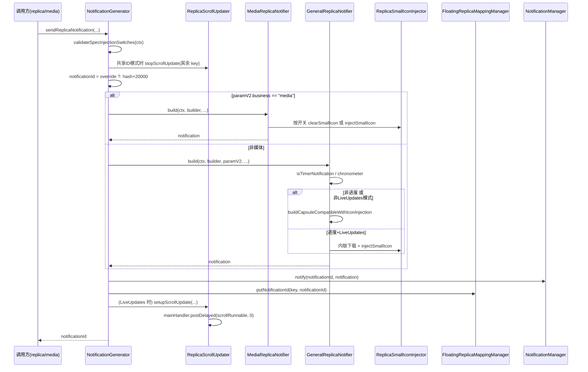

# 拆分计划：`NotificationGenerator.kt`

- 分支：`refactor/split-notification-generator`
- 工作树：`worktree/notification-generator`
- 基线提交：`6bb837f`
- 目标文件：`app/src/main/java/com/xzyht/notifyrelay/feature/notification/superisland/notification/NotificationGenerator.kt`

## 一、现状（已读文件核对）

| 项 | 值 |
|---|---|
| 实际行数 | 1150 |
| 顶层声明 | 仅 `object NotificationGenerator`（63-1150） |
| 对外接口 | `internal sendReplicaNotification`(199)、`internal cancelReplicaNotification`(1097)、`internal clearAllReplicaNotifications`(1120)、public `stopScrollUpdate`(175)、`clearAllScrollUpdates`(186) |

### 分区

| 行号 | 职责 | 主要成员 |
|---|---|---|
| 63-78 | object 头与状态 | `TAG`(64)、`NOTIFICATION_CHANNEL_ID="super_island_replica"`(67)、`NOTIFICATION_BASE_ID=20000`(70)、`mainHandler`(74)、`scrollRunnable`(75)、`cachedSmallIcons`(78) |
| 83-193 | 滚动更新 | `setupScrollUpdate`(83-170)、`stopScrollUpdate`(175)、`clearAllScrollUpdates`(186) |
| 199-723 | **主入口** `sendReplicaNotification` | 媒体分支 298-515、非媒体/计时器/进度分支 516-708、映射保存 710-715 |
| 728-845 | 胶囊兼容构建 | `buildCapsuleCompatibleNotification`(728) |
| 855-908 | 计时判定 + 图标反射 | `isTimerNotification`(855)、`clearSmallIcon`(870)、`injectSmallIcon`(888) |
| 913-1060 | 图标解析 + 带注入构建 | `resolveSmallIconBitmap`(913)、`buildCapsuleCompatibleNotificationWithIconInjection`(1005) |
| 1067-1092 | 图片下载 | `downloadBitmap`(1067)、`loadAlbumBitmapOrNull`(1081) |
| 1097-1149 | 取消/清理 | `cancelReplicaNotification`(1097)、`clearAllReplicaNotifications`(1120) |

## 二、拆分步骤

### 步骤 1（低风险）：抽 `ReplicaScrollUpdater`
- 范围：`mainHandler`(74) + `scrollRunnable`(75) + `cachedSmallIcons`(78) + `setupScrollUpdate`(83-170) + `stopScrollUpdate`(175) + `clearAllScrollUpdates`(186)。
- 新建 `notification/ReplicaScrollUpdater.kt`，internal object。
- 依赖外提：`NOTIFICATION_CHANNEL_ID`(120)、`cachedSmallIcons` 读写（143/179/191）、`CapsuleScrollManager`。
- 风险：**低**。`cachedSmallIcons` 生命周期与 `scrollRunnable` 绑定（75/78 同增删，见 `stopScrollUpdate` 179 与 `clearAllScrollUpdates` 190-191），抽离时两者必须同文件，否则缓存泄漏。
- 注意：`setupScrollUpdate` 内部有局部变量 `scrollRunnable`(99) 与字段同名（166 用 `NotificationGenerator.scrollRunnable[key]` 全限定区分），抽离后需重命名局部变量避免遮蔽。

### 步骤 2（中风险）：抽 `ReplicaSmallIconInjector`
- 范围：`clearSmallIcon`(870) + `injectSmallIcon`(888) + `resolveSmallIconBitmap`(913) + `downloadBitmap`(1067) + `loadAlbumBitmapOrNull`(1081)。
- 新建 `notification/ReplicaSmallIconInjector.kt`，internal object，持有 `cachedSmallIcons`。
- 冲突：`cachedSmallIcons` 同时被步骤 1 的滚动更新读（143）。方案：两者共用一个 `ReplicaIconCache` object（新文件），或两个 object 都引用它。
- 风险：**中**。
  - 反射写 `Notification.mSmallIcon`（876-878、896-898）跨 Android 版本脆弱，抽离后行为必须逐字一致。
  - `resolveSmallIconBitmap` 优先级链 progress→text→picMap aPicKey/bPicKey→appIconKey→null（注释 911）不可变序。
  - `CancellationException` rethrow（837-839、1051-1053）必须保留，否则协程取消被吞。

### 步骤 3（中高风险）：拆分 `sendReplicaNotification`（199-723，525 行）
- 子步骤 3a：配置与意图段（212-295）→ `ReplicaIntentFactory`
  - 含 `SuperIslandConfigUtils.validateSpecInjectionSwitches`(216)、浮窗/列表模式判定(231-235)、`contentIntent`(238-263)、`PendingIntent`(265-275)、`deleteIntent`(281-286)、渠道创建(289-295)。
  - 风险：低。纯构造，无状态。
- 子步骤 3b：媒体类型分支（298-515）→ `MediaReplicaNotifier`
  - 218 行，含歌词拆分(335-359)、胶囊滚动(361-422)、结构化数据(397-407)、图标注入(427-512)。
  - 风险：中。`isSuperIslandEnabled`/`isLiveUpdatesEnabled` 双开关决定 `clearSmallIcon`(431) 或 `injectSmallIcon`(437/448/504)，互斥分支不可合并。
- 子步骤 3c：非媒体分支（516-708）→ `GeneralReplicaNotifier`
  - 193 行，含计时器判定(525)、计时器标题改写(530-559)、chronometer 设置(592-629)、进度类型分流(632-704)。
  - 风险：中高。`isProgressType || liveUpdatesMode` 分流（639）决定走 `buildCapsuleCompatibleNotificationWithIconInjection` 还是内联图标下载（660-700），两路图标逻辑重复但**不可随意统一**（一路带胶囊字段注入，一路不带）。
- 子步骤 3d：主函数保留编排（约 60 行）：滚动任务清理(217-223)、ID 生成(228)、分支派发、`FloatingReplicaMappingManager.putNotificationId`(711)。

### 步骤 4（低风险）：搬移 `buildCapsuleCompatibleNotification`
- 728-845 与 `buildCapsuleCompatibleNotificationWithIconInjection`(1005-1060) 迁入步骤 2/3 的目标文件（随调用方走）。
- 风险：低。

## 三、不建议动的部分

- 通道 ID 字面量 `"super_island_replica"`(67)：与 `LiveUpdatesNotificationManager.CHANNEL_ID`(33)、监听服务 134 行字符串比较三方一致，**不可提取为共享常量之外还要改值**；如需统一，应单独提交并全量验证。
- action 字符串 `"com.xzyht.notifyrelay.ACTION_TOGGLE_FLOATING"`(241)、`ACTION_CLOSE_NOTIFICATION`：与 `NotificationBroadcastReceiver` 契约。
- `NOTIFICATION_BASE_ID = 20000`(70)：与 LiveUpdates 的 10000(35) 刻意错开避免 ID 冲突，**不可改**。
- `CancellationException` rethrow（717-718、837-839、1051-1053）。

## 四、验收标准

1. 执行前 `./gradlew :app:assembleDebug` 记录基线。
2. 每子步骤后 `./gradlew :app:compileDebugKotlin` 通过。
3. 完成后 `./gradlew :app:assembleDebug`，**无新增错误/警告**。
4. 行为等价：`sendReplicaNotification` 的返回 `Int?`（成功 ID / 失败 null）语义不变；`CancellationException` 仍向外抛。
5. `./gradlew ktlintFormat`（pre-commit 自动执行）。

## 五、时序（步骤 1+3d 抽离后的发送流程）

## 六、备注

- 步骤 3 是收益最大也最危险的一步，建议 3a → 3b → 3c 分三次提交，每提交后编译 + 真机冒烟（超级岛浮窗、歌词胶囊、计时器通知、进度通知四类样本）。
- 本文件与 `LiveUpdatesNotificationManager` 共享通道与 `SuperIslandStructuredDataHelper`，两者拆分若并行进行，注意 `Docs/文件用途基础说明.md` 同步。

---

## 七、实际执行记录（合并前审查回写）

本节由合并前独立审查补写，用于区分「有意偏离」与「漏做」。原计划正文未改。

### 已完成
- 步骤 1~4 全部完成。
- 行为等价性逐段比对通过：计时器标题改写与 chronometer 覆盖顺序、`isSuperIslandEnabled`/`iconText` 互斥分支、`resolveSmallIconBitmap` 优先级链、3 处 `CancellationException` rethrow、`cachedSmallIcons` 生命周期（仍在 `stopScrollUpdate` / `clearAllScrollUpdates` 同步移除，无泄漏）均保留。
- 按计划要求 `cachedSmallIcons` 由 `ReplicaIconCache` **单一持有**（滚动读 + 注入写共用），未各建一份。

### 实际偏离（**有意，未回写原计划**）
- 步骤 3 的 3a / 3b / 3c 合并为**单次提交**，而非 §备注 建议的三次分提交。已逐次真实编译验证（step1b / step23 / step23b / step23-verify 均 exit=0），符合「一次任务只提交一次」的纪律。

### 审查发现（遗留，未处理）
- `ReplicaSmallIconInjector.kt:424` `resolveSmallIconBitmapPublic` 全仓零调用者，纯转发 wrapper（死代码）。
- 本树原先**未更新** `Docs/文件用途基础说明.md`（§备注 明确要求），已由合并前审查补写。
