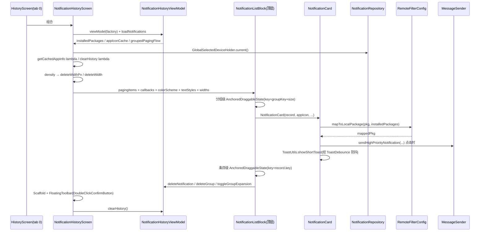

# 拆分计划：`NotificationHistory.kt`

- 分支：`refactor/split-notification-history`
- 工作树：`worktree/notification-history`
- 基线提交：`6bb837f`
- 目标文件：`app/src/main/java/com/xzyht/notifyrelay/ui/pages/NotificationHistory.kt`

## 一、现状（已读文件核对）

| 项 | 值 |
|---|---|
| 实际行数 | 642 |
| 顶层声明 | `dateTimeFormatter`(83, private)、`DragValue`(85, public enum)、`ToastDebounce`(88-91, public object)、`DeleteButton`(93, public)、`NotificationCard`(119, public)、`NotificationHistoryScreen`(229-642, public) |
| **局部 Composable** | `NotificationListBlock`(295-601) —— 声明在 `NotificationHistoryScreen` **函数体内**，非顶层 |
| 唯一调用方 | `ui/screen/HistoryScreen.kt:73`（tab index 0） |
| 文件外无引用的 public | `NotificationCard`、`DeleteButton`、`ToastDebounce`、`DragValue` |

### 分区

| 行号 | 职责 | 成员 |
|---|---|---|
| 1-91 | 导入 + 常量 | `dateTimeFormatter`(83)、`DragValue`(85)、`ToastDebounce`(88-91，含可变 `lastToastTime`) |
| 93-117 | 删除按钮 | `DeleteButton`(93) |
| 119-227 | 通知卡片 | `NotificationCard`(119)：包名等价映射(133/152)、点击跳转/高优通知(147-184) |
| 229-292 | 页面根前半 | VM 装配(234-237)、选中设备(242)、暗色状态栏、分页采集(258-261)、`getCachedAppInfo`(271-277)、`clearHistory`(279-289)、删除宽度(290-292) |
| 294-601 | **局部块** | `NotificationListBlock`：分组级(318-351) + 条目级(492-521) 双层滑动、内嵌 LazyColumn(481-568) |
| 603-668 | Scaffold + 工具栏 | 空态 + `DoubleClickConfirmButton`(620) |

## 二、拆分步骤

### 步骤 1（零风险）：`ToastDebounce` 与 `DragValue`
- `ToastDebounce`(88-91) 是 public object 且含可变 `lastToastTime`，被 161-171 读写 —— 属跨组件共享的隐式状态。
- 做法：
  - 方案 A（最小改动）：留在原文件，降为 `internal`。
  - 方案 B：迁入 `ui/common/`（项目已有 `DoubleClickConfirmButton` 等公共组件），改名 `ToastDebouncer`。
- `DragValue`(85) 与 `SuperIslandDragValue`（`SuperIslandHistory.kt:104`）**是同名同构的两个枚举**，可考虑统一 —— 但跨两个分支，**本分支不建议**，仅记录。
- 风险：**无**（方案 A）。

### 步骤 2（零风险）：`dateTimeFormatter` + `DeleteButton` → `ui/pages/history/`
- 范围：`dateTimeFormatter`(83)、`DeleteButton`(93-117)。
- 风险：**无**。`DeleteButton` 文件外无调用点，纯展示 + onClick。

### 步骤 3（低风险）：`NotificationCard` → `ui/pages/history/NotificationCard.kt`
- 范围：119-227（109 行）。
- 依赖：`RemoteFilterConfig.mapToLocalPackage`(133/152)、`MessageSender.sendHighPriorityNotification`(179)、`ToastUtils`(163/170)、`NotificationRecord`、`appIcon`、`getCachedAppInfo`、`installedPackages`。
- 参数：7 个（`record, appIcon, context, getCachedAppInfo, cardColor, contentColor, installedPackages`）—— 可聚合为 `NotificationCardArgs` data class。
- 风险：**低**。文件外无调用点。

### 步骤 4（中风险）：`NotificationListBlock` 提为顶层
- 范围：295-601（307 行）。
- 关键：它是**函数内局部 Composable**，闭包自由变量必须显式化为参数：
  - `context`(233)、`colorScheme`(231)、`textStyles`(232)、`deleteWidthPx`(291)、`deleteWidth`(292)
  - `pagingItems`(258-261)、`getCachedAppInfo`(271)
  - VM 回调：`toggleGroupExpansion`、`deleteGroup`、`deleteNotification`（在 661-663 才注入）
- 做法：新建 `ui/pages/history/NotificationListBlock.kt`，顶层 `@Composable`，参数化上述依赖。
- 风险：**中**。
  - 三层 `AnchoredDraggableState` 嵌套：分组级 key=`(groupKey, sortedList.size)`(318-323)、条目级 key=`record.key`(492-497)；分组侧用普通 `remember`(341-351) 而**非** `derivedStateOf`（与 `SuperIslandHistory` 的 295-303 不同），抽离时不要"统一风格"。
  - 两种渲染路径共用同一批 state：Lazy 的 `LazyColumn(heightIn(max=360.dp))`(481-568) 与非 Lazy 的 `showList.forEachIndexed`(439-473)。
  - 调用点 656-658 又包一层 lambda 转发 `pagingItems` 与 `getCachedAppInfo`，提为顶层后该转发可简化但需小心。

### 步骤 5（可选）：拆分 `NotificationHistoryScreen`（229-642，414 行）
- 拆为：
  - `NotificationHistoryScaffold`(603-668)：Scaffold + FloatingToolbar + 空态
  - 页面根保留 VM 装配与派生值
- 风险：**低**（步骤 4 完成后）。

## 三、不建议动的部分

- `ToastDebounce.lastToastTime`(89) 的跨组件共享语义：改为局部状态会改变 Toast 防抖行为，**只搬移不改语义**。
- `DragValue` 与 `SuperIslandDragValue` 的重复：跨分支统一，不在本分支做（记录到 `Docs/` 或议题）。
- 滑动删除的 `AnchoredDraggable` 语义：只搬移不重构。

## 四、验收标准

1. 执行前 `./gradlew :app:assembleDebug` 记录基线。
2. 每步骤后 `./gradlew :app:compileDebugKotlin` 通过。
3. 完成后 `./gradlew :app:assembleDebug`，**无新增错误/警告**。
4. 真机冒烟：历史页 tab 0 —— 分组展开/折叠、分组滑动删除、条目滑动删除、点击卡片跳转/高优通知、Toast 防抖（连续点击删除只提示一次）、空态显示、清空历史。
5. `./gradlew ktlintFormat`（pre-commit 自动执行）。

## 五、时序（步骤 3+4 抽离后的渲染链路）

## 六、备注

- 本文件行数（642）在 16 个目标中偏低，但**结构问题明显**：307 行的局部 Composable 嵌在函数体内，是本次拆分的核心收益点（步骤 4）。
- 与 `refactor/split-super-island-history` 存在同构重复（滑动删除 + 分组展开 + `DragValue` 枚举 + `DeleteButton`），两个分支合并后可考虑抽公共 `ui/common/SwipeToDeleteGroupList.kt` —— **建议作为后续独立议题**，不在本分支做。
- 与 `refactor/split-notification-data`（`NotificationRepository` 契约）、`refactor/split-message-sender`（`sendHighPriorityNotification`）存在交叉。
