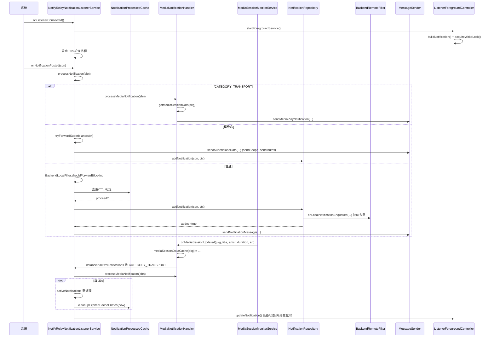

# 拆分计划：`NotifyRelayNotificationListenerService.kt`

- 分支：`refactor/split-notify-relay-notification-listener-service`
- 工作树：`worktree/notify-relay-notification-listener-service`
- 基线提交：`6bb837f`
- 目标文件：`app/src/main/java/com/xzyht/notifyrelay/feature/notification/service/NotifyRelayNotificationListenerService.kt`

## 一、现状（已读文件核对）

| 项 | 值 |
|---|---|
| 实际行数 | 859 |
| 顶层声明 | 仅 `class NotifyRelayNotificationListenerService : NotificationListenerService()`（48-858） |
| companion | 49-120：`latestMediaSbn`(59, @Volatile public)、`instance`(63, @Volatile public)、`mediaSessionDataCache`(66, private)、`@JvmStatic onMediaSessionUpdated`(69)、`getMediaSessionData`(109)、`data class MediaSessionData`(112) |
| internal | `getNotificationKey`(836) |

### 分区

| 行号 | 职责 | 成员 |
|---|---|---|
| 48-120 | companion：静态实例/媒体缓存 | 见上 |
| 122-213 | 移除回调 | `onNotificationRemoved`(122)、`onTaskRemoved`(206) |
| 215-312 | 生命周期 onCreate/onBind + 字段 | `onCreate`(215)、`onBind`(288)、字段 293-315 |
| 322-547 | 通知处理核心 | `processMediaNotification`(322)、`cleanupExpiredCacheEntries`(408)、`processNotification`(432) |
| 549-627 | 监听回调 | `onNotificationPosted`(549)、`forwardNotificationToRemoteDevices`(555)、`onListenerConnected`(575) |
| 629-727 | 断开/销毁/前台/唤醒锁 | `onListenerDisconnected`(629)、`onDestroy`(652)、`startForegroundService`(689)、`acquireWakeLock`(704)、`releaseWakeLock`(719) |
| 729-858 | 前台通知构建与辅助 | `buildNotification`(729)、`getNotificationText`(760)、`updateNotification`(810)、`getAppName`(823)、`getNotificationTitle`(832)、`getNotificationText(sbn)`(834)、`getNotificationKey`(836)、`getStorageBoolean`(841)、`logSbnDetail`(851) |

## 二、拆分步骤

### 步骤 1（低风险）：抽 `ListenerForegroundController`
- 范围：`channelId`(294)、`notifyId`(295)、`wakeLock`(315)、`startForegroundService`(689)、`acquireWakeLock`(704)、`releaseWakeLock`(719)、`buildNotification`(729)、`getNotificationText`(760)、`updateNotification`(810)。
- 新建 `service/ListenerForegroundController.kt`，持有 `Context` + `NotificationManager` + `ClipboardSyncManager` + `connectionManager` 引用。
- 依赖：`ClipboardSyncReceiver.ACTION_MANUAL_SYNC`(743)、`ClipboardSyncManager.isFcitx5Paired`(770)、`connectionManager.getAuthenticatedOnlineCount`(764)、`ConnectivityManager` 网络判定(787-792)。
- 风险：**低**。但 `buildNotification` 的 `PendingIntent`(746) 与 `getNotificationText` 的网络状态读取(787) 需注入依赖。
- 注意：`wakeLock` 生命周期绑定前台服务（704 acquire / 632、655 release），抽离后释放时机必须与 `onListenerDisconnected`、`onDestroy` 一致。

### 步骤 2（中风险）：抽 `MediaNotificationHandler`
- 范围：`processMediaNotification`(322-406) + companion 的 `mediaSessionDataCache`(66)、`onMediaSessionUpdated`(69-106)、`getMediaSessionData`(109)、`MediaSessionData`(112)。
- 新建 `service/MediaNotificationHandler.kt`。
- 风险：**中**。
  - `@JvmStatic onMediaSessionUpdated`(69) 是 `MediaSessionMonitorService` 的静态回调入口（389/591 两处调用），内部通过 `instance?.activeNotifications`(93/101) 取实例状态 —— **与 `@Volatile instance`(62) 强耦合**，抽离时要么保留 `instance` 引用，要么改为回调注入。
  - `MediaSessionData.artBitmap` 转 base64 data URI(346-350) 是媒体封面传输契约（MessageSender 消费），不可改。
  - 胶囊歌词开关本地生成(365-387) 与 `send_media_notifications_enabled`(389) 两个分支的短路顺序不可变。

### 步骤 3（中风险）：抽 `NotificationProcessedCache`
- 范围：`MAX_CACHE_SIZE`(51)、`CACHE_CLEANUP_THRESHOLD`(52)、`CACHE_ENTRY_TTL`(53)、`processedNotifications`(305)、`cleanupExpiredCacheEntries`(408-430)、`processNotification` 内的缓存读写段(511-532)。
- 新建 `service/NotificationProcessedCache.kt`，internal class。
- 风险：**中**。三方并发：监听线程(`onNotificationPosted`)、30s 轮询协程(608-626)、`NotificationRepository.registerCacheCleaner` 回调(220-233)。抽离后三者必须访问**同一个实例**。

### 步骤 4（中高风险）：拆分 `processNotification`（432-547，116 行）
- 拆为：
  - `tryForwardSuperIsland(sbn): Boolean`(449-497)：超级岛检测与转发
  - `shouldProcess(sbn, checkProcessed): Boolean`(505-532)：本地过滤 + 去重缓存
  - `commitToHistoryAndForward(sbn)`(534-546)：写历史 + 转发
- 风险：**中高**。
  - `sendScope` + `sendMutex`(308-309, 467-468) 串行化超级岛转发，抽离后必须共用同一 scope/mutex。
  - `superIslandHandledAndStop`(449) 为 true 时只留历史不转发(499-503)，语义不可变。
  - `checkProcessed` 的 TTL 判断(515-526) 与缓存更新(532) 顺序不可颠倒。

### 步骤 5（可选）：`onCreate` 内的反射
- 现状：239-244 反射 `connectionManager.discoveryManager` 字段并调 `startDiscovery()`；`onDestroy` 669-674 反射调 `stopDiscovery()`。
- 问题：侵入 `DeviceConnectionManager` 私有结构，字段改名即静默失效（catch 吞异常，无日志）。
- 建议：改为在 `DeviceConnectionManager` 暴露 internal 方法（需与 `refactor/split-device-connection-manager` 分支协调），或至少加日志。
- 风险：**中**（跨文件改动）。**建议另开议题**，本分支只加日志便于排查。

## 三、不建议动的部分

- `@Volatile instance`(62) 与 `@Volatile latestMediaSbn`(59)：被兄弟包（`MediaCapsulePresenter`、`FloatingReplicaManager` 等）跨线程读取，**签名与可见性不可改**。
- `getNotificationKey`(836)：internal，参与 `MessageSender` 的 `featureIdOverride` 会话键契约（464/197）。
- `onTaskRemoved`(206) 重启逻辑、`onListenerDisconnected`(629) 权限掉回弹引导(638-649)：行为敏感，只搬移不重构。

## 四、验收标准

1. 执行前 `./gradlew :app:assembleDebug` 记录基线。
2. 每步骤后 `./gradlew :app:compileDebugKotlin` 通过。
3. 完成后 `./gradlew :app:assembleDebug`，**无新增错误/警告**。
4. 真机冒烟：
   - 授权通知监听 → 前台常驻通知出现、文案（设备数/网络状态）正确
   - 发一条普通通知 → 历史新增 + 转发到已配对设备
   - 播放音乐 → 媒体通知处理、封面 base64、胶囊歌词开关
   - 超级岛应用（如计时器/外卖）→ 走超级岛分支不重复转发
   - 杀掉应用任务 → 服务自动重启
   - 关闭通知监听权限 → 回弹引导页
5. `./gradlew ktlintFormat`（pre-commit 自动执行）。

## 五、时序（步骤 2+3+4 抽离后的处理链路）

## 六、备注

- 本文件是 Service 生命周期 + 多职责聚合，拆分收益中等但风险偏高（涉及并发、反射、跨线程静态入口）。建议按 1→3→2→4 顺序，每步单独提交。
- 与 `refactor/split-device-connection-manager`（反射 `discoveryManager`）、`refactor/split-message-sender`（`MessageSender` 契约）、`refactor/split-notification-data`（`NotificationRepository` 契约）存在交叉，合并时注意冲突。

---

## 七、实际执行记录（合并前审查回写）

本节由合并前独立审查补写，用于区分「有意偏离」与「漏做」。原计划正文未改。

### 已完成
- 步骤 1~5 全部完成。三段核心逻辑逐行保真：`shouldProcess` 的 TTL 判定 → 清理 → 写缓存顺序、`tryForwardSuperIsland` 短路顺序、`commitToHistoryAndForward` 的 `added` 判定均未变；`@Volatile instance` 可见性未动。
- 步骤 5 严格按 §步骤5 原文「建议另开议题，本分支只加日志便于排查」：保留反射，仅把 `onCreate` / `onDestroy` 两处空 `catch` 改为记录 `Logger.w`，未改调用结构。

### 实际偏离（**必要，已论证**）
- `MediaNotificationHandler` 必须为 `public object`（不能 `internal`）：`NotifyRelayNotificationListenerService.getMediaSessionData` 是 public 静态方法，其返回类型含 `MediaNotificationHandler`，`internal` 会触发 `'public' function exposes its 'internal' return type`。
- `getAppName` / `getStorageBoolean` / `deviceManager` 由 `private` 提为 `internal`（被搬出的 handler 需要），未改逻辑与签名，仅可见性。
- `releaseWakeLock()` 增加 `this::foregroundController.isInitialized` 守卫：原 `wakeLock` 是普通可空字段可安全释放，而 controller 是 `lateinit`，不守卫会在未走完 `onCreate` 时抛 `UninitializedPropertyAccessException`。

### 审查发现（遗留，未处理）
- `:243` / `:573` / `:591` `deviceManager`、`getAppName`、`getStorageBoolean` 由 `private` 放宽为 `internal`，建议改构造注入或回调。
- `MediaNotificationHandler.kt:60-63` `val mediaSbn = firstOrNull{...}` 结果未使用，又整表循环一遍（冗余扫描，基线遗留）。
- `:27` 整个 handler 为 `public`，仅为 public 静态 `getMediaSessionData` 的返回类型所需；把入口降 `internal` 即可收窄。

### 合并冲突提示
- 与 `refactor/split-notification-data` **同时改动** `NotifyRelayNotificationListenerService.kt`（对端已把 `getStringCompat` / `getNotificationTextWithVerifyCode` 迁至 `NotificationTextReader`），是本次最实质的合并冲突点。
