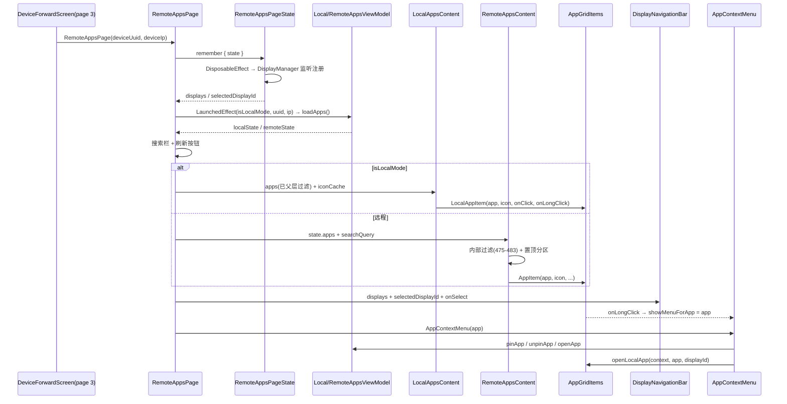

# 拆分计划：`RemoteAppsPage.kt`

- 分支：`refactor/split-remote-apps-page`
- 工作树：`worktree/remote-apps-page`
- 基线提交：`6bb837f`
- 目标文件：`app/src/main/java/com/xzyht/notifyrelay/ui/pages/RemoteAppsPage.kt`

## 一、现状（已读文件核对）

| 项 | 值 |
|---|---|
| 实际行数 | 807 |
| 顶层声明 | 8 个：`DisplayInfo`(60, public data class)、`RemoteAppsPage`(66, public)、`LocalAppsContent`(280)、`RemoteAppsContent`(388)、`DisplayNavigationBar`(571)、`LocalAppItem`(634)、`AppItem`(694)、`AppContextMenu`(784)、`openLocalApp`(824) |
| 无顶层属性、无 companion object |
| 唯一调用方 | `ui/screen/DeviceForwardScreen.kt:119-122`（page == 3 分支） |

### 分区

| 行号 | 职责 | 成员 |
|---|---|---|
| 60-64 | 模型 | `DisplayInfo(id, name, isBuiltIn)` |
| 66-145 | 页面根状态 + 副作用 | `searchQuery`(80)、`showMenuForApp: Any?`(81)、`displays`(85)、`selectedDisplayId`(86)、`LaunchedEffect`(88-94)、`DisposableEffect`(96-145) |
| 147-278 | 布局主体 | 搜索栏/刷新(154-200)、本地/远程分支(202-227)、底栏(230-240)、菜单派发(243-277) |
| 280-386 | 本地应用网格 | `LocalAppsContent`(280) + 图标加载(295-317) + 四态占位(319-385) |
| 388-569 | 远程应用网格 | `RemoteAppsContent`(388) + 图标解码(401-410) + 置顶/普通分区(505-564) |
| 571-632 | 多显示器底栏 | `DisplayNavigationBar`(571) |
| 634-782 | 两个网格单元 | `LocalAppItem`(634)、`AppItem`(694) |
| 784-845 | 上下文菜单 + 启动 | `AppContextMenu`(784)、`openLocalApp`(824) |

## 二、拆分步骤

### 步骤 1（零风险）：`DisplayInfo` 独立成文件
- 新建 `ui/pages/remoteapps/DisplayInfo.kt`（或留在 `ui/pages/`）。
- 依赖方：`RemoteAppsPage`(85/99/108/230)、`DisplayNavigationBar`(571)。
- 风险：**无**。同包 data class 搬移，调用处无需改 import。

### 步骤 2（低风险）：`DisplayNavigationBar` → `ui/pages/remoteapps/DisplayNavigationBar.kt`
- 范围：571-632（62 行）。
- 依赖：`DisplayInfo` 列表、`selectedDisplayId`、`onSelect: (Int) -> Unit`。
- 风险：**无**。纯展示组件，参数简单。

### 步骤 3（低风险）：网格单元 → `ui/pages/remoteapps/AppGridItems.kt`
- 范围：`LocalAppItem`(634-692) + `AppItem`(694-782) + `openLocalApp`(824-845)。
- 依赖：`LocalAppInfo`(635)、`RemoteAppInfo`(696)、`AppRepository` 图标、`onLongClick`/`onClick` 回调。
- 风险：**低**。
  - `openLocalApp`(824) 是非 Composable 的启动函数，需一并搬移或放到 `util/`。
  - 两个 item 组件都读 `iconCache[pkg]`（组合期读 state map），抽离后需把 `ImageBitmap?`/`Bitmap?`（注意两者值类型不同：本地 293 是 `ImageBitmap?`，远程 399 是 `Bitmap?`）作为参数传入。

### 步骤 4（中风险）：内容区 → `ui/pages/remoteapps/LocalAppsContent.kt` / `RemoteAppsContent.kt`
- 范围：`LocalAppsContent`(280-386)、`RemoteAppsContent`(388-569)。
- 依赖：`LocalAppsViewModel`/`RemoteAppsViewModel` state、`searchQuery`、`iconCache`、置顶回调。
- 风险：**中**。
  - 过滤逻辑分裂在两处：本地在父层(205-209)，远程在 `RemoteAppsContent` 内部(475-483)，且**均未 `remember`**。抽离时不要顺手加 `remember`（可能改变重组行为），如需优化应单独提交。
  - 图标加载是「`LaunchedEffect(apps)` 写 `mutableStateMapOf`」模式(295-317、401-410)，抽离后 map 生命周期随组合，行为不变。
  - 置顶段(508-565) 用 `GridItemSpan(maxLineSpan)` 全限定写法(515-518/534-537/545-548)，保持。

### 步骤 5（中高风险）：拆分 `RemoteAppsPage`（66-278，213 行）
- 拆为：
  - `RemoteAppsPageState`（状态 holder）：`searchQuery`(80)、`showMenuForApp`(81)、`displays`(85)、`selectedDisplayId`(86) + 显示器监听副作用(96-145)
  - `RemoteAppsMenuHost`：`showMenuForApp` 的三组 `when (app) { is RemoteAppInfo -> ...; is LocalAppInfo -> ... }`(243-276)
  - 主函数保留布局编排
- 风险：**中高**。
  - `DisposableEffect(isLocalMode)`(96) 内嵌局部函数 `updateDisplays()`(100-128)，闭包捕获 `displayManager`、`displays`、`selectedDisplayId` 三处状态；`onDispose`(139-141) 注销监听。抽离为状态类后需改为 `rememberDisposableEffect` 或显式生命周期方法。
  - `deviceUuid!!`(92) 与 `deviceIp!!`(222) 非空断言依赖 `isLocalMode` 判断，抽离后不要改为 `?.let`（会改变崩溃/静默行为）。
  - `showMenuForApp: Any?`(81) 是类型擦除持有，243-276 三组同构 when 下转型取字段 —— 若改为密封类型会是大改，**本分支不建议**。

## 三、不建议动的部分

- `showMenuForApp: Any?` 的类型擦除设计：改为密封类是**行为无关但改动面大**的重构，建议另开议题。
- 图标缓存的两套类型（`ImageBitmap?` 本地 / `Bitmap?` 远程）：统一需同步改 `AppRepository` 返回类型，跨分支，不在本分支做。
- `android.util.Log.d` 直接打日志(102/117/126)：可替换为 `Logger`，属风格统一，可顺带做（低风险）。

## 四、验收标准

1. 执行前 `./gradlew :app:assembleDebug` 记录基线。
2. 每步骤后 `./gradlew :app:compileDebugKotlin` 通过。
3. 完成后 `./gradlew :app:assembleDebug`，**无新增错误/警告**。
4. 真机冒烟：设备页 → 应用（page 3）—— 本地/远程切换、搜索过滤、下拉刷新、图标加载、长按上下文菜单（置顶/取消置顶/打开）、多显示器切换、启动应用。
5. `./gradlew ktlintFormat`（pre-commit 自动执行）。

## 五、时序（步骤 4+5 抽离后的页面链路）

## 六、备注

- 纯 UI 拆分，整体风险低于数据/服务层文件。建议按 1→2→3→4→5 顺序，每步单独提交。
- 若 `ui/pages/` 目录已较拥挤（12 个页面文件），新建 `ui/pages/remoteapps/` 子目录更符合项目现有 `superisland` 分包习惯（参照 `ui/dialog/SuperIslandTestSamples.kt` 与 `feature/notification/superisland/` 的分包方式）。
