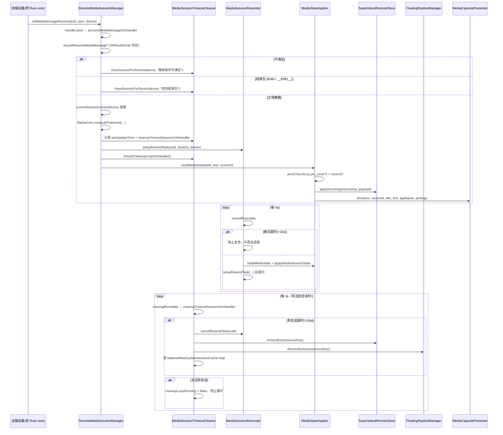

# 拆分计划：`RemoteMediaSessionManager.kt`

- 分支：`refactor/split-remote-media-session-manager`
- 工作树：`worktree/remote-media-session-manager`
- 基线提交：`6bb837f`
- 目标文件：`app/src/main/java/com/xzyht/notifyrelay/feature/media/RemoteMediaSessionManager.kt`

## 一、现状（已读文件核对）

| 项 | 值 |
|---|---|
| 实际行数 | 547 |
| 顶层声明 | `enum class MediaMessageReceiveMode`(21-25, public)、`object RemoteMediaSessionManager`(27-547) |
| 同目录 | `MediaControlUtil.kt` |

### 分区

| 行号 | 职责 | 成员 |
|---|---|---|
| 21-25 | 接收模式枚举 | `MediaMessageReceiveMode { On, Off, AudioOnly }` |
| 27-78 | 常量与状态 | `KEY_ENABLED`(28)、`DEFAULT_ENABLED`(29)、`KEY_RECEIVE_MODE`(30)、`MODE_ON/OFF/AUDIO_ONLY`(31-33)、`currentSession`(37, @Volatile)、`currentDevice`(40, @Volatile)、`isEnabled`(42)、`applicationContext`(45)、`SOURCE_KEY_PREFIX`(48)、`mediaFeatureIdCache`(51)、`mediaLastUpdateTime`(54)、`mediaSessionCache`(57)、`MEDIA_SESSION_TIMEOUT_MS=16s`(60)、`MEDIA_SESSION_RESEND_INTERVAL_MS=6s`(63)、`CLEANUP_INTERVAL_MS=3s`(66)、`handler`(69)、`cleanupRunnable`(73)、`cleanupLoopRunning`(78) |
| 81-107 | 清理循环 | `createCleanupRunnable`(81)、`MediaSessionCacheData`(102, private data class) |
| 109-143 | 初始化与循环启停 | `init`(109)、`ensureCleanupLoop`(122)、`stopCleanupLoop`(138) |
| 145-207 | 接收模式读写 | `isEnabled`(145)、`setEnabled`(147)、`getReceiveMode`(154)、`setReceiveMode`(179)、`shouldReceiveMediaMessage`(202) |
| 209-295 | 消息处理 | `onMediaMessageReceived`(209)、`processMediaMessageOnHandler`(220-295) |
| 297-357 | 会话关闭 | `ensureCleanupLoopOnHandler`(300)、`clearSession`(310)、`closeSessionForDevice`(336) |
| 359-403 | 查询与媒体控制 | `getCurrentSession`(359)、`getCurrentDevice`(361)、`sendMediaControl`(363)、`onPlayPause`(384)、`onPrevious`(391)、`onNext`(398) |
| 405-546 | 超时清理与状态应用 | `cleanupTimeoutSessionsOnHandler`(408)、`buildMediaState`(453)、`applyMediaSessionState`(469)、`setupResendTask`(501)、`cancelResendTask`(541) |

## 二、评估

本文件 547 行，是 16 个目标中**较小**的一个，且内聚度较高（全部围绕「远端媒体会话的接收、缓存、复传、超时清理、浮窗展示」）。plan.md 原判 P3「会话清理/重发可外提，整体内聚」。

### 值得做的拆分（收益中等）

#### 步骤 1（低风险）：`MediaMessageReceiveMode` 独立成文件
- 范围：21-25（5 行）。
- 新建 `feature/media/MediaMessageReceiveMode.kt`。
- 风险：**无**。

#### 步骤 2（中风险）：抽 `MediaSessionTimeoutCleaner`
- 范围：`MEDIA_SESSION_TIMEOUT_MS`(60)、`CLEANUP_INTERVAL_MS`(66)、`cleanupRunnable`(73)、`cleanupLoopRunning`(78)、`createCleanupRunnable`(81)、`mediaFeatureIdCache`(51)、`mediaLastUpdateTime`(54)、`ensureCleanupLoop`(122)、`stopCleanupLoop`(138)、`ensureCleanupLoopOnHandler`(300)、`cleanupTimeoutSessionsOnHandler`(408-450)。
- 新建 `feature/media/MediaSessionTimeoutCleaner.kt`。
- 风险：**中**。
  - 全部状态读写**串行在 main looper handler 上**（注释 76/214/285/298 反复强调），抽离后必须保持同一 handler，且 `ensureCleanupLoop`(122) 是 post 版本、`ensureCleanupLoopOnHandler`(300) 是直调版本 —— **两个版本的区分不可混淆**（在 handler 内调用 post 版本会导致时序错误）。
  - `cleanupLoopRunning` 只在 handler 线程读写(77-78)，抽离后不可改为 `@Volatile` 跨线程访问。
  - 清理逻辑在 `clearSession`(312-326)、`closeSessionForDevice`(336-357)、`cleanupTimeoutSessionsOnHandler`(420-443) **三处重复**（都是 cancelResendTask → Store.removeExact → FloatingReplicaManager.dismissBySource → 清三个 map → 清 current）。可提取为 `closeSessionInternal(deviceUuid, reason)`（低风险去重，可选）。

#### 步骤 3（中风险）：抽 `MediaSessionResender`
- 范围：`MEDIA_SESSION_RESEND_INTERVAL_MS`(63)、`mediaSessionCache`(57)、`MediaSessionCacheData`(102)、`setupResendTask`(501-536)、`cancelResendTask`(541-546)。
- 风险：**中**。
  - `setupResendTask`(501) 是**自递归调度**：Runnable 内部再次调 `setupResendTask`(522) 实现 6s 周期复传。`cancelResendTask`(541) 依赖 `mediaSessionCache[deviceUuid]?.resendRunnable` 才能 `handler.removeCallbacks` —— 抽离后 map 与 handler 必须同源，否则取消失效导致泄漏。
  - 接近超时的守卫(513-516)：`> TIMEOUT-1000` 时停止复传。

#### 步骤 4（低风险）：抽 `MediaStateApplier`
- 范围：`buildMediaState`(453-466)、`applyMediaSessionState`(469-496)。
- 风险：**低**。纯构造 + 写 Store + 调 `MediaCapsulePresenter.show`。
  - 注释 452/468 说明「Rust 合并引擎已输出全量，本地无需 diff」—— 不要引入 diff 逻辑。
  - `currentState.pics` 的 key `miui.focus.pic_cover`(459) 是超级岛契约。

### 不建议动的部分

- `sendMediaControl`(363) 与 `onPlayPause`/`onPrevious`/`onNext`(384/391/398)：三个包装函数仅传不同 action 字符串（`"playPause"`/`"previous"`/`"next"`），可合并但属 API 兼容性考量，**保留**。
- JSON 字段契约（244-249）：`mediaType`/`terminateValue`/`packageName`/`appName`/`title`/`text`/`coverUrl`/`time`，与 PC 端发送协议对齐，**不可改名**。
- `SOURCE_KEY_PREFIX = "media_island"`(48) + `"_${device.uuid}"`：与 `SuperIslandRemoteStore`/`FloatingReplicaManager` 的 sourceKey 契约。
- `NativeCore.computeFeatureId`(273)：JNA 调用。
- `shouldReceiveMediaMessage`(202) 的 `AudioOnly` 分支依赖 `AudioForwardingService.isAudioForwardingRunning()`(206)。

## 三、验收标准

1. 执行前 `./gradlew :app:assembleDebug` 记录基线。
2. 每步骤后 `./gradlew :app:compileDebugKotlin` 通过。
3. 完成后 `./gradlew :app:assembleDebug`，**无新增错误/警告**。
4. 真机冒烟（需两台设备配对）：
   - 远端播放音乐 → 本机浮窗显示标题/歌手/封面
   - 6s 复传生效（浮窗在 12s 自动关闭前被刷新两次）
   - 远端暂停/结束（`__END__`/`END`）→ 浮窗立即关闭
   - 超过 16s 无更新 → 超时清理，浮窗关闭，清理循环停止
   - 媒体控制：播放/暂停、上一首、下一首能到达远端
   - 设置切换接收模式（开/关/仅音频）—— 关闭时清空全部会话
5. `./gradlew ktlintFormat`（pre-commit 自动执行）。

## 四、时序（步骤 2+3 抽离后的会话生命周期）

## 五、备注

- 若评估后认为本文件拆分收益有限，**可接受「只做步骤 1 + 步骤 4」** 或标记为「低优先级」。
- 步骤 2/3 涉及 mainLooper handler 上的串行状态机，是本文件唯一有实质风险的部分；若做，建议一次只做一个并单独提交。
- 与 `refactor/split-notify-relay-notification-listener-service`（媒体消息入口）弱交叉；与超级岛浮窗模块（`SuperIslandRemoteStore`/`FloatingReplicaManager`/`MediaCapsulePresenter`）仅 API 依赖，不受本分支影响。
