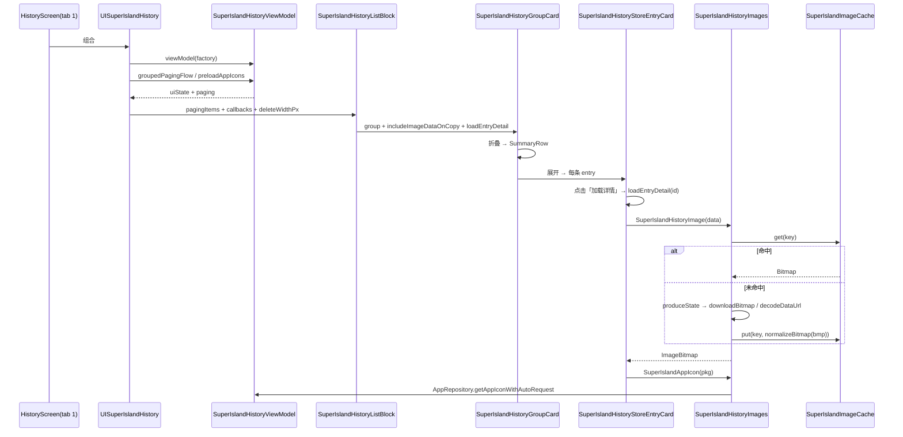

# 拆分计划：`SuperIslandHistory.kt`

- 分支：`refactor/split-super-island-history`
- 工作树：`worktree/super-island-history`
- 基线提交：`6bb837f`
- 目标文件：`app/src/main/java/com/xzyht/notifyrelay/ui/pages/SuperIslandHistory.kt`

## 一、现状（已读文件核对）

| 项 | 值 |
|---|---|
| 实际行数 | 1107 |
| 顶层声明 | 18 个（1 常量、1 枚举、13 个 private Composable/函数、1 个 private object、若干 private val） |
| 唯一 public 入口 | `UISuperIslandHistory()`（127-249），仅被 `ui/screen/HistoryScreen.kt:74`（tab index 1）调用 |
| 其他 public | `SuperIslandDeleteButton`(106-125)、`SuperIslandDragValue`(104) —— **文件外无调用点** |

### 分区

| 行号 | 职责 | 成员 |
|---|---|---|
| 1-104 | 导入 + 常量/枚举 | `SUPER_ISLAND_IMAGE_MAX_DIMENSION=320`(102)、`SuperIslandDragValue`(104) |
| 106-249 | 入口 + 删除按钮 | `SuperIslandDeleteButton`(106)、`UISuperIslandHistory`(127) |
| 251-345 | 分页列表块 | `SuperIslandHistoryListBlock`(251) |
| 347-533 | 分组卡片 | `SuperIslandHistoryGroupCard`(347) |
| 535-620 | 折叠预览行 | `SuperIslandHistorySummaryRow`(535) |
| 622-778 | 展开条目卡 | `SuperIslandHistoryStoreEntryCard`(622) |
| 780-1002 | 图片与图标 | `SuperIslandHistoryImage`(780)、`rememberAppIconBitmap`(865)、`SuperIslandAppIcon`(890)、`downloadBitmap`(937)、`SuperIslandImageCache`(947) |
| 1004-1177 | 纯工具 | `formatTimestamp`(1004)、`buildEntryCopyText`(1011)、`copyEntryToClipboard`(1052)、`triggerFloatingReplica`(1071)、`sanitizeImageContent`(1096)、`formatMultilineContent`(1118)、`prettyPrintJson`(1124)、`wrapPlainText`(1139)、`appendMultilineField`(1166) |

## 二、拆分步骤（均由低到高风险递增）

### 步骤 1（零风险）：工具函数 → `ui/pages/superisland/SuperIslandHistoryFormatters.kt`
- 范围：1004-1177 全部 + 正则 `DATA_URL_REGEX`(1106)、`IMAGE_URL_REGEX`(1112)、`prettyGson`(1161)、`SANITIZED_LINE_WRAP`(1163)、`WRAP_BREAK_CHARS`(1164)。
- 目标包：`ui/pages/superisland/`（新建目录）或留在 `ui/pages/`。
- 可见性：保持 `private` 需改为 `internal`（跨文件不可 private）。
- 依赖：`buildEntryCopyText` 用 `SuperIslandHistoryStoreEntry`(1012)；`triggerFloatingReplica` 用 `FloatingReplicaManager.showFloating`(1085)。
- 风险：**无**。纯函数，无状态。

### 步骤 2（零风险）：图片缓存 object → `ui/pages/superisland/SuperIslandImageCache.kt`
- 范围：`SuperIslandImageCache`(947-1002)，含 `MAX_CACHE_SIZE=32`(948)、LRU `LinkedHashMap`(949-952)、`get`(954)、`put`(964)、`normalizeBitmap`(976)。
- 需从 `private object` 改为 `internal object`。
- 风险：**低**。唯一注意：`normalizeBitmap`(976-1001) 内部会 `source.recycle()`(996)，缓存与 `produceState`(790) 持有同一批 Bitmap 引用，抽离后生命周期语义不变即可。

### 步骤 3（低风险）：图片与图标 Composable → `ui/pages/superisland/SuperIslandHistoryImages.kt`
- 范围：`SuperIslandHistoryImage`(780-863)、`rememberAppIconBitmap`(865-888)、`SuperIslandAppIcon`(890-935)、`downloadBitmap`(937-945) + 常量 `SUPER_ISLAND_IMAGE_MAX_DIMENSION`(102)。
- 依赖：`SuperIslandImageStore.resolve`(802)、`ImageUtils`(809/942)、`AppRepository.iconUpdates`(869)/`getExternalAppIcon`(876)/`getAppIconWithAutoRequest`(883)。
- 风险：**低**。`produceState`(790-820) 缓存命中直接 `return@produceState`(819)，抽离后 key 逻辑不变。

### 步骤 4（中风险）：卡片子组件 → `ui/pages/superisland/SuperIslandHistoryCards.kt`
- 范围：`SuperIslandHistoryGroupCard`(347-533)、`SuperIslandHistorySummaryRow`(535-620)、`SuperIslandHistoryStoreEntryCard`(622-778)、`SuperIslandHistoryListBlock`(251-345)。
- 问题：参数透传链深——
  - `includeImageDataOnCopy`(130) → 237 → 317 → 479/513 → 575/678（五层）
  - `deleteWidthPx`/`deleteWidth`(169-170) → 242-243 → 261-262 → 321-322 → 356-357
  - `loadEntryDetail: suspend (Long) -> Entry?`(241) → 260 → 354 → 482/516 → 629
- 建议：抽出 `SuperIslandHistoryCardArgs` data class 聚合这三个 + `onToggleExpand`/`onDeleteGroup`/`onDeleteEntry`，减少 4 个函数的参数个数。
- 风险：**中**。
  - `AnchoredDraggableState` 嵌套：分组级 key=`(groupKey, entries.size)`(276-281)、条目级 key=`entry.id`(438-443)，尺寸变化即重建；抽离后 key 计算必须逐字保留，否则滑动删除行为突变。
  - 展开分支(436-507) 用非 Lazy `forEachIndexed` 内联 `remember`，与 Lazy 路径共用 state。
  - `StoreEntryCard` 内 744 的 `loadedDetail` 状态定义在 Card content lambda 内，760-775 写入。

### 步骤 5（可选）：`SuperIslandDeleteButton`(106-125) 与 `SuperIslandDragValue`(104)
- 现状：public 但文件外无调用点。
- 做法：降为 `internal` 或 `private`；`DeleteButton` 在 `ui/common/` 已有类似组件（`DoubleClickConfirmButton`），可评估复用。
- 风险：**低**。需先确认无 XML/其他模块引用（计划执行时全局搜索一次）。

## 三、不建议动的部分

- `UISuperIslandHistory`(127-249)：页面根，负责 VM 装配(132-135)、分页采集(147)、图标预载(153-155)、清空工具栏(174-197)。保留在原文件作为入口，便于定位。
- 滑动删除的 `AnchoredDraggable` 语义：改动会导致用户可见的手势行为变化，**只搬移不重构**。

## 四、验收标准

1. 执行前 `./gradlew :app:assembleDebug` 记录基线。
2. 每步骤后 `./gradlew :app:compileDebugKotlin` 通过。
3. 完成后 `./gradlew :app:assembleDebug`，**无新增错误/警告**。
4. UI 等价冒烟：历史页 tab 1 —— 分组展开/折叠、条目滑动删除、长按复制、点击悬浮复刻、图片加载（含 data URL 与远程 URL）、应用图标显示。
5. `./gradlew ktlintFormat`（pre-commit 自动执行）。

## 五、时序（步骤 3+4 抽离后的渲染链路）

## 六、备注

- 本文件是纯 UI 拆分，风险整体最低，适合作为 UI 类拆分的第一个实践。
- 若担心 `AnchoredDraggableState` 行为变化，步骤 4 可只搬移 `SummaryRow`(535) 与 `StoreEntryCard`(622)，把 `GroupCard`(347) 与 `ListBlock`(251) 留到最后并单独提交验证。

---

## 七、实际执行记录（合并前审查回写）

本节由合并前独立审查补写，用于区分「有意偏离」与「漏做」。原计划正文未改。

### 已完成（本次审查评价为最规范的一棵）
- 步骤 1~5 全部完成，含标注「可选」的步骤 5。
- 逐段比对（`git show 基线:原文件` vs 新文件）：**4 个新文件与基线对应区段字节级一致，唯一差异是 8 处 `private` → `internal`**。
- 因此以下全部零变化：`remember(groupKey, group.entries.size)` 的 AnchoredDraggable key、`LaunchedEffect` 依赖与所属层级、`mutableStateOf` 持有位置、LazyColumn item key、`produceState` 的 `key1=data`、`SuperIslandImageCache` 的 LRU + `recycle` 生命周期、`formatTimestamp` 的 locale/时区行为。
- 9 个搬迁符号全仓各仅 1 处定义，无悬空引用、无重复定义。
- 步骤 5：全工作树 grep `SuperIslandDeleteButton` / `SuperIslandDragValue`，除本文件与 Cards 新文件外无任何调用点，`*.xml` 亦无引用；因 Cards 需跨文件使用，二者由 `public` 降为 `internal`。

### 实际偏离（**有意，已论证**）
- **未采纳步骤 4 建议的 `SuperIslandHistoryCardArgs` 聚合参数**：聚合会把 `includeImageDataOnCopy` / `deleteWidthPx` 等从独立 Compose 参数变为 data class 字段，其 `equals` 行为会改变相关 `remember(...)` / 重组失效判定（计划自己标注此处「风险：中」，并要求「key 计算必须逐字保留，否则滑动删除行为突变」）。故按「只搬移不重构」执行，四个函数签名原样保留，仅加 `internal`。
- 未采纳 §备注 的「只搬 SummaryRow / EntryCard、把 GroupCard / ListBlock 留下」备选：该备选是为规避 `AnchoredDraggable` 行为变化而设，而逐字保留 key 已消除该风险。

### 审查发现（遗留，未处理）
- `SuperIslandHistoryCards.kt:158-167` / `:433-439` 参数透传链仍为 5 层 8 参数（步骤 4 建议的 `CardArgs` 未落地，纯风格债）。
- `SuperIslandHistory.kt:49` / `:52` `SuperIslandDragValue` / `SuperIslandDeleteButton` 只被 `ui.pages.superisland` 子包使用，却仍留在页面入口文件。
